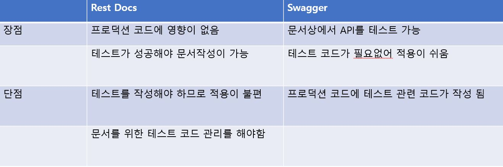
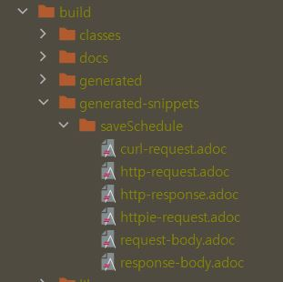
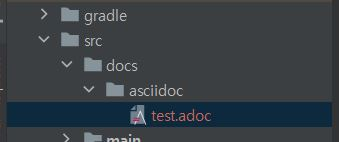
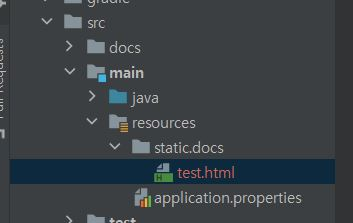
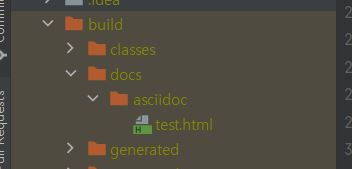
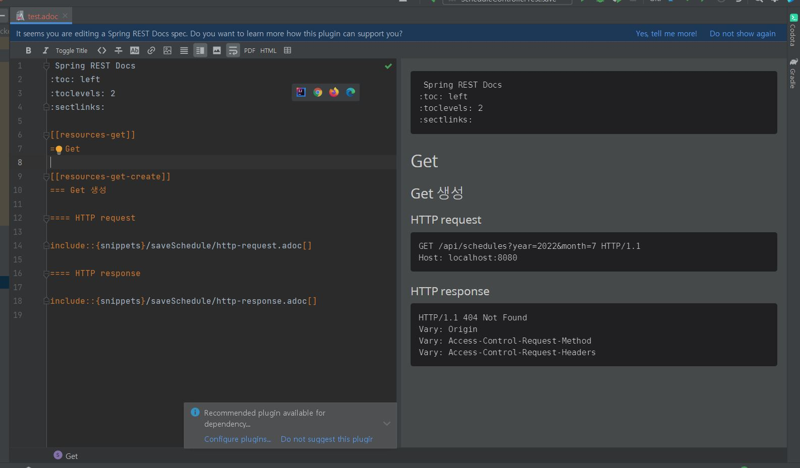
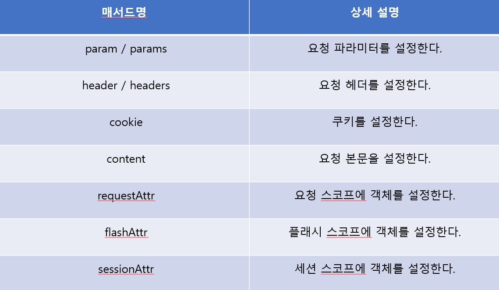
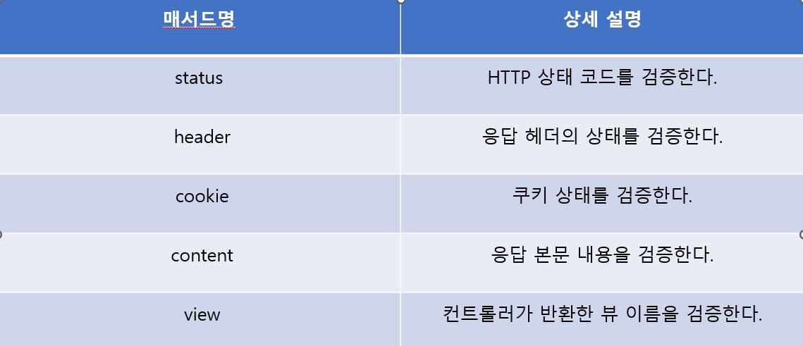

> 이 글은 우테코 달록팀 크루 '[리버](https://github.com/gudonghee2000)'가 작성했습니다.

## Rest Docs
Spring Rest Docs는 테스트 코드 기반으로 자동으로 Rest API 문서를 작성 할 수 있도록 도와주는 프레임 워크이다.

## Rest Docs와 Swagger
자바 문서 자동화에는 주로 Rest Docs와 Swagger가 사용된다.
각 자동화 프레임 워크의 장단점을 살펴보자.


Swagger는 API 문서의 작성을 위해 프로덕션 코드에 추가적인 코드를 작성해야한다. 
그래서 Swagger의 사용은 프로덕션 코드의 가독성을 떨어트린다고 생각한다.

반대로, Spring Rest Docs는 테스트 코드에 의존적이기 때문에 Spring Rest Docs를 사용하는것이 좋다고 생각한다.

## MockMvc vs Rest Assured
Spring Rest Docs를 사용하여 문서를 작성 하려면 테스트 코드가 필요하다.
테스트 코드를 작성 할 때, 대표적으로 MockMvc와 Rest Assured를 사용한다.

MockMvc를 사용하면  `@WebMvcTest`로 테스트 할 수 있다.
그래서 Controller Layer만으로 테스트 하기 때문에 테스트 속도가 빠르다.

반면, RestAssured는 `@SpringBootTest`로 수행해야한다. 그러면 전체 어플리케이션 컨텍스트를 로드하여 빈을 주입하기에 테스트 속도가 느리다.
하지만, 실제 객체를 통한 테스트가 가능하기 때문에 테스트의 신뢰성이 높다.

통합 테스트, 인수 테스트의 경우 RestAssuerd가 좋을 수 있지만, 문서를 작성하기 위한 테스트에는 MockMvc가 더 적절하다고 생각한다.

**_💡 @WebMvcTest와 @SpringBootTest_**
@WebMvcTest는 Application Context를 완전하게 Start하지 않고 Present Layer 관련 컴포넌트만 스캔하여 빈 등록한다.
반면, @SpringBootTest의 경우 모든 빈을 로드하여 등록한다.


## AsciiDoc

Spring Boot Rest Docs는 Asciidoc를 문서 번역을 위한 텍스트 프로세서로 사용한다.

## Rest Docs API 문서 생성 매커니즘
우선, Rest Docs의 문서 생성 매커니즘을 살펴보자.

1. MockMvc로 작성한 테스트 코드를 실행한다.

2. 테스트가 통과하면 아래와 같이 `build/generated-snippets` 하위에 스니펫(문서조각)들이 생성된다. 


   _❗❗ gradle은 build/generated-snippets에 스니펫이 생성된다._

3. `build/generated-snippets` 하위에 생성된 스니펫들을 묶어서 HTML 문서를 만들기 위해서는, gradle의 경우 아래와 같이`src/docs/asciidoc` 하위에 스니펫들을 묶은 adoc문서를 만든다.

4. 스니펫을 이용해서 `src/docs/asciidoc` 하위에 adoc 파일을 생성했다면, `./gradlew build` 명령어를 통해 빌드를 해준다.

빌드가 완료되면 위와 같이 `resources - static - docs` 하위에 HTML 문서가 생성된다.

5. 어플리케이션을 실행 한 후, `http://localhost:8080/docs/{HTML 파일명}` 을 웹브라우저에 검색하면 생성한 REST API 문서를 확인 할 수 있다. 

	**❗❗ API문서 url은 코드를 통해 변경 가능하다.**
    
### ❗유의할 점
resources - static - docs 하위의 HTML 파일은 실제로는 build.gradle의 설정파일에 따라서 위와같이 build - docs - asciidoc 하위의 HTML 파일을 복사해온 파일이다.


### 아이디어
REST API 문서를 확인할 때, `http://localhost:8080/docs/{HTML 파일명}` 을 통해서 웹브라우저에 접근하지 않아도 확인하는 방법이 있다.

AsciiDoc 플러그인을 설치하면 위와같이, 인텔리제이 상에서도 REST API 문서를 실시간으로 확인할수 있다.  (✔설치 추천)

## Rest Docs 사용을 위한 빌드파일 설정
``` java
plugins {
    id 'org.asciidoctor.jvm.convert' version '3.3.2' // 1
}

ext {
    snippetsDir = file('build/generated-snippets') // 2
}

test { 
    outputs.dir snippetsDir // 3
    useJUnitPlatform()
}

configurations {
    asciidoctorExtensions
}

asciidoctor { // 4
    configurations 'asciidoctorExtensions' 
    inputs.dir snippetsDir 
    dependsOn test
}

dependencies {
    testImplementation 'org.springframework.restdocs:spring-restdocs-mockmvc' // 5
    asciidoctorExtensions 'org.springframework.restdocs:spring-restdocs-asciidoctor' // 6
}

task copyDocument(type: Copy) { // 7
    dependsOn asciidoctor
    
    from file("build/docs/asciidoc")
    into file("src/main/resources/static/docs")
}
	
bootJar { 
    dependsOn copyDocument // 8
}
  ```


1. gradle7부터 사용하는 플러그인으로 asciidoc 파일 변환, build 디렉토리에 복사하는 플러그인이다.

2. 생성된 스니펫을 저장할 위치를 정의한다. gradle은 `build/generated-snippets`에 스니펫이 생성된다.

3. 테스트 Task의 결과 아웃풋 디렉토리를 `build/generated-snippets`로 지정한다.

4. asciidoctor Task가 사용할 인풋 디렉토리를 `build/generated-snippets`로 지정한다.
	dependsOn test로 문서가 작성되기 전에 테스트가 실행되도록 한다.
    
5. MockMvc를 테스트에 사용하기 위한 의존성을 추가 해준다.

6. 일반 텍스트를 처리하고 HTML 파일을 생성하는 의존성을 추가 해준다.

7. asciidoctor Task로 생성한 `build/docs/asciidoc`파일을 `src/main/resources/static/docs`로 복사한다.

8. bootJar 실행시 copyDocument를 먼저 실행하도록 한다.


--- 

✅MockMvc를 사용한 Rest Docs 테스트 작성을 알아보기 전에 우선 MockMvc에 대해 알아보자.

##MockMvc 기본 메서드
어떠한 것들이 있는지 알아보고 밑에서 자세히 알아보자.

### perform()
가상의 request를 처리한다.

```java
mockMvc.perform(get("/api/schedules/?year=2022&month=7"))
```

### andExpert()
andExpert()

예상값을 검증한다. 

```java
.andExpect(status().isOk())
// status 값이 정상인 경우를 기대하고 만든 체이닝 메소드의 일부

.andExpect(content().contentType("application/json;charset=utf-8"))
//contentType을 검증
```

### andDo()
요청에 대한 처리를 맡는다. print() 메소드가 일반적이다.

```java
.andDo(print())
```

### andReturn()
테스트한 결과 객체를 받을 때 사용한다.

```java
MvcResult result = mockMvc.perform(get("/"))
.andDo(print())
.andExpect(status().isOk())
.andReturn();
```

## MockMvc 요청 만들기
요청을 만들 때는 static 메서드인 get, post, put, delete, fileUpload 등을 이용해서 MockHttpServletRequestBuilder 객체를 생성하는 것에서 시작한다.

MockHttpServletRequestBuilder는 ServletRequest를 구성하기에 필요한 다양한 메서드를 제공한다.

위 메서드들은 메서드 체이닝을 지원하기 때문에, 아래와 같이 요청 데이터를 연결해서 작성하면된다.


```java 
@Test
    void test() throws Exception {
        MockHttpServletRequestBuilder builder = get("/api/schedules")
                .param("year", "2022")
                .param("month", "7")
                .accept(MediaType.APPLICATION_JSON)
                .header("sessionId", "세션아이디입니다.");

        mockMvc.perform(builder)
                .andExpect(status().isOk());
    }

```
_**❗❗ 유의 할 점**_
MockMvc.perform() 의 파라미터 값이 MockHttpServletRequestBuilder의 상위 객체이다. 

그래서 perform() 파라미터로 아래와 같이 넣어주어도 작동된다.
```java
@Test
    void test() throws Exception {
        mockMvc.perform(get("/api/schedules")
                .param("year", "2022")
                .param("month", "7")
                .accept(MediaType.APPLICATION_JSON)
                .header("sessionId", "세션아이디입니다."))
                .andExpect(status().isOk());
    }
```

## MockMvc 실행 결과 검증
perform()은 반환 값으로 ResultActions가 반환된다.
ResultActions의 andExpect는 요청 실행 결과를 검증 하려면 ResultMatcher를 넘겨줘서 검증해야한다.
ResultMatcher는 다음의 MockMvcResultMatchers가 가지는 static 메서드를 통해서 얻는다.

MockMvcResultMatchers는 다음의 static 메서드를 통해 다양한 ResultMatcher를 제공한다.



아래의 예시를 살펴보자.
```java
	@Test
    void test() throws Exception {
        mockMvc.perform(builder)
                .andExpect(handler().handlerType(ScheduleController.class))
                .andExpect(handler().methodName("save"))
                .andExpect(forwardedUrl("index"))
                .andExpect(header().stringValues("Content-Language", "en"))
                .andExpect(model().attribute("message", "저장이 잘되었습니다."))
                .andExpect(status().isOk());
    }
```

## MockMvc 실행 결과 처리
실행 결과를 출력할 떄는 andDo 메서드를 사용한다.
andDo 메서드 의 인수에는 실행 결과를 처리 할 수 있는 ResultHandler를 지정한다.
MockMvcResultHandlers는 다양한 ResultHandler를 제공하지만 print()를 주로 사용한다.


## MockMvc를 사용한 Rest Docs 생성
테스트 코드와 함께 MockMvc를 사용한 Rest Docs 생성을 알아보자.

```java
@WebMvcTest(ScheduleController.class)
@AutoConfigureRestDocs // 1
class ScheduleControllerTest {

    @Autowired
    private MockMvc mockMvc;

    @Autowired
    private ObjectMapper objectMapper;

    @MockBean // 2
    private ScheduleService scheduleService;

    @Test
    void save() throws Exception {
        // given
        ScheduleCreateRequest request = new ScheduleCreateRequest("제목", LocalDateTime.now(), LocalDateTime.now(), "메모");

        given(scheduleService.save(request))
                .willReturn(1L); // 3

        // when & then
        mockMvc.perform(post("/api/schedules")
                        .content(objectMapper.writeValueAsString(request))
                        .contentType(MediaType.APPLICATION_JSON)
                        .accept(MediaType.APPLICATION_JSON))
                .andExpect(status().isOk())
                .andDo(document("schedule-save", // 4
                        requestFields(
                                fieldWithPath("title").type(JsonFieldType.STRING).description("제목"),
                                fieldWithPath("startDateTime").type(JsonFieldType.STRING)
                                        .description("2022-07-04T13:00"),
                                fieldWithPath("endDateTime").type(JsonFieldType.STRING).description("2022-07-05T07:00"),
                                fieldWithPath("memo").type(JsonFieldType.STRING).description("메모입니다.")
                        )
                ));
    }
}
```

1. target/generated-snippets dir 생성하고 테스트 코드를 통해 snippets를 추가해주는 애노테이션이다.

2. `ScheduleService`를 mocking을 하기위해서 `@MockBean` 을 선언한다.

3. mocking을 통해 `ScheduleService` 를 통해 받을 응답값을 설정한다.

4. test 수행시 `andDo(document("xxx"))`를 통해서 `./build/generated-snippets` 하위에 문서가 작성된다.


---
## 끝내면서 
이상 Rest Docs의 매커니즘, 설정 그리고 MockMvc를 활용한 Rest Docs 생성 방법을 살펴보았다.
프로젝트에 RestAssuered를 사용한 Rest Docs를 적용하면서 테스트 격리에 문제를 경험하였는데,
테스트 격리에 대해서 추후에 포스팅 해봐야겠다.
