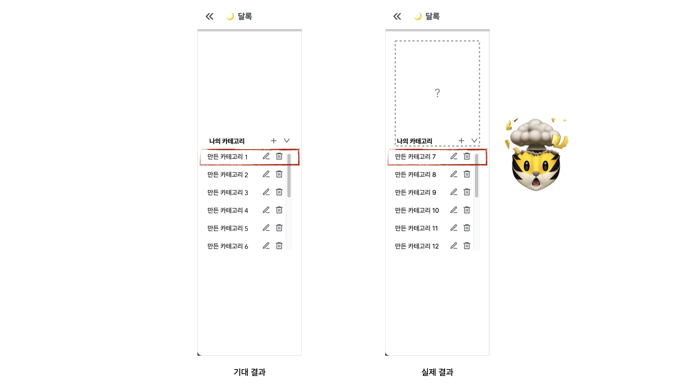

> 이 글은 우테코 달록팀 크루 [티거](https://github.com/daaaayeah)가 작성했습니다.

## 무슨 문제가 발생했는가?

목록을 아래로 스크롤하고 다시 위로 돌아왔더니 윗부분이 보이지 않았습니다. 개발자 도구를 열어서 확인해 보면 보이지 않는 목록도 잡히긴 했어요. 어딘가에 가려져서 보이지만 않은 거죠. 무슨 일이 일어난 걸까요?



달록은 사용자 경험을 위해 사이드 바를 만들기로 했습니다. 그리고 이 사이드 바 안에는 사용자의 잦은 접근이 기대되는 '구독 카테고리' 목록과 '나의 카테고리' 목록을 넣기로 했어요. 아무래도 두 목록 모두 적지 않은 정보를 제공할 것 같아 `스크롤`이 필요하겠다고 생각했습니다. 어느 영역을 스크롤 가능하게 만들지 팀원과의 논의 끝에 사이드 바 전체를 스크롤하지 않고 각 목록의 영역에서 스크롤하도록 구현하기로 했습니다. 사용자가 스크롤할 때 어떤 부분을 스크롤하고 있는지, 어떤 정보를 보고 있는지 알 수 있도록이요.

제가 개발을 맡은 부분은 '나의 카테고리'였습니다. 컴포넌트를 만들고 API 명세에 따라 무한 스크롤 요청을 하면서 목록을 그리는데 웬걸, 스크롤을 하면 할수록 목록 윗부분이 점점 숨더라고요. 여러 크루들에게 물어봤지만 다들 별거 아닐 것 같긴 한데 뭔지 모르겠다는 반응이었습니다. 저도 이런 경우가 처음이라 해결하는 데에 꽤나 머리가 아팠어요. 뭐라고 검색해야 되는지 감이 잡히지도 않았습니다. 여러분은 무엇 때문인지 감이 오나요?

## 문제의 원인이 무엇인가?

달록의 프론트엔드에서는 자주 사용되는 스타일을 theme으로 정의하고 필요할 때마다 가져다가 사용하고 있습니다. 아래와 같이 `flex.row`와 `flex.column` 스타일도 정의해두고 사용하고 있어요.

```ts
const flex = {
  row: css`
    display: flex;
    flex-direction: row;
    justify-content: center;
    align-items: center;
  `,
  column: css`
    display: flex;
    flex-direction: column;
    justify-content: center;
    align-items: center;
  `,
};
```

어라 . . . ?

```ts
const sideBar = ({ colors, flex }: Theme, isSideBarOpen: boolean) => css`
  ${flex.row}

  // ...
```

. . . !

```css
/* 사용하려고 했던 스타일 */
display: flex;
flex-direction: row;
justify-content: center;

/* 적용된 스타일 */
display: flex;
flex-direction: row;
justify-content: center;
align-items: center;
```

네, 사이드 바에서 `flex.row` 스타일을 가져다가 사용했습니다. `align-items` 속성의 유무는 신경도 쓰지 않았어요. 있으면 중앙 정렬되니까 오히려 좋다고 안일하게 생각했습니다. 😇🔫

무한 스크롤을 하면 할수록 목록의 길이는 늘어나는데 `align-items` 속성이 세로 정렬을 해버리는 탓에 목록은 점점 더 위쪽으로 숨는 것처럼 보였던 것입니다.

저는 세로 정렬이 필요하지 않기 때문에 사이드 바 스타일에 `align-items: flex-start` 속성을 추가함으로써 이 문제를 해결하였습니다. 이 방법보다는 flex 스타일을 조금 더 자세히 나누어 정의해서 theme을 더욱 범용적으로 사용할 수 있도록 개선하는 게 더 좋은 방법이라고 생각합니다.

가로와 세로 정렬을 유지하고 싶으시다면 아래의 첫 번째 방식 대신 두 번째 방식을 사용하시면 됩니다.

```css
/* X */
justify-content: center;
align-items: center;

/* O */
margin: auto;
```

## 정리

Flex 컨테이너에서 `align-items: center`나 `justify-content: center`로 정렬한다면, 컨테이너는 내부 아이템이 넘치는 것과 관계 없이 항상 내부 아이템을 정렬합니다. Flex 아이템이 Flex 컨테이너보다 클 때 이러한 방식으로 요소를 정렬하는 경우 넘치는 부분에 대해서 접근할 수 없으므로 예상치 못한 문제가 발생할 수 있습니다.

> CSS 공부도 열심히 하자! 😞
