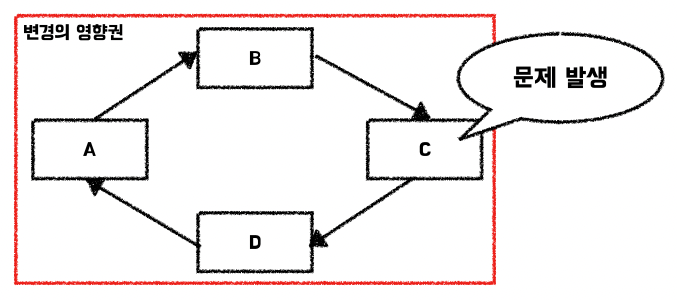

> 이 글은 우테코 달록팀 크루 '[매트](https://github.com/hyeonic)'가 작성했습니다.

순환 참조란, 서로 다른 여러 빈이 상호 간의 의존성을 가져 의존성이 순환하고 있다는 것을 의미한다. 예를 들면 아래와 같은 상황이다.

우리 달록은 Member가 생성되는 시점에 개인의 일정을 저장하기 위한 Category와 개인 Cateogry에 대한 Subscription 정보가 추가되어야 하는 요구사항을 가지고 있다. 이것을 코드로 표현하면 아래와 같다.

```java
@Service
public class MemberService {

    private static final String MY_SCHEDULE = "내 일정";

    private final CategoryService categoryService; // 순환 참조
    private final SubscriptionService subscriptionService;
    private final MemberRepository memberRepository;

    public MemberService(final CategoryService categoryService, final SubscriptionService subscriptionService,
                         final MemberRepository memberRepository) {
        this.categoryService = categoryService;
        this.subscriptionService = subscriptionService;
        this.memberRepository = memberRepository;
    }

    @Transactional
    public Member save(final String email, final String displayName) {
        Member newMember = memberRepository.save(new Member(email, displayName));

        Category newCategory = categoryService.save(newMember.getId(), MY_SCHEDULE);
        subscriptionService.save(newMember.getId(), newCategory.getId());

        return newMember;
    }

    public Member findById(final Long id) {
        return memberRepository.findById(id)
                .orElseThrow(NoSuchElementException::new);
    }
}
```

앞서 언급한 것처럼 Member 생성 시 아래와 같이 내 일정을 저장하기 위한 Category와 내 일정을 바로 Subscription 하기 위한 로직이 필요하다. 즉 `MemberService`는 `CategoryService`와 `SubscriptionService`를 필드로 가지며 `의존`하는 형태를 띄게 된다. 

```java
@Service
public class CategoryService {

    private final MemberService memberService; // 순환 참조
    private final CategoryRepository categoryRepository;

    public CategoryService(final MemberService memberService, final CategoryRepository categoryRepository) {
        this.memberService = memberService;
        this.categoryRepository = categoryRepository;
    }

    @Transactional
    public Category save(final Long memberId, final String name) {
        Member member = memberService.findById(memberId);
        Category newCategory = new Category(name, member);
        return categoryRepository.save(newCategory);
    }

    public Category findById(final Long id) {
        return categoryRepository.findById(id)
                .orElseThrow(NoSuchElementException::new);
    }
}
```

위 코드는 Category 저장을 위한 로직을 담은 `CategoryService`이다. `CategoryService`의 경우 요청된 `Member Id` 정보를 기반으로 Member를 조회한 뒤 Category를 저장하게 된다.

이러한 구조 덕분에 `MemberService`는 `CategoryService`를 의존하고, `CategoryService`는 `MemberService`를 의존하게 되어 `순환 참조`가 발생하게 된다.

```shell
***************************
APPLICATION FAILED TO START
***************************

Description:

The dependencies of some of the beans in the application context form a cycle:

┌─────┐
|  categoryService defined in file [/Users/hyeonic/study/blog-code/circular-reference/build/classes/java/main/io/github/hyeonic/circularreference/category/CategoryService.class]
↑     ↓
|  memberService defined in file [/Users/hyeonic/study/blog-code/circular-reference/build/classes/java/main/io/github/hyeonic/circularreference/member/MemberService.class]
└─────┘


Action:

Relying upon circular references is discouraged and they are prohibited by default. Update your application to remove the dependency cycle between beans. As a last resort, it may be possible to break the cycle automatically by setting spring.main.allow-circular-references to true.
```

## 의존성 살펴보기

객체가 다른 객체의 의존성을 가진다는 것은 해당 객체의 변화에 직접적인 영향을 받을 수 있다는 것이다. 위 예시를 다시 한번 살펴보자.

```java
@Service
public class MemberService {

    private static final String MY_SCHEDULE = "내 일정";

    private final CategoryService categoryService; // 순환 참조
    ...

    @Transactional
    public Member save(final String email, final String displayName) {
        Member newMember = memberRepository.save(new Member(email, displayName));
        
        // Category save 메서드의 시그니처나 반환 타입이 변경 된다면..?
        Category newCategory = categoryService.save(newMember.getId(), MY_SCHEDULE);
        subscriptionService.save(newMember.getId(), newCategory.getId());

        return newMember;
    }
    ...
}
```

만약 Category에 대한 요구사항이 변경되어 `save` 메서드의 시그니처나 반환 타입에 대한 변경에 `MemberService`는 직접적인 코드 수정으로 변화에 대응해야 한다.

그만큼 객체가 객체를 의존한다는 것은 의존 객체의 변경에 영향을 받을 수 있다는 것을 의미한다. 이러한 의존이 순환되어 연결되어 있다고 생각해보자. 순환 참조에 해당하는 객체 모두 연쇄적으로 변경에 영향을 받을 수 있다는 것을 의미한다.



사실 순환 참조를 해결하기 위한 방법으로는 `@Lazy` 애노테이션을 활용하거나 `setter` 주입을 사용하는 등 다양한 방법이 존재한다. 하지만 결국 이러한 순환 참조를 야기하는 설계는 근본적으로 각 객체에 대한 책임이 적절하지 않다는 의미를 내포할 수 있다. 

다음 시간에는 앞서 발생한 순환 참조를 달록에서 어떻게 개선하고 있는지 시리즈로 작성할 예정이다.
