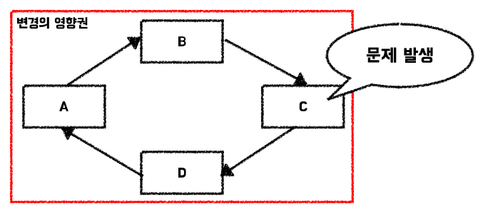
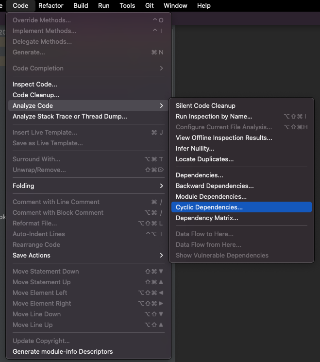
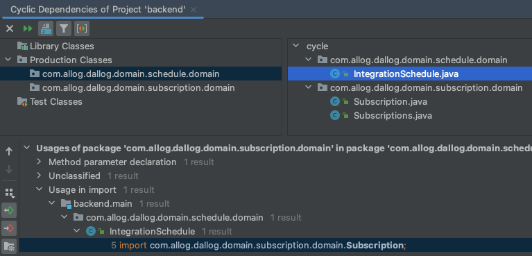
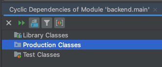

> 이 글은 우테코 달록팀 크루 [매트](https://github.com/hyeonic)가 작성했습니다.

달록팀은 `2명의 프론트엔드 개발자(티거, 나인)`와 `4명의 백엔드 개발자(파랑, 리버, 후디, 매트)`로 이루어져 있다. 프론트엔드와 백엔드의 경우 서로의 영역을 침범할 일이 적지만 각각의 영역에서는 대부분의 코드를 공유하여 `병렬적`으로 태스크를 진행하게 된다.

아래는 실제 달록에서 어떠한 과정을 통해 태스트를 나누고 진행하고 있는지 설명하기 위해 백엔드에서 구성한 패키지 구조이다.

```
└── src
    ├── main
    │   ├── java
    │   │   └── com
    │   │       └── allog
    │   │           └── dallog
    │   │               ├── domain
    │   │               │   ├── auth
    │   │               │   │   └── ...
    │   │               │   ├── subscription
    │   │               │   │   └── ...
    │   │               │   ├── schedule
    │   │               │   │   └── ...
    │   │               │   └── member
    │   │               │       └── ...
    │   │               │    
    │   │               ├── global
    │   │               │   └── ...
    │   │               │     
    │   │               ├── infrastructure
    │   │               │   └── oauth
    │   │               └── AllogDallogApplication.java
    |   |
    │   └── resources
    │       └── application.yml
```

크게 3개의 기준을 가지고 패키지 구조를 분리하였다.

- `domain`: 실제 애플리케이션의 핵심이 되는 도메인 로직이 모여 있다. 애플리케이션의 주요 비즈니스 로직이 모여 있으며 `외부와의 의존성을 최소화`해야 한다. 도메인 패키지 내부에는 달록의 요구사항에 맞춰 도출된 도메인 별 패키지(e.g. auth, category, schedule 등)가 위치하고 있다. 해당 패키지 내부에는 각 도메인에서 계층 혹은 역할 별로 나뉘게 된다.
- `global`: 프로젝트 전반에서 사용하는 객체로 구성한다.
- `infrastructure`: 외부와 통신을 담당하는 로직이 담겨 있다.

> 각각의 도메인 별 패키지(e.g. auth, category, schedule 등)를 또 한번 `domain` 패키지로 묶은 이유는 `global`과 `infrastructure`와의 의존성을 편리하게 확인하기 위한 의도가 담겨 있다. 다만 불필요하게 패키지 depth가 늘어난 것이 우려되어 팀원 과의 충분한 상의 이후 개선할 예정이다.
> 

## 달록 작업 과정 시나리오

먼저 파랑이 `schedule`과 관련된 태스크를 부여받은 뒤 열심히 작업을 진행하고 있다. 달록과 지원 플랫폼 근로에 소속된 파랑은 일치감치 달록의 태스크를 마무리한 뒤 지원 플랫폼 근로를 진행하기 위해 달록 서비스 운영 코드에 작업 내역을 반영한다.

그와 동시에 후디도 `subscription`과 관련된 태스크를 부여 받았다. 후디는 현재 달록에만 소속되어 있기 때문에 파랑이 지원 플랫폼 근로로 이동한 후에도 계속해서 작업을 진행하고 있다. 

위 시나리오만 살펴보면 서로 다른 패키지에서 태스크를 진행하기 때문에 크게 문제 되는 부분은 없어보인다. 하지만 여기에는 함정이 숨어있다. 바로 `schedule`과 `subscription`이 `패키지 순환 참조`를 하고 있기 때문이다.

## 의존성 비순환 원칙

> ***하루 종일 일해서 무언가를 작동하게 만들어 놓고 퇴근했는데, 이틑날 출근해 보면 전혀 돌아가지 않는 경험을 해본적 있지 않은가? 왜 작동하지 않게 되었나? 왜냐하면 누군가 당신보다 더 늦게까지 일하면서 당신이 `의존`하고 있던 무언가를 수정했기 때문이다. 나는 이러한 현상을 ‘숙취 증후군$_{the morning after syndrome}$’이라고 부른다.***  - ***클린 아키텍처 116p***
> 

객체 세계에서 패키지가 패키지를 의존하는 것은 너무나 자연스러운 일이다. 각각의 객체는 서로가 필요한 순간에 적절히 의존하여 메시지를 전달해야 한다. 하지만 `의존이 순환하는 것`은 큰 파장을 불러일으킨다. 이것은 패키지 사이에도 동일하게 적용된다.



의존성을 `비순환`하도록 개선하는 것만으로도 문제 발생의 포인트 지점을 쉽게 파악하고 관리할 수 있다. 이상적인 의존 구조는 `비순환 방향 그래프`의 형태를 띄게 될 것이다. 이것을 적절히 지키기 위한 원칙을 `의존성 비순환 원칙`이라 한다. 

## 순환 참조 개선

이처럼 순환 참조 구조는 특정 패키지/객체에 변화가 생기면 연쇄적으로 영향을 받을 수 있기 때문에 유연하게 대응할 수 없다. 때문에 객체의 의존이 `단방향`으로 흐를 수 있도록 개선해야 한다. 

IntelliJ에서는 패키지 간의 순환 참조를 확인하기 위한 기능을 제공한다.

> 상단탭 `Code` → `Analyze Code` → `Cyclic Dependencies…` 클릭



자 이제 달록의 패키지 순환 참조 유무를 확인해보자. 나름대로 `객체 사이의 의존성`을 고려하여 진행 했다고 자부하지만 그럼에도 `패키지 사이의 의존성` 까지는 고려하지 못했다. 아래 사진을 보면 패키지 간의 `순환 참조 발생 지 점`을 확인할 수 있다.



자 이제 순환 참조가 발생하는 코드를 간단히 살펴보자.

`schedule` 패키지에 소속된 `IntegrationSchedule` 객체는 특정 행위를 달성하기 위해 `subscription` 패키지를 의존하고 있다.

```java
package com.allog.dallog.domain.schedule.domain;
...
import com.allog.dallog.domain.subscription.domain.Subscription; // subscription 패키지 의존
...
public class IntegrationSchedule {
    ...
    public boolean isSameCategory(final Subscription subscription) {
        Category category = subscription.getCategory();
        return category.getId().equals(categoryId);
    }
    ...
}
```

`subscription` 패키지에 소속된 `Subscriptions` 객체도 `IntegrationSchedule`를 의존하는 형태를 띄고 있다. 

```java
package com.allog.dallog.domain.subscription.domain;
...
import com.allog.dallog.domain.schedule.domain.IntegrationSchedule; // schedule 패키지 의존
...
public class Subscriptions {
    ...
    public Color findColor(final IntegrationSchedule schedule) {
        return subscriptions.stream()
                .filter(schedule::isSameCategory)
                .findAny()
                .orElseThrow(() -> new NoSuchCategoryException("구독하지 않은 카테고리 입니다."))
                .getColor();
    }
    ...
}
```

이제 문제가 되는 부분을 개선해보자!

먼저 기존에 `IntegrationSchedule`에서 의존하던 `Subscription`을 제거한다.

```java
package com.allog.dallog.domain.schedule.domain;
...
public class IntegrationSchedule {
    ...
    public boolean isSameCategory(final Category category) {
        Long categoryId = category.getId();
        return this.categoryId.equals(categoryId);
    }
    ...
}
```

변경된 메서드에 맞춰 사용하던 부분까지 적절히 수정한다. 

```java
package com.allog.dallog.domain.subscription.domain;
...
import com.allog.dallog.domain.schedule.domain.IntegrationSchedule;
...
public class Subscriptions {
    ...
    public Color findColor(final IntegrationSchedule schedule) {
        return subscriptions.stream()
                .filter(subscription -> schedule.isSameCategory(subscription.getCategory()))
                .findAny()
                .orElseThrow(() -> new NoSuchCategoryException("구독하지 않은 카테고리 입니다."))
                .getColor();
    }
    ...
}
```

이제 `subscription` 패키지가 `schedule` 패키지를 `단방향 의존`하고 있다. 

다시 한번 IntelliJ를 통해  `Cyclic Dependencies…`를 통해 패키지 순환 구조를 확인해보자.



패키지 순환 구조가 깔끔히 제거된 것을 확인할 수 있다.

## 정리

간단한 시나리오를 기반으로 순환 참조하는 구조가 어떠한 문제를 야기하는지 알아보았다. 순환 참조는 문제의 발생 지점을 명확하게 파악하기 어렵다. 즉 의존 방향이 `단방향`으로 향하도록 해야 한다.

IntelliJ에 다양한 기능을 활용하면 손쉽게 의존 구조를 파악할 수 있다. 주기적으로 패키지/객체 사이의 의존을 확인하며 프로젝트를 진행하다 보면 보다 더 견고한 서비스를 만들 수 있을 것이라 기대한다.

## References.

- 로버트 C.마틴 지음, 송준이 옮김, 『클린 아키텍처』 (인사이트, 2019), 116p.
- [https://jojoldu.tistory.com/603?category=1011740](https://jojoldu.tistory.com/603?category=1011740)
