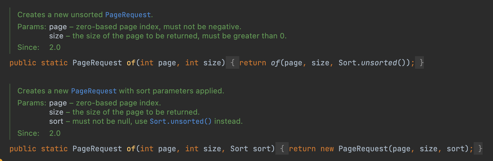
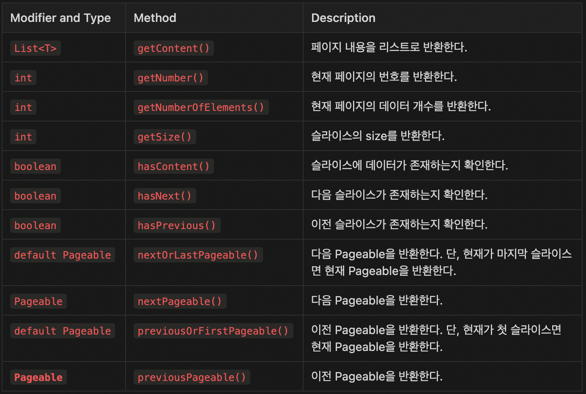
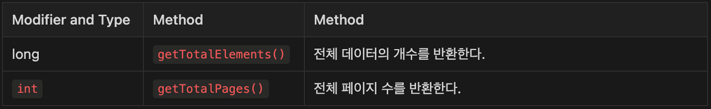

> 이 글은 우테코 달록팀 크루 [파랑](https://github.com/summerlunaa)이 작성했습니다.

Spring Data JPA에서는 Pagination을 위한 두 가지 객체를 제공한다. 바로 Slice와 Page다. Repository 코드를 먼저 보자.

```java
public interface MemberRepository extends JpaRepository<Member, Long> {
    Slice<Member> findSliceBy(final Pageable pageable);
        Page<Member> findPageBy(final Pageable pageable);
}

// Controller
// queryParameter를 통해 page, size를 받는다
@GetMapping("/api/members")
public List<MemberResponse> findAll(@RequestParam int page, @RequestParam int size) {
    // 생략
}

// Service
PageRequest pageRequest = PageRequest.of(page, size); // pageRequest 생성
Slice<Member> slices = memberRepository.findSliceBy(pageRequest); // repository에서 페이지 가져오기
Page<Member> pages = memberRepository.findPageBy(pageRequest);
```

메서드를 보면 파라미터로 `Pageable` 객체를 받는다. **`Pageable` 객체는 Pagination을 위한 정보를 저장하는 객체**다. `Pageable` 인터페이스의 구현체인 `PageRequest`의 인스턴스를 생성하여 메서드 인자로 넘겨줄 수 있다.



`PageRequest`는 정적 팩토리 메서드 `of`를 사용하여 인스턴스를 생성할 수 있다. `PageRequest`는 인자로 page, size, 필요하다면 sort까지 받을 수 있다.

- `page` : 0부터 시작하는 페이지 인덱스 번호
- `size` : 한 페이지에 반환할 데이터의 개수
- `sort` : 정렬 방식

page와 size를 쿼리 파라미터로 받아 `PageRequest`를 생성하여 Repository 메서드에 넘겨주는 것으로 간단하게 Pagination을 구현할 수 있는 것이다.

## Slice VS Page

```java
public interface MemberRepository extends JpaRepository<Member, Long> {
    Slice<Member> findSliceBy(final Pageable pageable);
        Page<Member> findPageBy(final Pageable pageable);
}
```

Repository의 메서드를 보면 반환 값으로 `Slice` 혹은 `Page`를 받을 수 있다. 둘은 어떤 차이가 있을까?

### Slice


`Slice`는 `Streamable`을 상속받는 인터페이스로 Pagination과 관련된 여러 메서드를 갖고 있다. 대표적인 메서드 몇 가지만 살펴보자.



현재 페이지의 내용을 확인하거나 다음 페이지, 이전 페이지에 대한 정보를 가져올 수 있다. 그렇다면 `Page`는 무엇일까?

### Page


`Page`는 `Slice`를 상속한다. 따라서 `Slice`가 가진 모든 메서드를 `Page`도 사용할 수 있다. 다만 `Page`가 다른 점은 **조회 쿼리 이후 전체 데이터 개수를 조회하는 쿼리가 한 번 더 실행된다는 것**이다.

Page가 추가적으로 구현하고 있는 메서드 두 가지만 살펴보자.



Page의 경우 전체 데이터 개수를 조회하는 쿼리가 추가적으로 실행되므로 Slice와 다르게 전체 데이터 개수나 전체 페이지 수까지 확인할 수 있다.

> 추가적으로..

```java
public interface PagingAndSortingRepository<T, ID> extends CrudRepository<T, ID> {

    Iterable<T> findAll(Sort sort);

    Page<T> findAll(Pageable pageable);
}
```

`Page`를 반환받을 경우 아래처럼 **`Page`를 반환하는 `findAll` 메서드가 이미 존재**한다. 따로 Repository Interface에 메서드를 추가해주지 않아도 `findAll` 메서드에 `Pageable` 객체를 넘겨주면 Pagination을 사용할 수 있다. (Slice를 반환하려면 메서드를 정의해주어야 한다.)

### Slice VS Page 어떤 걸 사용해야 할까?

`Slice`는 전체 데이터 개수를 조회하지 않고 이전 or 다음 `Slice`가 존재하는지만 확인할 수 있다. 따라서 **`Slice`는 무한 스크롤 등을 구현하는 경우 유용**하다. `Page`에 비해 쿼리가 하나 덜 날아가므로 **데이터 양이 많을수록 `Slice`를 사용하는 것이 성능상 유리**하다.

`Page`는 전체 데이터 개수를 조회하는 쿼리를 한 번 더 실행한다. 따라서 **전체 페이지 개수나 데이터 개수가 필요한 경우 유용**하다.

> 알록에서는 카테고리 조회를 무한 스크롤로 구현하므로 Slice를 사용했다.

## 컨트롤러에서 queryParameter를 Pageable 객체로 받는 방법

앞에선 queryParameter를 통해 page, size를 받아 PageRequest를 만들어 넘겨주는 방법을 설명했다.

```java
// Controller
// queryParameter를 통해 page, size를 받는다
@GetMapping("/api/members")
public List<MemberResponse> findAll(@RequestParam int page, @RequestParam int size) {
    // 생략
}
```

하지만 이렇게 구현하니까 *“ModelAttribute를 통해 queryParameter를 DTO로 받는 것처럼, queryParameter를 Pageable 객체로 받을 수 없을까?”*하는 의문이 생겼다. 직접 ArgumentResolver를 구현할 뻔했지만 찾아보니 역시 똑똑한 JPA.. Pageable 객체를 인수로 설정하면 어노테이션 없이도 자동으로 객체를 만들어준다. `PageableHandlerMethodArgumentResolver` 가 이미 구현되어 있기 때문이다.

```java
// Controller
// Pageable 객체를 바로 받을 수 있다.
@GetMapping("/api/members")
public List<MemberResponse> findAll(Pageable pagealbe) {
    // 생략
}

// Service
Slice<Member> slices = memberRepository.findSliceBy(pageable); // PageReqeust를 생성할 필요 없이 바로 객체를 넘겨줄 수 있다.
```

이렇게 사용하면 PageReqeust를 생성할 필요 없이 바로 객체를 넘겨줄 수 있어 훨씬 편하다. 하지만 문제가 한 가지 발생한다. **프론트에서는 page index를 1부터 계산하는 것과 달리 Pageable은 page index를 0부터 계산한다.** 따라서 page의 인덱스를 1부터 시작하도록 설정할 필요가 있다.

## page 인덱스를 1부터 시작하도록 설정하기

### 방법 1. PageableHandlerMethodArgumentResolverCustomizer 커스터마이징 하기

```java
@Configuration
public class CustomPageableConfiguration {
    @Bean
    public PageableHandlerMethodArgumentResolverCustomizer customize() {
        return p -> p.setOneIndexedParameters(true);
    }
}
```

따로 `CustomPageableConfiguration` 클래스를 만들어 `PageableHandlerMethodArgumentResolverCustomizer`를 커스터마이징 해주는 방법이 있다. 여기서 `setOneIndexedParameters` 메서드를 통해 인덱스를 1부터 시작하게 설정할 수 있다.

### 방법 2. application-properties에 설정 추가하기

```java
spring.data.web.pageable.one-indexed-parameters=true
```

### 유의점

이렇게 인덱스를 1부터 시작하도록 설정하더라도 **이후에 반환받은 `Slice`, `Page` 객체에서는 page 인덱스가 다시 0부터 시작**한다. 따라서 **`getNumber` 등의 메서드를 통해 page 번호를 받으면 -1씩 차이가 난다는 사실을 잊어선 안 된다.** 유의해서 사용하자.

### References

[https://tecoble.techcourse.co.kr/post/2021-08-15-pageable/](https://tecoble.techcourse.co.kr/post/2021-08-15-pageable/)

[https://treasurebear.tistory.com/59](https://treasurebear.tistory.com/59)

[https://docs.spring.io/spring-data/commons/docs/current/api/org/springframework/data/domain/Slice.html](https://docs.spring.io/spring-data/commons/docs/current/api/org/springframework/data/domain/Slice.html)

[https://docs.spring.io/spring-data/commons/docs/current/api/org/springframework/data/domain/Page.html](https://docs.spring.io/spring-data/commons/docs/current/api/org/springframework/data/domain/Page.html)
