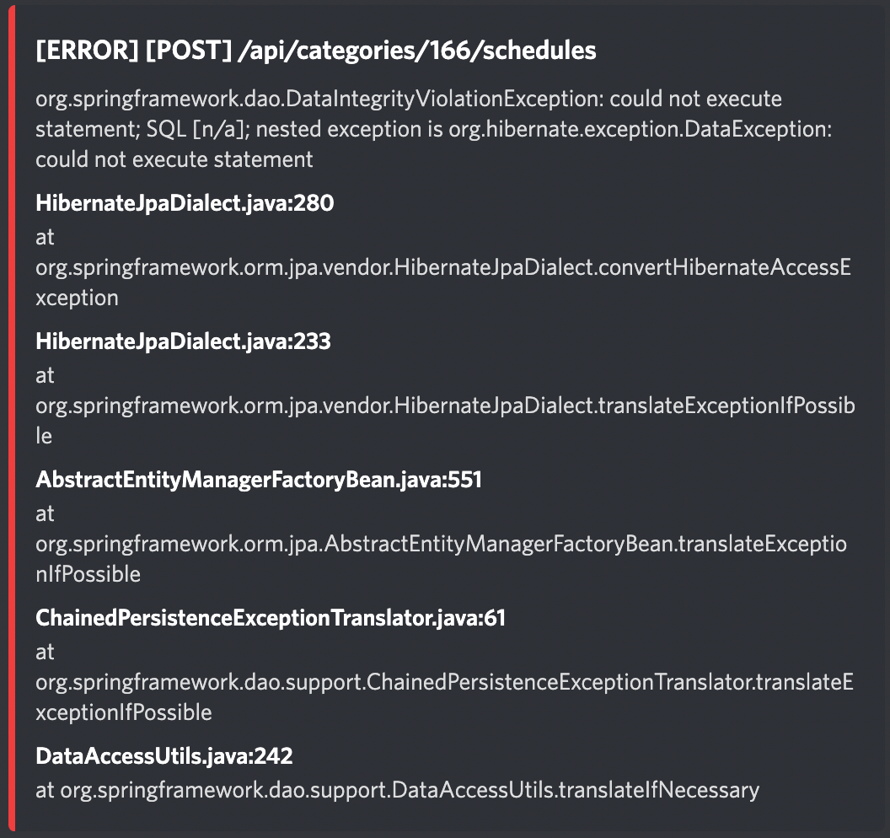
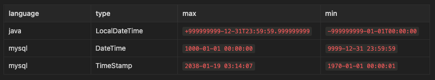
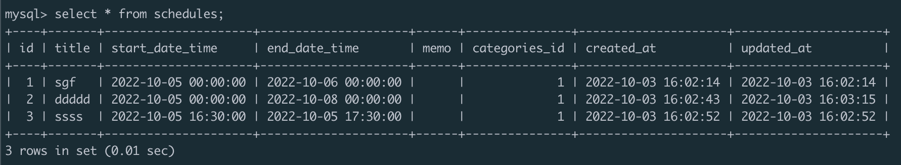
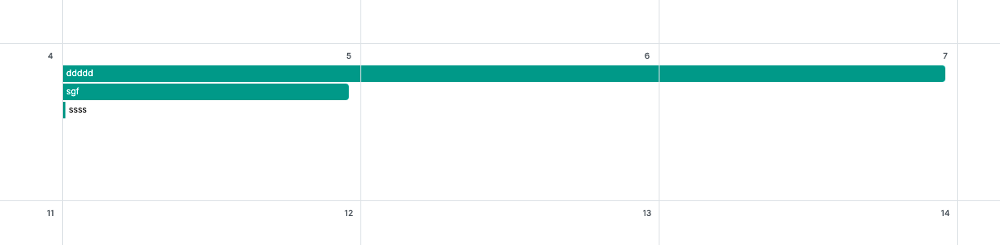

> 이 글은 우테코 달록팀 크루 [파랑](https://github.com/summerlunaa)이 작성했습니다.

## 문제 상황

```sql
CREATE TABLE IF NOT EXISTS schedules (
  ...
  start_date_time timestamp NOT NULL DEFAULT CURRENT_TIMESTAMP,
  end_date_time timestamp NOT NULL DEFAULT CURRENT_TIMESTAMP,
  created_at timestamp NOT NULL DEFAULT CURRENT_TIMESTAMP,
  updated_at timestamp NOT NULL DEFAULT CURRENT_TIMESTAMP,
	...
);
```

달록은 스케줄의 시작 일시와 종료 일시의 타입이 `timestamp` 로 지정되어 있다. 우리가 따로 날짜 범위에 대한 검증을 해주고 있지 않아 특정 날짜 범위를 벗어나면 아래와 같은 예외가 발생했다.



그제서야 날짜의 최대 최소 값을 알아보았다.



java의 경우 거의 무제한이라고 봐도 무방했다. 문제는 mysql이었다.

TimeStamp는 min, max 값이 너무 작았다. 이대로 계속 TimeStamp를 쓰게 되면 우리 달록 서비스의 수명은 최대 2038년이 되는 것이었다. 생각보다 이 문제가 유명해서 이를 `2038 문제`라 부른다고 한다.

[https://namu.wiki/w/2038년 문제](https://namu.wiki/w/2038%EB%85%84%20%EB%AC%B8%EC%A0%9C)

이는 캘린더 서비스를 제공하는 달록에게는 치명적인 부분이었다. ~~달록이 그때까지 살아 있으면 소원이 없겠..~~

## TimeStamp와 DateTime의 차이점

TimeStamp가 DateTime과 다른 점은 **시스템의 Time Zone 설정에 따라 시간이 변경**된다는 것이다. 이런 특성 때문에 글로벌 서비스를 필요로 하는 경우 TimeStamp를 유용하게 사용할 수 있다.

하지만 달록은 아직 글로벌 서비스를 염두에 두고 있지 않아 Time Zone에 따라 자동으로 시간이 바뀌는 것에 대한 필요성을 느끼지 못했다. 오히려 달력 서비스임에도 일정이 2038년까지만 등록되는 것이 더 큰 문제로 느껴졌다.

> 따라서 달록은 일정의 start date time, end date time의 타입을 TimeStamp에서 DateTime으로 바꿔주기로 했다.

## 타입을 변경해도 서비스 로직에 문제가 생기지 않는지 확인

실제로 타입을 변경하기 전, local에서 schema.sql을 변경하여 start_date_time, end_date_time의 타입을 변경해도 서비스 로직이 잘 동작하는지 확인해보았다.

```sql
// schema.sql
CREATE TABLE IF NOT EXISTS schedules (
  ...
  start_date_time datetime NOT NULL,
  end_date_time datetime NOT NULL,
  ...
);
```

기본은 `datetime(6)` 이며 괄호 안의 숫자는 datetime의 소수점 자리수를 나타낸다. 최대 6자리까지 지정할 수 있다. 하지만 달록에서는 소수점까지는 사용하지 않기 때문에 `datetime` 으로 지정했다.





그 결과 타입을 datetime으로 변경해도 서비스 로직이 잘 동작하는 것을 확인할 수 있었다.

### Reference

[https://kciter.so/posts/deep-dive-into-datetime](https://kciter.so/posts/deep-dive-into-datetime)

[https://dev.mysql.com/doc/refman/8.0/en/datetime.html](https://dev.mysql.com/doc/refman/8.0/en/datetime.html)
