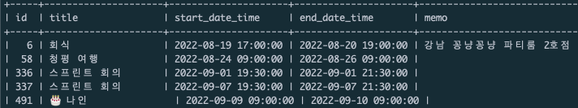
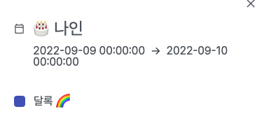
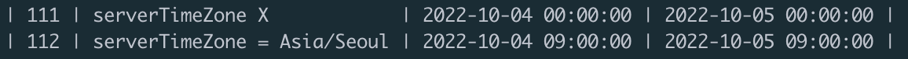
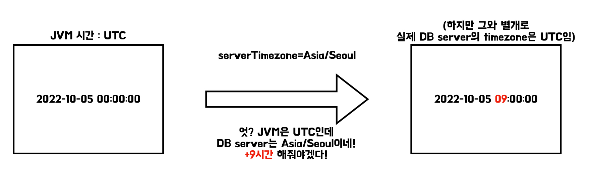

> 이 글은 우테코 달록팀 크루 [파랑](https://github.com/summerlunaa)이 작성했습니다.

## 문제 상황



어느날 실제 배포 서버의 DB를 확인해보았는데 start/end date time이 전부 +9시간되어 저장된 것을 확인했다.



분명 서비스에서는 00시 00분으로 잘 나오는데 왜 DB에만 9시간이 더해져서 저장되는 걸까?

## 원인 찾기

### 가정 1. MySQL Server timezone이 UTC여서일 것이다. ❌

KST에서 UTC로 바뀌면서 시간이 변한 거라면 시간이 +9가 아니라 -9가 되었어야 했다. 그리고 Time Zone을 변경해도 계속해서 +9가 되어 시간이 저장되는 것은 변함이 없었다.

- Ubuntu의 Server Time Zone 변경하는 방법

    ```bash
    # Using timedatectl command (추천)
    > sudo timedatectl set-timezone "Asia/Seoul"
    > timedatectl  # 확인
    							 Local time: Tue 2022-10-04 21:31:53 KST
               Universal time: Tue 2022-10-04 12:31:53 UTC
                     RTC time: Tue 2022-10-04 12:31:54
                    Time zone: UTC (KST, +0900)
    System clock synchronized: yes
                  NTP service: active
              RTC in local TZ: no
    
    # Using /etc/localtime Symlink
    > sudo cp /usr/share/zoneinfo/Asia/Seoul /etc/localtime # 변경
    > date # 현재 시간 확인
    > sudo service mysql restart # mysql 재시작
    
    > sudo rm -f /etc/localtime # UTC로 되돌리기
    ```

- MySQL의 Time Zone 확인하기

    ```bash
    > SELECT @@time_zone, now(); # timezone과 현재 시간 확인
    +-------------+---------------------+
    | @@time_zone | now()               |
    +-------------+---------------------+
    | SYSTEM      | 2022-10-04 12:32:40 |
    +-------------+---------------------+
    
    > SHOW VARIABLES WHERE Variable_name LIKE '%time_zone%'; # system timezone 확인
    +------------------+--------+
    | Variable_name    | Value  |
    +------------------+--------+
    | system_time_zone | UTC    |
    | time_zone        | SYSTEM |
    +------------------+--------+
    ```


> 물론 MySQL Server Time Zone 설정을 바꾸지 않아 생기는 문제도 있다. 모든 시간이 UTC 기준으로 저장되고 있기 때문이다. Time Zone 설정을 KST로 바꾸면 모든 시간이 전부 +9가 된다.

하지만 DB에 시간이 +9가 되어 저장되는 문제의 원인은 아니었다.

### 가정 2. yml 파일 설정의 `serverTimezone` 설정 때문이다. ⭕️

```java
spring:
	datasource:
    driver-class-name: com.mysql.cj.jdbc.Driver
    url: jdbc:mysql://어쩌고저쩌고/dallog?serverTimezone=Asia/Seoul
```

설마하는 마음으로 설정을 제거해보니 시간이 정상적으로 들어가는 것을 확인할 수 있었다.



그렇다면 이 문제는 왜 발생하는 것일까? 아래 그림을 보자.



JVM의 timezone은 기본값인 UTC로 설정된 상태다. 여기서 yml 설정을 통해 db의 serverTimezone을 Asia/Seoul이라고 알려줬다. 이때문에 DB에 시간이 저장되는 과정에서 자동으로 9시간을 더해준 것이다. DB에서 시간을 가져올 때는 반대로 -9시간을 적용하기 때문에 서비스 로직에는 아무 문제가 없었다.

시간을 다룰 때 MySQL 서버 뿐만 아니라 JVM의 Time Zone도 고려해야 함을 잊지 말자!

## 해결 방법

내가 찾은 해결 방법은 두 가지다.

### 1. serverTimezone 설정을 제거한다.

원인을 찾았으니 원인인 serverTimezone 설정을 제거하면 문제를 해결할 수 있다.

```java
spring:
	datasource:
    driver-class-name: com.mysql.cj.jdbc.Driver
    url: jdbc:mysql://어쩌고저쩌고/dallog # 설정 제거
```

### 2. JVM의 시간 변경

설정을 제거하지 않고 문제를 해결하기 위해서는 JVM의 Time Zone과 mysql server의 Time Zone을 동일하게 맞춰주어야 한다.

jar 파일 실행 시 timezone 설정을 통해 Time Zone을 Asia/Seoul로 맞춰주면 문제를 해결할 수 있다.

```bash
# -Duser.timezone=Asia/Seoul
nohup java -jar -Duser.timezone=Asia/Seoul -Dspring.profiles.active=${SPRING_PROFILE} /home/ubuntu/$JAR_NAME > /dev/null 2>&1 &
```

> 달록의 경우 2번을 통해 JVM 시간과 mysql의 server 시간을 모두 Asia/Seoul로 맞춰주기로 했다.

#### Reference

[https://dev.mysql.com/doc/connector-j/8.0/en/connector-j-time-instants.html](https://dev.mysql.com/doc/connector-j/8.0/en/connector-j-time-instants.html)

[https://tecadmin.net/linux-change-timezone/](https://tecadmin.net/linux-change-timezone/)

[https://velog.io/@kyu/Timestamp-와-Datetime](https://velog.io/@kyu/Timestamp-%EC%99%80-Datetime)

**Special Thanks To `애쉬` & `차리`**
