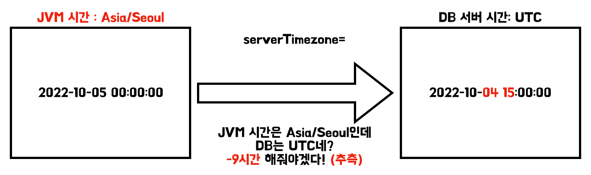

> 이 글은 우테코 달록팀 크루 [파랑](https://github.com/summerlunaa)이 작성했습니다.

시간과 날짜를 다루는 달록을 개발하다보니 타임존을 설정할 수 있는 곳과 그 방법이 아주 다양하다는 걸 알게 되었다. 설정 방법과 그 결과를 공유해보려 한다.

# TimeZone 설정할 수 있는 곳

## 1. yml 파일 설정

```java
spring:
	datasource:
    driver-class-name: com.mysql.cj.jdbc.Driver
    url: jdbc:mysql://어쩌고저쩌고/dallog?serverTimezone=Asia/Seoul
```

이 설정은 실제로 DB 서버의 타임존을 변경하지는 않는다. 단순히 Spring에게 DB의 서버 타임존이 이것이니, 이에 맞게 동작(time zone에 맞춰 시간을 더하거나 빼주는 행위)하라고 알려주는 것 뿐이다.

다른 설정 없이 이 설정만 적용하면 모든 datetime 값이 아래처럼 +9시간 되어 저장된다.


## 2. MySQL 서버 설정

여기서 타임존을 바꾸려면 timedatectl을 사용하는 방법과 symlink를 사용하는 방법이 있다.

```sql
# 1. Using timedatectl command (추천)
> sudo timedatectl set-timezone "Asia/Seoul"

# 2. Using /etc/localtime Symlink
> sudo cp /usr/share/zoneinfo/Asia/Seoul /etc/localtime

# timedatectl로 변경사항 확인
> timedatectl
							 Local time: Tue 2022-10-04 21:31:53 KST
           Universal time: Tue 2022-10-04 12:31:53 UTC
                 RTC time: Tue 2022-10-04 12:31:54
                Time zone: UTC (KST, +0900)
System clock synchronized: yes
              NTP service: active
          RTC in local TZ: no

# date 명령어로 현재 시간 확인
# 위의 값과 다를 수 있으니 둘 다 확인하는 것이 좋다
> date 

# mysql에 time zone 적용을 위해 재시작한다
> sudo service mysql restart 

# UTC로 되돌리기
# 주의: sudo timedatectl set-timezone "UTC" 명령어를 사용해도 원래대로 돌아가지 않는다. 꼭 아래의 명령어를 사용해서 파일을 삭제해주어야 한다.
> sudo rm -f /etc/localtime # UTC로 되돌리기
```

MySQL 안에서 확인하려면 아래의 명령어를 사용하면 된다. 값이 SYSTEM인 경우 서버의 설정 값을 따라간다는 뜻이다.

```sql
> SHOW VARIABLES WHERE Variable_name LIKE '%time_zone%';
+------------------+--------+
| Variable_name    | Value  |
+------------------+--------+
| system_time_zone | KST    |
| time_zone        | SYSTEM |
+------------------+--------+

> SELECT @@GLOBAL.time_zone, @@SESSION.time_zone;
+--------------------+---------------------+
| @@GLOBAL.time_zone | @@SESSION.time_zone |
+--------------------+---------------------+
| SYSTEM             | SYSTEM              |
+--------------------+---------------------+
```

이는 말 그대로 MySQL의 타임존을 변경하는 것이다. 다른 설정들이 모두 UTC인데 db 서버만 KST로 변경하는 것은 무의미하다. 다른 특별한 설정이 없으므로 직접 시간을 넣어주는 `start_date_time`, `end_date_time`의 경우 값이 그대로 들어간다. 하지만  `created_at` , `updated_at` 과 같이 현재 시간이 찍히는 값은 UCT 시간으로 저장된다.

## 3. system properties의 user.timezone 설정

이 변수를 설정하는 방법은 두 가지가 있다.

### 3-1. jar 파일 실행 시 설정

```bash
# -Duser.timezone=Asia/Seoul
nohup java -jar -Duser.timezone=Asia/Seoul -Dspring.profiles.active=${SPRING_PROFILE} /home/ubuntu/$JAR_NAME > /dev/null 2>&1 &
```

system properties의 user.timezone을 설정할 수 있다. 이를 설정하면 `created_at` , `updated_at` 과 같이 현재 시간이 찍히는 값도 한국 시간으로 DB에 잘 저장된다.

### 3-2. 애플리케이션 레벨에서 SpringBoot 설정

```java
@Configuration
public class TimeZoneConfig {

    public static final String DEFAULT_TIME_ZONE = "Asia/Seoul";

    @PostConstruct
    public void setDefaultTimeZone() {
        TimeZone.setDefault(TimeZone.getTimeZone(DEFAULT_TIME_ZONE));
    }
}
```

`TimeZone.setDefault` 메서드를 사용하면 같은 설정을 애플리케이션 레벨에서 설정할 수 있다. 메서드를 자세히 보면 아래와 같은 로직이 있다. 즉, 3-1 방법과 동일하게 system properties의 user.timezone의 값을 바꿔주는 것이다.

```java
SecurityManager sm = System.getSecurityManager();
if (sm != null) {
		sm.checkPermission(new PropertyPermission("user.timezone", "write"));
}
```

로컬에서는 이렇게 해도 서버 시간이 잘 변경되지만 이상하게 배포 서버에서는 설정이 적용되지 않고 모든 시간이 -9시간으로 저장된다. 다른 팀에서도 같은 문제를 겪었다고 한다. 분명 3번이랑 같은 변수를 설정해주는 방법인데 왜 결과가 다르게 나오는지 모르겠다.

아마 아래와 같은 느낌으로 동작하는 것 같지만 원인은 모른다.



이 경우 MySQL의 타임존을 Asia/Seoul로 JVM 시간과 같게 맞춰주면 원하는 대로 동작한다.

## 정리

원하는 결과: DB에 일정의 일시와 데이터의 생성, 수정 일시가 한국 시간으로 들어갔으면 좋겠다.

|  | JVM 타임존 | DB 타임존 | 결과 |
| --- | --- | --- | --- |
| 1. yml 설정 | UTC | UTC | 모두 +9로 저장 |
| 2. MySQL 서버 설정 | UTC | Asia/Seoul | 일정의 일시는 원하는 대로 저장, 데이터의 생성, 수정 일시가 -9로 저장 |
| 3-1. jar 파일 실행 시 설정 | Asia/Seoul | UTC | 모두 원하는 대로 저장 |
| 3-2. 애플리케이션 레벨에서 SpringBoot 설정 | Asia/Seoul | UTC | 모두 -9로 저장 |

결론: 지금으로썬 3-1 방법이 가장 간단한 방법이다.

**Special Thanks To `제이슨`**
