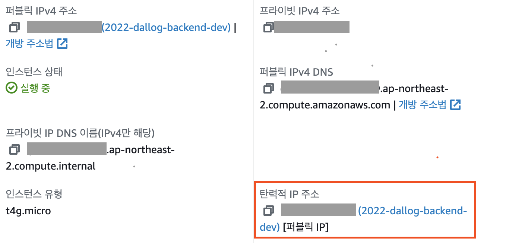
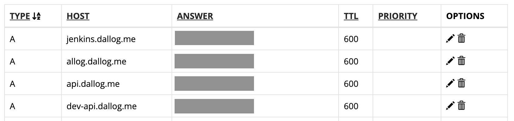

> 이 글은 우테코 달록팀 크루 [파랑](https://github.com/summerlunaa)이 작성했습니다.

## 실제 배포 설정

그럼 이제 실제로 어떤 과정을 통해 배포를 진행했는지 자세히 살펴보겠습니다.

## EC2 생성

EC2 → 인스턴스 → 인스턴스 시작

### 이름 및 태그

- 이름: ec2-dallog-XXXX
- 태그: `Role` - `student`

### 애플리케이션 및 OS 이미지

- `Ubuntu`
- 아키텍처: `64비트(Arm)`

### 인스턴스 유형

- `t4g.micro`

### 키 페어

- `key-dallog`

### 네트워크 설정

- VPC
  - PROJECT

- 보안 그룹
    - 기존 보안 그룹 선택: `SG-PROJECT-DEFAULT`

## 탄력적 IP(Elastic IP) 설정

[AWS 공식 문서](https://docs.aws.amazon.com/ko_kr/AWSEC2/latest/UserGuide/elastic-ip-addresses-eip.html)

### 탄력적 IP란?

- 동적 클라우드 컴퓨팅을 위해 고안된 정적 IPv4 주소 (IPv6는 지원X)
- 탄력적 IP 주소는 AWS 계정에 할당되며 릴리스할 때까지 할당된 상태로 유지된다.

원래 EC2 인스턴스를 생성하면 동적 IP를 할당받습니다. 따라서 인스턴스를 중지했다가 다시 시작하면 IP가 바뀝니다. IP가 계속 바뀌면 배포 설정을 계속해서 바꿔줘야 하겠죠? 탄력적 IP는 고정 IP 주소이기 때문에 인스턴스를 중지했다 재시작해도 IP 주소가 바뀌지 않습니다.

### 설정

- EC2 → 네트워크 및 보안 → 탄력적 IP → 탄력적 IP 주소 할당
- 태그: `Role` - `student` → 할당
- 작업 → 탄력적 IP 주소 연결 → 원하는 인스턴스 선택 → 프라이빗 주소 선택 → 연결

## 도메인(DNS) 설정

- `jenkins.dallog.me`
    - 달록의 젠킨스 서버
- `allog.dallog.me`
    - 달록의 프론트 서버 (현재 ssl 인증서 발급 문제로 해당 서브 도메인 사용 중. 추후 dallog.me로 변경 예정)
- `api.dallog.me`
    - 달록의 백엔드 WS 운영 서버
- `dev-api.dallog.me`
    - 달록의 백엔드 개발 서버

#### 여기서 잠깐, `TTL`이란?

Time To Live. DNS 변경 사항이 적용되기까지 걸리는 시간. 단위는 초.

#### 여기서 잠깐, `레코드 타입` 어떻게 다를까?

- `A`
    - 정규화된 도메인 이름/호스트명을 IPv4에 연결한다.
    - `HOST`: 도메인에 접두사 부여   ex) api.dallog.me
    - `ANSWER`: IP   ex) 123.456.123.456
- `CNAME`
    - 실제 호스프명(A 레코드)와 연결되는 별칭 도메인을 정의한다.
    - `HOST`: 도메인에 접두사 부여   ex) api.dallog.me
    - `ANSWER`: 연결할 별칭 도메인 정의
- `TXT`
    - 임의의 문자열로 구성된 값. 소유한 도메인에 TXT 레코드를 추가하여 유효한 도메인인지 판단할 수 있다.
