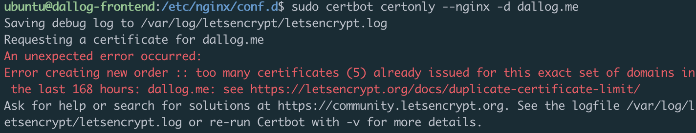

> 이 글은 우테코 달록팀 크루 [파랑](https://github.com/summerlunaa)이 작성했습니다.

## NGINX 설치

### NGINX란?

[달록 기술블로그 - 리버의 NGINX 란?](https://dallog.github.io/what_is_nginx/)

### 설치

```bash
$ sudo apt update # 운영체제에서 사용 가능한 패키지들과 그 버전에 대한 정보(리스트) 업데이트 
$ sudo apt install nginx -y # nginx 설치
$ nginx -v # 설치한 nginx 버전 확인
$ sudo service nginx status # nginx 상태 확인
```

## SSL 인증서 발급 (with Certbot)

### Let’s Encrypt

90일짜리 단기 인증서를 무료로 발급해주는 곳입니다. 주기적으로 재발급 해줘야 합니다.

### Snapd 설치

[snapcraft 공식문서 - Installing snap on Ubuntu](https://snapcraft.io/docs/installing-snap-on-ubuntu)

certbot은 snapd로 certbot을 설치하는 것을 권장하고 있습니다. 리눅스 통합 패키지 관리 툴인 snapd를 먼저 설치해봅시다.

```bash
$ sudo apt update
$ sudo apt install snapd
```

### Certbot 설치

[certbot 공식 문서 - certbot 설치](https://certbot.eff.org/instructions?ws=apache&os=centosrhel7)

```bash
$ sudo snap install core; 
$ sudo snap install --classic certbot # certbot 설치
$ sudo ln -s /snap/bin/certbot /usr/bin/certbot # certbot 명령어를 사용하기 위해 심볼릭링크 걸기
$ certbot --version # 버전 확인
```

### SSL 인증서 발급 방법

[certbot 공식 문서 - 인증서 발급 방법](https://eff-certbot.readthedocs.io/en/stable/using.html#apache)

Certbot을 통해 SSL 인증서를 발급받는 방법은 여러가지가 있습니다. 그 중 몇 가지를 간단하게 살펴볼게요. 달록은 Nginx 방법을 사용했습니다.

- `**Nginx**` (우리가 사용한 방법)
    - 인증 및 설치를 위해 nginx 플러그인을 사용한다. nginx에 대한 인증서 취득 및 설치가 자동적으로 이루어진다.
- `Webroot`
    - 기능이 동작하고 있는 로컬 웹 서버를 실행 중이라면 웹 서버를 중지하면 안 되는 경우가 있다. 그런 경우 webroot 방식을 사용할 수 있다.
    - 웹의 디렉토리 내에 인증서의 유효성을 확인할 수 있는 임시 파일을 만들어 인증을 진행한다.
    - 한 번에 하나의 도메인만 발급 가능하다.
- `Standalone`
    - 인증서 발급을 위해 기존의 웹 서버를 중지해야 한다.
    - 인증을 위해 80 포트로 가상의 standalone 웹서버를 띄워 인증서를 발급한다.
    - 한 번에 여러 도메인을 발급할 수 있다.
- `Manual`
    - 도메인의 유효성 검증을 직접 수행하는 경우 사용한다.
    - 디렉토리에 특정 이름과 특정 내용을 가진 임시 파일을 만들어야 한다. webroot 방식과 비슷하지만 자동으로 진행되지 않는다.
    - 도메인에 `_acme-challenge` 를 붙인 TXT DNS 레코드를 설정해주어야 한다.

        ```bash
        # 예시
        _acme-challenge.example.com. 300 IN TXT "gfj9Xq...Rg85nM"
        ```


### 인증서 발급하기

그럼 이제 Nginx 방법을 사용해서 인증서를 발급받아 보겠습니다.

```bash
$ sudo certbot certonly --nginx -d {도메인 이름}
```

- `certonly`
    - 자동으로 nginx 설정을 수정하지 않고 인증서만 발급받는 옵셥입니다. 자동으로 어떻게 설정되는지 확실히 알지 못하는 경우엔 certonly로 받는 것이 나을 수 있습니다.
- `—-nginx`
    - nginx 방식을 활용하겠다는 의미입니다.

### Nginx 설정

이제 nginx 설정을 위해서 설정 파일을 생성합니다. `/etc/nginx/conf.d` 디렉토리로 이동하여 `default.conf` 파일을 생성합니다. 꼭 sudo로 명령어를 입력해야 합니다.

```bash
$ cd /etc/nginx/conf.d
$ sudo vim default.conf
```

> ⚠️ 주의: `sites-available` 과 `sites-enabled` 는 더 이상 사용되지 않는 nginx 설정 방법입니다.
>

`sites-available` 과 `sites-enabled` 두 디렉토리는 sym link로 연결되어 있습니다. 기존 방식은 `sites-available`에 여러 설정파일들을 때려 박은 다음에 `sites-enabled`에 원하는 설정을 선택적으로 동기화하는 방식입니다. 이는 비효율적인 방법이므로 더 이상 사용되지 않는다고 합니다.

**따라서 `sites-available` 에 기본 설정 파일이 있다면 제거해줍시다.**

<br>

`default.conf` 파일을 생성했다면 아래와 같이 내용을 적어줍니다.

```bash
# dallog-frontend /etc/nginx/conf.d/default.conf

# 80 포트로 요청이 오는 경우 https가 적용된 url로 redirect 한다.
server {
  listen 80;
  server_name dallog.me;

  return 301 https://dallog.me;
}

# 443 포트로 요청이 오는 경우
server {
  listen 443 ssl http2;
  server_name dallog.me;

	# SSL 인증을 위한 pem key 위치를 설정한다.
  ssl_certificate /etc/letsencrypt/live/dallog.me/fullchain.pem;
  ssl_certificate_key /etc/letsencrypt/live/dallog.me/privkey.pem;

	# front의 경우 정적 페이지를 보여주기 위해 index.html 위치를 설정한다.
  location / {
    root /usr/share/nginx/html;
    index index.html;
    try_files $uri $uri/ /index.html;
  }
}
```

```bash
# dallog-ws /etc/nginx/conf.d/default.conf

server {
  listen 80;
  server_name api.dallog.me;

  return 301 https://api.dallog.me;
}

server {
  listen 443 ssl http2;
  server_name api.dallog.me;

  ssl_certificate /etc/letsencrypt/live/api.dallog.me/fullchain.pem;
  ssl_certificate_key /etc/letsencrypt/live/api.dallog.me/privkey.pem;

	# web server의 경우 리버스 프록시를 위한 proxy 설정이 들어간다.
  location / {
    proxy_pass http://{backend-prod server ip}; # backend-prod server ip
    proxy_set_header Host $http_host;
    proxy_set_header X-Real-IP $remote_addr;
    proxy_set_header X-Forwarded-For $proxy_add_x_forwarded_for;
    proxy_set_header X-Forwarded-Proto $scheme;
  }
}
```

- `proxy_pass` : 프록시 주소, 백엔드 운영 서버 ip를 넣어준다.
- `proxy_set_header Host $http_host` : HTTP Request의 Host 헤더 값, 클라이언트가 요청한 원래 호스트 주소
- `X-Real-IP $remote_addr`: 실제 방문자의 원격 ip 주소
- `X-Forwarded-For $proxy_add_x_forwared_for` : 클라이언트가 프록시 처리한 모든 서버의 IP 주소를 포함하는 목록
- `X-forwarded-Proto $scheme` : HTTP의 구조로 http or https를 의미한다. HTTPS 서버 블록 내에서 사용할 경우 프록시 서버의 HTTP 응답이 HTTPS로 변환된다.

### Nginx 설정 이후 재시작

설정을 끝냈다면 적용을 위해 Nginx를 재시작 해주어야 합니다.

```bash
# nginx 재시작, 둘 중 하나 선택
$ sudo service nginx reload
$ sudo service nginx restart
```

## 인증서 발급 시 발생할 수 있는 에러

인증서 발급 시 발생할 수 있는 에러들을 알아봅시다. 아래 두 가지 에러는 실제로 달록이 SSL 인증서를 발급받는 과정에서 겪은 에러입니다.

### 1. too many failed authorizations recently

[Let's encrypt 공식 문서 - failed validation limit](https://letsencrypt.org/docs/failed-validation-limit/)

```bash
$ sudo certbot certonly --nginx -d api.dallog.me

Saving debug log to /var/log/letsencrypt/letsencrypt.log
Requesting a certificate for api.dallog.me
An unexpected error occurred:
Error creating new order :: too many failed authorizations recently: see https://letsencrypt.org/docs/failed-validation-limit/
Ask for help or search for solutions at https://community.letsencrypt.org. See the logfile /var/log/letsencrypt/letsencrypt.log or re-run Certbot with -v for more details.
```

이 오류는 계정, 호스트 네임, 시간당 5번의 유효성 검사 실패시 발생합니다. 몇 시간(3-4시간 정도) 기다리면 제한이 풀립니다. 그 때 다시 시도하면 됩니다.

### 2. too many certificates

[Let's encrypt 공식 문서 - duplicate certificate limit](https://letsencrypt.org/docs/duplicate-certificate-limit/)



문제는 이 두 번째 에러입니다. 이 오류는 주당 5번이라는 인증서 발급 횟수 제한을 넘긴 경우 발생합니다. 이 경우 일주인간 인증서 발급이 제한됩니다(…🥲). 이 오류를 피하기 위해서는 인증서를 재발급 받는 대신 pem key를 복사해서 사용해야 합니다. **재발급은 신중히 받도록 합시다.**

## 기타 인증서 관련 명령어

### 인증서 자동 갱신

```bash
$ sudo certbot renew --dry-run
```

### 인증서 삭제

```bash
$ certbot delete --cert-name {인증서 이름}
```

<br>
 
- reference
  - [후디 블로그 - Nginx와 Let's Encrypt로 HTTPS 웹 서비스 배포하기 (feat. Certbot)](https://hudi.blog/https-with-nginx-and-lets-encrypt/)
  - [2. Nginx 설치 부터 spring boot 기반 앱 배포 - Cerbot 인증서 발급과 SSL 적용](https://velog.io/@jihyunhillpark/2.-spring-boot-기반-앱-배포-Cerbot-인증서-발급과-SSL-적용)
  - [4. SSL 인증서(letsencrypt) 발급](https://blog.naver.com/PostView.naver?blogId=kangdydtjs&logNo=222546308110&from=search&redirect=Log&widgetTypeCall=true&directAccess=false)

#### Special Thanks To `승팡`
