> 이 글은 우테코 달록팀 크루 '[매트](https://github.com/hyeonic)'가 작성했습니다.

## Git-flow

git 브랜치 전략 중 하나이다, 이것은 어떠한 기능을 나타내는 것이 아니라 방법론이다. 각각의 프로젝트와 개발 환경에 따라 알맞게 수정하여 사용해야 한다.

이 게시글은 git을 알고 사용해 본 경험이 있다는 것을 전제로 작성하였다. 또한 직접 프로젝트에 적용하고 연습하고 있기 때문에 정답이 될 수 없고, 지속적으로 개선할 예정이다.

## Git Repository

프로젝트에 적용하기 앞서 어떠한 형태로 Git Repository가 구성되는지 살펴보았다.

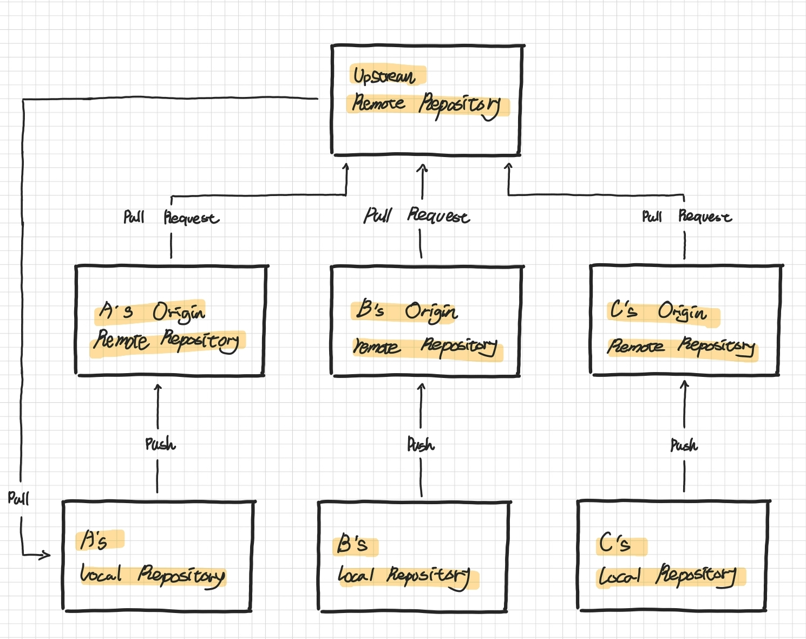

### Upstream Remote Repository

개발자가 공유하는 저장소로 최신 소스코드가 저장되어 있는 원격 저장소이다.

#### 적용하기

이러한 Remote Repository 생성을 위하여 github에 New organization을 사용히였다.

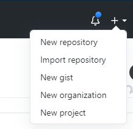

다양한 기능을 제공하는 Team과 Enterprice는 월마다 일정 금액을 사용해야 한다. 하지만 간단한 프로젝트 진행을 위해 생성하였기 때문에 Free만 사용하여도 충분한 실습과 프로젝트를 진행할 수 있다.

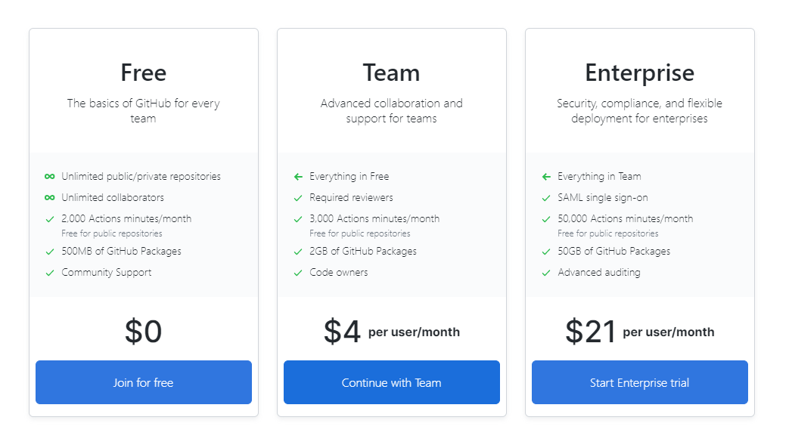

organization을 생성하게 되면 소속된 repository를 생성할 수 있다. 이것을 `Upstream Remote Repository`로 적용한다.

### A's, B's, C's Origin Remote Repository

`Upstream Repository`를 Fork한 원격 개인 저장소이다. Upstream Repository를 직접 clone하여 작업하는 것이 아니라 각각의 팀원들이 `Fork`를 하여 원격 저장소를 생성하고 그것을 clone하여 `Local Repository`를 생성하여 작업한다.

이렇게 두 개의 remote repository로 나눈 이유는 Upstream repository의 경우 `팀원이 공유`하고 있는 Repository이기 때문에 다양한 시도를 하기에 큰 위험 부담을 가지고 있다. 각자의 개인 repository에서 `작업을 시도`한 후 적절한 기능 merge 하기 위해 `Pull Request`를 요청한다.

### 운영 방식

git-flow는 기본적으로 5가지의 브랜치를 사용하여 운영한다.

 * `main`: 제품으로 출시될 수 있는 브랜치
 * `develop`: 다음 출시 버전을 개발하는 브랜치
 * `feature`: 기능을 개발하는 브랜치
 * `release`: 이번 출시 버전을 준비하는 브랜치
 * `hotfix`: 출시 버전에서 발생한 버그를 수정하는 브랜치

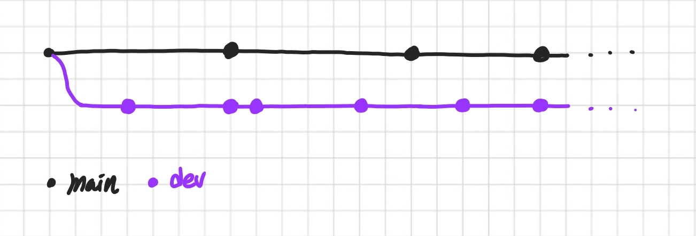

`main`과 `develop` 브랜치이다. 두 브랜치는 항시 운영되어야 하는 브랜치이다. `develop`는 개발을 위한 브랜치이고, `main`은 제품으로 출시될 수 있는 브랜치 이기 때문에 `항시 배포 가능한 상태`이어야 한다.

`main`과 `develop`은 `Upstream remote repository`에서 운영한다.

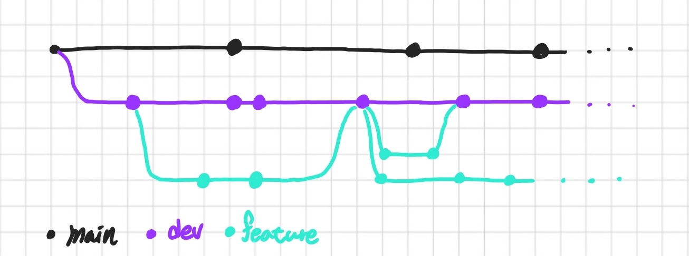

`feature` 브랜치는 단위 기능을 개발하는 브랜치이다. 기능 개발이 완료되면 `develop` 브랜치와 `merge` 된다.

`develop`은 모든 팀원이 `공유`하는 브랜치이다. feature는 각자 맡아 작성한 코드들이 들어 있는 브랜치이다. merge 작업 전에 팀원들 간의 `지속적인 코드 리뷰`가 필요하다.

그렇기 때문에 `Pull Request`를 사용하여 `merge` 작업 전 리뷰어들에게 코드 리뷰를 받고 반영 사항을 수정하여 commit 후 merge 한다. 이 과정은 `협업에서 가장 중요한 부분`이라고 생각된다.

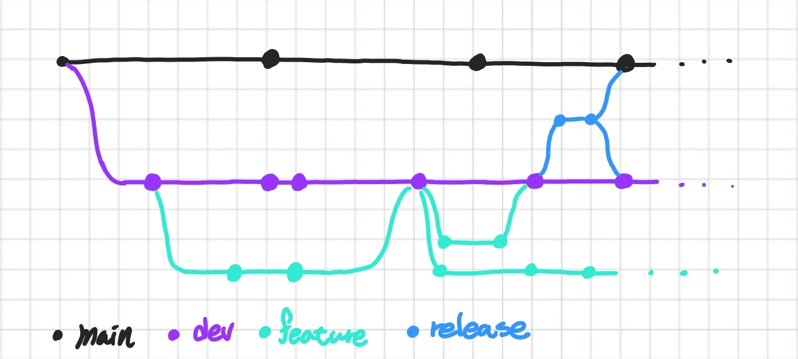

`release` 브랜치는 배포를 하기 전에 충분한 검증을 위해 생성하는 브랜치이다. 배포 가능한 상태가 되면 `main` 브랜치로 `merge` 작업을 거친다. 또한 `develop`에도 반영사항을 모두 `merge` 시켜야 한다.

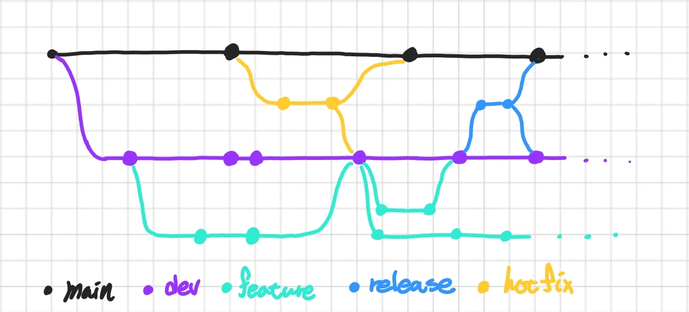

`hotifx` 브랜치는 배포 중 버그가 생겨 긴급하게 수정해야 하는 브랜치이다. 배포 이후에 이루어지는 브랜치이고, 반영 사항을 `main`과 `develop`에 모두 적용 시켜야 한다.

앞서 말했듯이 `main`과 `develop`는 항시 운영되는 브랜치이다. 이 둘을 제외한 나머지 브랜치 들은 제 역할이 마무리 되어 `merge` 작업이 완료되면 브랜치를 삭제하여 정리한다.

### 간단히 적용해보기

`Upstream Remote Repository`를 기반으로 원격 개인 저장소에 `Fork` 해야 한다.

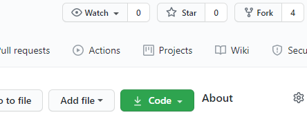

Organization에 생성한 repository에 Fork를 누르면 손쉽게 할 수 있다. Fork로 생성된 repository를 기반으로 `Local Repository`를 생성해야 한다.

```bash
git clone https://github.com/{개인 github 이름}/{repository 이름}.git
```

git clone을 사용하여 원격 저장소에 있는 repository를 손쉽게 clone할 수 있다.

```bash
$ git remote -v

origin  https://github.com/{github 사용자 이름}/{repository 이름}.git (fetch)
origin  https://github.com/{github 사용자 이름}/{repository 이름}.git (push)
```

clone 받은 local repository를 git remote -v로 확인해보면 원격 저장소가 등록되어 있는 것을 확인 할 수 있다. 매번 최신 코드를 `fetch` 및 `rebase` 하기 위해서는 `Upstream`을 등록해야 한다.

```bash
$ git remote add upstream https://github.com/{organization 이름}/{repository 이름}.git

$ git remote -v

origin  https://github.com/{github 사용자 이름}/{repository 이름}.git (fetch)
origin  https://github.com/{github 사용자 이름}/{repository 이름}.git (push)
upstream        https://github.com/{organization 이름}/{repository 이름}.git
upstream        https://github.com/{organization 이름}/{repository 이름}.git
```

`git remote add upstream`을 통하여 upstream을 등록한다. 정상적으로 등록 된 것을 확인할 수 있다. 이제 작업할 때 마다 브랜치를 생성하고 최신 코드를 pull 받아야 한다.

우리 팀원은 각각 개발해야 하는 기능을 github issue에 등록한 후 등록 번호를 기반으로 브랜치를 생성하기로 하였다.

우선 간단한 예시를 위하여 이슈를 등록한다.

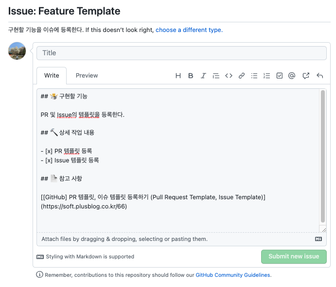

3번 번호가 부여된 이슈라고 가정한다. 해당 번호를 기반으로 `local repository`에서 feature 브랜치를 생성한다.

```bash
$ git branch feature/3-init-setting
$ git checkout feature/3-init-setting
```

이제 Upstream에 있는 remote repository에서 최신 소스코드를 받아 와야 한다.

```bash
$ git fetch upstream
$ git rebase upstream/develop
```

git pull을 사용하여 등록한 upstream develop에서 commit 기록을 병합한다. 이제 신나게 작업을 진행하고 자신의 원격 저장소인 `Origin remote repository`에 push한다.

```bash
$ git push origin feature/3-init-setting
```

그렇게 github repository를 살펴보면 `변경을 감지`하고 pull request를 생성할 것인지에 대한 탭을 확인할 수 있다.

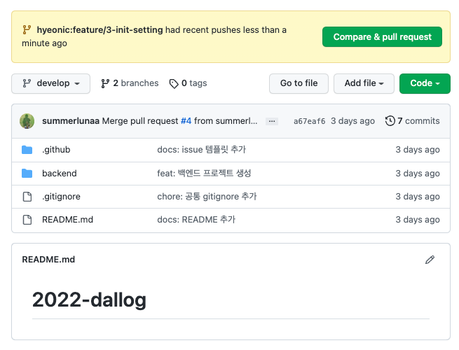

이제 fork한 개인 원격 저장소를 살펴보면 새롭게 작성한 브랜치를 감지하고 pull request 작성을 위한 버튼이 생성된다.

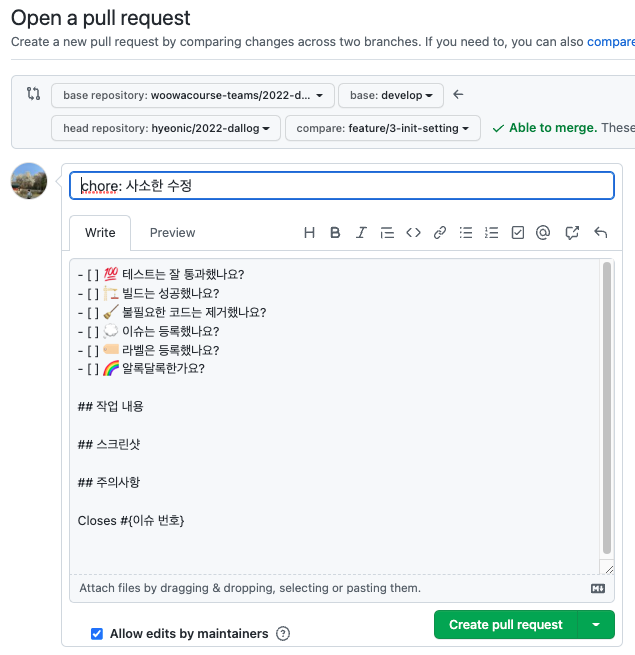

`feature/3-init-setting` 브랜치를 develop에 merge하기 위한 pull request를 진행하는 예시이다. 작성한 코드를 리뷰해줄 팀원들을 선택하고, commit한 코드의 내용을 간단히 요약하여 작성한다. 이제 생성한 PR을 기반으로 `코드리뷰`를 진행한다. 변경 사항이 적용되면 develop에 반영하기 위해 merge한다.

### 달록에 맞게 수정하기

git-flow는 빠르게 급변하는 웹 서비스에는 맞지 않은 git 브랜치 전략이다. 관리해야 할 브랜치가 늘어나기 때문에 개발자들이 신경써야 할 포인트가 늘어난다. 

빈번한 배포로 인해 급작스러운 이슈가 발생할 수 있다. 즉 예상치 못한 롤백이 자주일어날 수 있다. 또한 웹 서비스의 특성상 다양한 릴리즈 버전을 유지할 필요가 없다. 이러한 특성들로 인해 웹 서비스에는 다소 보수적인 git-flow 전략은 맞지 않을 수 있다.

그럼에도 우리 달록팀은 git-flow를 선택했다. 우리는 실제 운영할 수 있는 서비스를 개발하며 다양한 경험을 습득해야 한다. 또한 대부분의 팀원들이 git에 익숙하지 않았으며 다양한 시도를 통해 빠르게 학습해야 한다. 

대신 git-flow를 정석적으로 사용하지 않고 필요한 부분을 수정하여 반영하려 한다. 현재 수준에서 `develop`에서 대부분의 빌드를 진행하기 때문에 `release` 브랜치의 필요성이 다소 옅어졌다. 결국 `release`를 제외한 `main`, `develop`, `feature`, `hotfix`만 사용하기로 결정하였다.

### 달록이 집중한 것

달록의 팀 각 구성원들은 맡은 이슈를 기반으로 브랜치를 생성한 뒤 작업을 진행할 것이다. 결국 다수의 브랜치가 아래와 같이 병렬적으로 커밋이 쌓이게 된다.

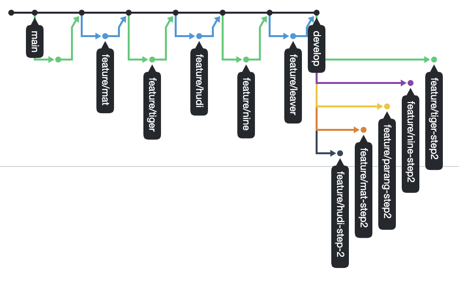

만약 팀원 중 한명이 작업을 끝내서 PR이 merge된 상황이라고 가정하자. develop 브랜치의 커밋 베이스는 변경됬으며 이전에 작업을 진행하던 브랜치들은 시작점이 뒤로 밀려나게 된다. 

여러 사람이 하나의 저장소를 기반으로 작업을 진행하기 때문에 함께 사용하는 공간의 코드들은 충돌을 야기할 가능성이 크다. 즉 지속적인 `fetch` + `rebase`를 통해 사전에 충돌에 대비하며 항상 `develop` 브랜치와 커밋 싱크를 맞춘다.

정리하면 위 그림과 같이 항시 develop 브랜치의 끝 단에서 시작해야 한다. 이러한 방식은 코드의 충돌을 최소화할 수 있으며 순차적인 git 커밋 목록을 기반으로 쉽게 기능이 추가된 것을 확인할 수 있다.

## 정리

지금까지 간단히 `git-flow의 흐름`과 이것을 기반으로 `달록에 적용한 과정`들을 알아보았다. git-flow는 언급한 것 처럼 부가적인 브랜치로 인해 `관리에 대한 부담감`을 느낄 수 있다. 하지만 `upstream`과 `origin`을 분리한 환경은 좀 더 도전적인 과제들을 적용하기에 매우 좋은 환경을 구성해준다. 또한 `pull request`를 통한 코드 리뷰를 통해 보다 더 양질의 애플리케이션 개발에 힘쓸 수 있다.

## References.

[git flow; 환상과 현실 그 사이에 서비스](https://vallista.kr/git-flow;-%ED%99%98%EC%83%81%EA%B3%BC-%ED%98%84%EC%8B%A4-%EA%B7%B8-%EC%82%AC%EC%9D%B4%EC%97%90-%EC%84%9C%EB%B9%84%EC%8A%A4/)<br>
[우린 Git-flow를 사용하고 있어요](https://woowabros.github.io/experience/2017/10/30/baemin-mobile-git-branch-strategy.html)<br>
