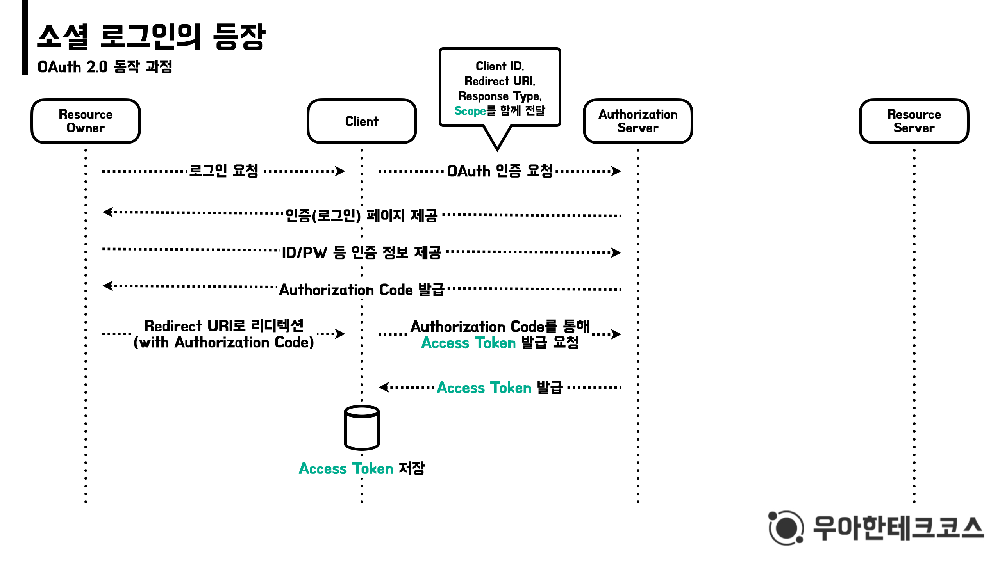
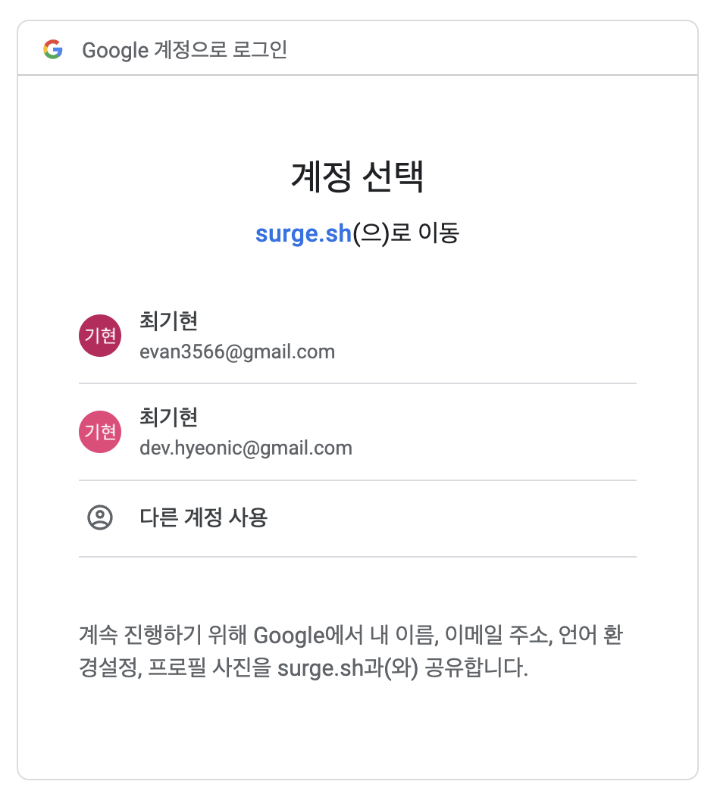
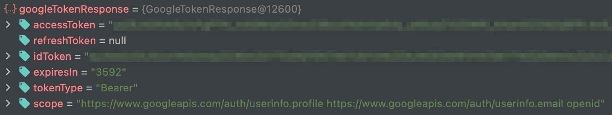
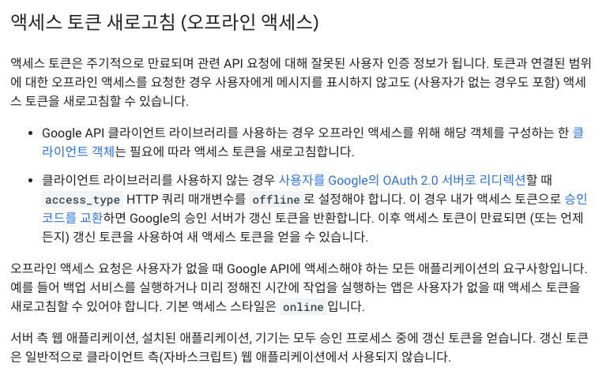
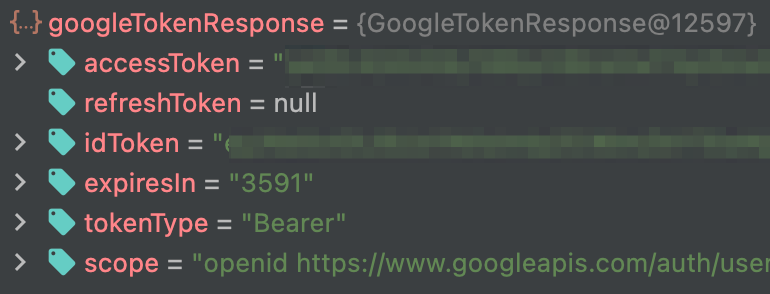
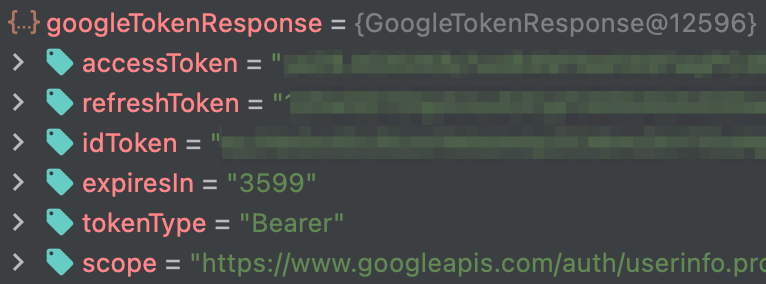

> 이 글은 우테코 달록팀 크루 [매트](https://github.com/hyeonic)가 작성했습니다.

## Google은 Refresh Token을 쉽게 내주지 않는다.

우리 [달록](https://github.com/woowacourse-teams/2022-dallog)은 캘린더를 손쉽게 공유할 수 `구독형 캘린더 공유 서비스`이다. 현재에는 우리 서비스 내에서만 일정이 등록 가능한 상태이다. 추후 확장성을 고려하여 `Google Calendar API`와 연동하기 위해 Google에서 제공하는 token 정보를 관리해야 하는 요구사항이 추가 되었다.

## code를 활용한 AccessToken 및 IdToken 발급

Google은 OAuth 2.0 요청 때 적절한 `scope(e.g. openid)`를 추가하면 `OpenID Connect`를 통해 Google 리소스에 접근 가능한 `Access Token`, AccessToken을 재발급 받기 위한 `Refresh Token`, 회원의 정보가 담긴 `IdToken`을 발급해준다. 

`Access Token`의 경우 짧은 만료 시간을 가지고 있기 때문에 google `Access Token` 재발급을 위한 `Refresh Token`을 저장하고 관리해야 한다. `Refresh Token`은 `Access Token`보다 긴 만료 시간을 가지고 있기 때문에 보안에 유의해야 한다. 그렇기 때문에 프론트 측에서 관리하는 것 보다 달록 DB에 저장한 뒤 관리하기로 결정 하였다. 참고로 Google은 보통 아래와 같은 이유가 발생할 때 `Refresh Token`을 만료시킨다고 한다.

[Refresh Token 만료](https://developers.google.com/identity/protocols/oauth2#expiration)

 * 사용자가 앱의 액세스 권한을 취소한 경우
 * Refresh Token이 6개월 동안 사용되지 않은 경우
 * 사용자가 비밀번호를 변경했으며 Gmail scope가 포함된 경우
 * 사용자가 계정에 부여된 Refresh Token 한도를 초과한 경우
 * 세션 제어 정책이 적용되는 Google Cloud Platform 조직에 사용자가 속해있는 경우

정리하면 `Refresh Token`은 만료 기간이 비교적 길기 때문에 서버 측에서 안전하게 보관하며 필요할 때 리소스 접근을 위한 `Access Token`을 발급 받는 형태를 구상하게 되었다.

우리 [달록](https://github.com/woowacourse-teams/2022-dallog)은 아래와 같은 형태로 인증이 이루어진다. 



> _달록팀 후디 고마워요!_

프론트 측에서 `OAuth 인증`을 위해서는 달록 서버에서 제공하는 `OAuth 인증을 위한 페이지 uri`을 활용해야 한다. 달록 서버는 해당 uri를 생성하여 전달한다. 로직은 아래 코드로 구현되어 있다.

```java
@Component
public class GoogleOAuthUri implements OAuthUri {

    private final GoogleProperties properties;

    public GoogleOAuthUri(final GoogleProperties properties) {
        this.properties = properties;
    }

    @Override
    public String generate() {
        return properties.getOAuthEndPoint() + "?"
                + "client_id=" + properties.getClientId() + "&"
                + "redirect_uri=" + properties.getRedirectUri() + "&"
                + "response_type=code&"
                + "scope=" + String.join(" ", properties.getScopes());
    }
}
```

이제 브라우저에서 해당 uri에 접속하면 아래와 같은 페이지를 확인할 수 있다.



계정을 선택하면 `redirect uri`와 함께 `code` 값이 전달되고, google의 token을 발급 받기 위해 백엔드 서버로 `code` 정보를 전달하게 된다. 아래는 실제 code 정보를 기반으로 google token을 생성한 뒤 `id token`에 명시된 정보를 기반으로 회원을 생성 or 조회한 뒤 `달록 리소스에 접근하기 위한 access token`을 발급해주는 API이다.

```java
@RequestMapping("/api/auth")
@RestController
public class AuthController {

    private final AuthService authService;

    public AuthController(final AuthService authService) {
        this.authService = authService;
    }
    ...
    @PostMapping("/{oauthProvider}/token")
    public ResponseEntity<TokenResponse> generateToken(@PathVariable final String oauthProvider,
                                                       @RequestBody final TokenRequest tokenRequest) {
        TokenResponse tokenResponse = authService.generateToken(tokenRequest.getCode());
        return ResponseEntity.ok(tokenResponse);
    }
    ...
}
```

 * `authService.generateToken(tokenRequest.getCode())`: code 정보를 기반으로 google 토큰 정보를 조회한다. 메서드 내부에서 [code을 액세스 토큰 및 ID 토큰으로 교환](https://developers.google.com/identity/protocols/oauth2/openid-connect#exchangecode)에서 제공된 형식에 맞춰 google에게 code 정보를 전달하고 토큰 정보를 교환한다. 

실제 Google에서 토큰 정보를 교환 받는 클라이언트를 담당하는 `GoogleOAuthClient`이다. 핵심은 인가 코드를 기반으로 `GoogleTokenResponse`를 발급 받는 다는 것이다.
```java
@Component
public class GoogleOAuthClient implements OAuthClient {

    private static final String JWT_DELIMITER = "\\.";

    private final GoogleProperties properties;
    private final RestTemplate restTemplate;
    private final ObjectMapper objectMapper;

    public GoogleOAuthClient(final GoogleProperties properties, final RestTemplateBuilder restTemplateBuilder,
                             final ObjectMapper objectMapper) {
        this.properties = properties;
        this.restTemplate = restTemplateBuilder.build();
        this.objectMapper = objectMapper;
    }

    @Override
    public OAuthMember getOAuthMember(final String code) {
        // code을 액세스 토큰 및 ID 토큰으로 교환
        GoogleTokenResponse googleTokenResponse = requestGoogleToken(code);
        String payload = getPayload(googleTokenResponse.getIdToken());
        UserInfo userInfo = parseUserInfo(payload);

        String refreshToken = googleTokenResponse.getRefreshToken();
        return new OAuthMember(userInfo.getEmail(), userInfo.getName(), userInfo.getPicture(), refreshToken);
    }

    private GoogleTokenResponse requestGoogleToken(final String code) {
        HttpHeaders headers = new HttpHeaders();
        headers.setContentType(MediaType.APPLICATION_FORM_URLENCODED);
        MultiValueMap<String, String> params = generateTokenParams(code);

        HttpEntity<MultiValueMap<String, String>> request = new HttpEntity<>(params, headers);
        return fetchGoogleToken(request).getBody();
    }

    private MultiValueMap<String, String> generateTokenParams(final String code) {
        MultiValueMap<String, String> params = new LinkedMultiValueMap<>();
        params.add("client_id", properties.getClientId());
        params.add("client_secret", properties.getClientSecret());
        params.add("code", code);
        params.add("grant_type", "authorization_code");
        params.add("redirect_uri", properties.getRedirectUri());
        return params;
    }

    private ResponseEntity<GoogleTokenResponse> fetchGoogleToken(
            final HttpEntity<MultiValueMap<String, String>> request) {
        try {
            return restTemplate.postForEntity(properties.getTokenUri(), request, GoogleTokenResponse.class);
        } catch (RestClientException e) {
            throw new OAuthException(e);
        }
    }

    private String getPayload(final String jwt) {
        return jwt.split(JWT_DELIMITER)[1];
    }

    private UserInfo parseUserInfo(final String payload) {
        String decodedPayload = decodeJwtPayload(payload);
        try {
            return objectMapper.readValue(decodedPayload, UserInfo.class);
        } catch (JsonProcessingException e) {
            throw new OAuthException("id 토큰을 읽을 수 없습니다.");
        }
    }

    private String decodeJwtPayload(final String payload) {
        return new String(Base64.getUrlDecoder().decode(payload), StandardCharsets.UTF_8);
    }
    ...
}
```

이제 Google에게 제공 받은 `Refresh Token`을 저장해보자.

## Refresh Token에 채워진 null

이게 무슨 일인가, 분명 요청 형식에 맞춰 헤더를 채워 디버깅을 해보면 계속해서 `null` 값으로 전달되고 있는 것이다. 즉, Google 측에서 Refresh Token을 보내주지 않고 있다는 것을 의미한다.



다시 한번 [액세스 토큰 새로고침 (오프라인 액세스)](https://developers.google.com/identity/protocols/oauth2/web-server#offline)를 살펴보았다.



정리하면 [Google OAuth 2.0 서버로 리디렉션](https://developers.google.com/identity/protocols/oauth2/web-server#redirecting)할 때 query parameter에 `access_type`을 `offline`으로 설정해야 한다는 것이다. 다시 되돌아 가서 Google 인증 요청을 위한 uri를 생성하는 메서드를 아래와 같이 수정하였다.

```java
@Component
public class GoogleOAuthUri implements OAuthUri {

    private final GoogleProperties properties;

    public GoogleOAuthUri(final GoogleProperties properties) {
        this.properties = properties;
    }

    @Override
    public String generate() {
        return properties.getOAuthEndPoint() + "?"
                + "client_id=" + properties.getClientId() + "&"
                + "redirect_uri=" + properties.getRedirectUri() + "&"
                + "response_type=code&"
                + "scope=" + String.join(" ", properties.getScopes()) + "&"
                + "access_type=offline"; // 추가된 부분
    }
}
```

이제 다시 요청을 진행해보자! 분명 `refresh token`이 정상적으로 교환될 것이다.

## 또 다시 Refresh Token에 채워진 null

분명 문서에 명시한 대로 설정을 진행했지만 아직도 동일하게 `null` 값이 채워져 있다.



> _해달라는 데로 다해줬는데..._

## 엄격한 Google

Google은 OAuth 2.0을 통해 인증을 받을 때 Refresh Token을 굉장히 엄격하게 다룬다. 사용자가 로그인을 진행할 때 마다 Refresh Token 정보를 주는 것이 아니라, Google에 등록된 App에 최초 로그인 할 때만 제공해준다. 즉, 재로그인을 진행해도 Refresh Token은 발급해주지 않는다. 

Google의 의도대로 동작하려면 내가 우리 서비스에 최초로 로그인을 진행하는 시점에만 Refresh Token을 발급받고 서버 내부에 저장한 뒤 필요할 때 꺼내 사용해야 한다.

하지만 우리 서버는 모종의 이유로 최초에 받아온 Refresh Token을 저장하지 못할 수 있다. 이때 [Google OAuth 2.0 서버로 리디렉션](https://developers.google.com/identity/protocols/oauth2/web-server#redirecting)할 때 `prompt`를 `consent`로 설정하게 되면 매 로그인 마다 사용자에게 동의를 요청하기 때문에 강제로 `Refresh Token`을 받도록 지정할 수 있다.

이제 진짜 마지막이다. 아래와 같이 수정한 뒤 다시 디버깅을 진행하였다.

```java
@Component
public class GoogleOAuthUri implements OAuthUri {

    private final GoogleProperties properties;

    public GoogleOAuthUri(final GoogleProperties properties) {
        this.properties = properties;
    }

    @Override
    public String generate() {
        return properties.getOAuthEndPoint() + "?"
                + "client_id=" + properties.getClientId() + "&"
                + "redirect_uri=" + properties.getRedirectUri() + "&"
                + "response_type=code&"
                + "scope=" + String.join(" ", properties.getScopes()) + "&"
                + "access_type=offline"
                + "prompt=consent"; // 추가된 부분
    }
}
```



정상적으로 발급 되는 것을 확인할 수 있다!

## 문제점

하지만 여기서 문제가 하나 있다. 단순히 `prompt`를 `consent`로 설정할 경우 우리 서비스에 가입된 사용자는 Google OAuth 2.0 인증을 진행할 때 매번 재로그인을 진행해야 한다. 이것은 사용자에게 매우 `불쾌한 경험`으로 다가올 수 있다. 즉 우리는 매번 `재로그인`을 통해 Refresh Token을 발급 받는 것이 아닌, 최초 로그인 시 `Refresh Token`을 발급 받은 뒤 적절한 저장소에 저장하고 관리해야 한다.

그렇다면 실제 운영 환경이 아닌 테스트 환경에서는 어떻게 해야 할까? 운영 환경과 동일한 `Google Cloud Project`를 사용할 경우 최초 로그인을 진행할 때 `내 권한 정보가 등록`된다. 즉 Refresh Token을 재발급 받을 수 없다는 것을 의미한다. 

우리 달록은 운영 환경과 테스트 환경에서 서로 다른 `Google Cloud Project`를 생성하여 관리하는 방향에 대해 고민하고 있다. 이미 Spring Profile 기능을 통해 각 실행 환경에 대한 설정을 분리해두었기 때문에 쉽게 적용이 가능할 것이라 기대한다. 정리하면 아래와 같다.

 * `운영 환경`: Refresh Token 발급을 위해 `accept_type`을 `offline`으로 설정한다. 단 최초 로그인에만 Refresh Token을 발급 받기 위해 `prompt`는 명시하지 않는다.
 * `개발 환경`: 개발 환경에서는 매번 DataBase가 초기화 되기 때문에 Refresh Token을 유지하여 관리할 수 없다. 테스트를 위한 추가적인 `Google Cloud Project`를 생성한 뒤, `accept_type`을 `offline`으로, `prompt`는 `consent`로 설정하여 매번 새롭게 Refresh Token을 받도록 세팅한다.

## 정리

영어를 번역기로 해석한 수준의 문장으로 인해 많은 시간을 삽질하게 되었다. 덕분에 Google에서 의도하는 Refresh Token에 대한 사용 방식과 어디에서 저장하고 관리해야 하는지에 대해 좀 더 깊은 고민을 할 수 있게 되었다. 만약 나와 같은 상황에 직면한 사람이 있다면 이 글이 도움이 되길 바란다!

## References.

[dallog repository](https://github.com/woowacourse-teams/2022-dallog)<br>
[https://github.com/devHudi](https://github.com/devHudi)<br>
[passport.js에서 구글 OAuth 진행 시 Refresh Token을 못 받아오는 문제 해결](https://m.blog.naver.com/dldbdgml99/222013891067)<br>
