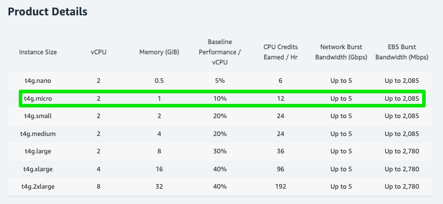
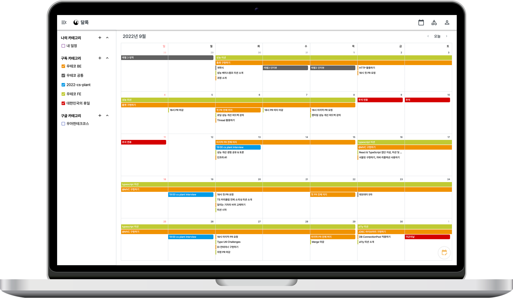
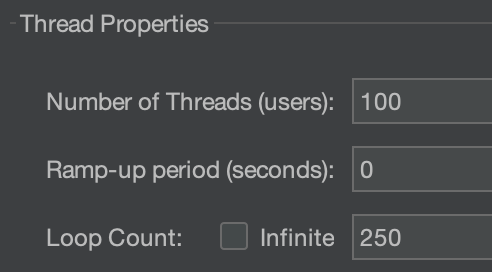
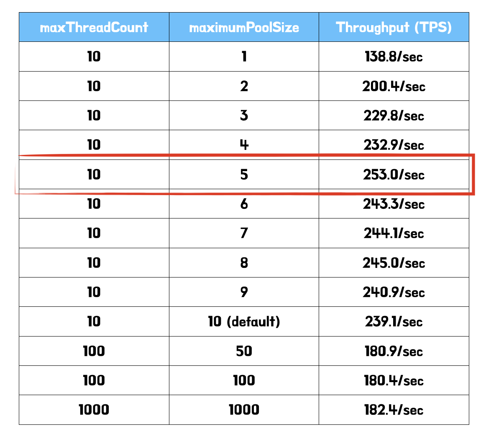
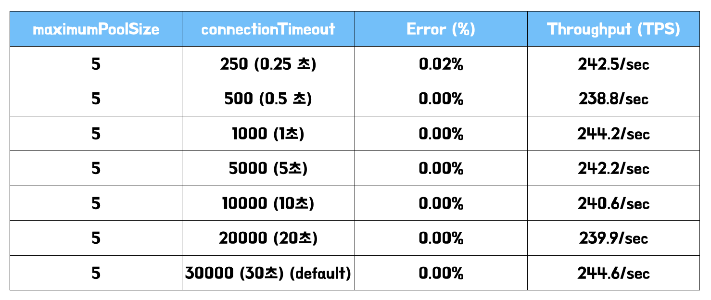

> 이 글은 우테코 달록팀 크루 [매트](https://github.com/hyeonic)가 작성했습니다.

## HikariCP와 적절한 풀 사이즈 고민하기 (2) - 삽질편

[About Pool Sizing](https://github.com/brettwooldridge/HikariCP/wiki/About-Pool-Sizing)

HikariCP 공식 문서에 따르면 디스크 및 네트워크의 `block` 시간을 고려하면 아래와 같은 공식을 제안했다. 또한 여러 데이터베이스에도 적용할 수 있다고 언급되어 있다. 

> *connections = (core_count * 2) + effective_spindle_count*

## 서버 사양 살펴보기

우선 현재 우리가 사용하고 있는 데이터베이스 서버의 사양을 살펴보자.



EC2 T4g 인스턴스는 `Arm` 기반 AWS Gravition2 프로세서로 구동되며 T3 인스턴스에 비해 최대 40% 더 나은 가격 성능을 제공한다. 다양한 상품이 존재하지만 우리에게 허락된 사양은 `2개의 vCPU`와 `1GB` 메모리를 가진 `t4g.micro` 뿐이었다.

## Tomcat 스레드 풀 세팅

[톰캣 튜닝을 위한 달록의 서버 성능 테스트 준비 과정](https://dallog.github.io/preparing-for-performance-test/)

이전 성능 테스트를 진행할 때 사용한 세팅을 그대로 활용한다. 

```yaml
server:
  tomcat:
    accept-count: 10
    max-connections: 8192
    threads:
      max: 10

...
```

## 공식에 대입하기

> 5 = (2 * 2) + 1

CPU 코어의 개수는 `2개(core_count)`이며 `1개(effective_spindle_count)`의 디스크를 활용하고 있다. 위 공식은 절대적인 것은 아니지만 기준으로 잡고 테스트를 진행해보았다.

먼저 성능 테스트는 `JMeter`를 활용하여 진행하였다.

`JMeter` 는 아파치 재단에서 개발한 성능 테스트를 위한 도구이다. 순수 Java로 개발된 애플리케이션이다. 웹 애플리케이션 서버 성능 테스트를 위해 개발되었지만, 현재는 FTP, 데이터베이스, TCP 등 여러 프로토콜의 성능을 테스트할 수 있도록 발전하였다.

먼저 우리 서비스에서 `주로 조회되는 API`를 기준으로 성능 테스트를 진행하였다. 달록에서 가장 많은 요청은 `한달 단위로 자신이 체크한 일정 정보를 조회하는 API`이다.



실제 API는 아래와 같다.

```
GET /api/members/me/schedules?startDateTime=2022-09-15T00:00&endDateTime=2022-11-15T00:00    
```

`startDateTime`와 `endDateTime`을 활용하여 특정 날짜 사이에 존재하는 일정 정보를 조회하는 로직이다. 

> 간단한 확인을 위해 외부 요청 로직은 배제하고 진행한다.

유의미한 결과를 획득하기 위해 미리 데이터베이스에 `100만건`의 일정 정보를 세팅해두었다.

```
mysql> SELECT COUNT(*) FROM schedules;
+----------+
| COUNT(*) |
+----------+
|  1000000 |
+----------+
```

해당 로직에서는 아래와 같은 형식의 쿼리가 사용된다.

```sql
SELECT * 
FROM schedules s
INNER JOIN categories c ON s.categories_id = c.id
WHERE c.id IN ('check한 카테고리 id 목록')
AND s.start_date_time <= '2022-11-15 00:00'
AND s.end_date_time >= '2022-09-15 00:00';
```

원할한 조회를 위해서 인덱스 까지 미리 세팅해두었다.

```sql
ALTER TABLE schedules ADD INDEX idx_categories_id_start_date_time_end_date_time (categories_id, start_date_time, end_date_time);    
```

## JMeter 세팅

먼저 가상의 사용자 `100명`이 위 API를 요청하는 상황을 가정한다.



보다 더 유의미한 처리량을 확인하기 위해 `반복 횟수(loop count)`도 적절히 설정한다. 

> 각 설정은 테스트 하고자 하는 상황에 맞게 적절히 설정한다.

## 성능 측정하기

먼저 처리량에 가장 큰 영향을 주는 커넥션 풀의 개수부터 조정하며 테스트를 진행했다.



> 커넥션 풀의 개수가 스레드 풀의 개수보다 적으면 무의미하기 때문에 적절히 증가시켜 비교해보았다.

가장 높은 처리량은 공식으로 부터 도출된 `5개`이다. 또한 커넥션 풀의 개수를 과하게 설정할 경우 재밌는 결과를 확인할 수 있었다. 오히려 `처리량이 줄어드는 것`을 볼 수 있다. 서버가 가진 `한정된 자원`인 CPU 코어가 과도한 `컨텍스트 스위칭`으로 인해 처리 시간이 늘어난 것에 대한 결과로 추측된다.

다음으로 고려해볼만한 값은 `connectionTimeout`이다. `connectionTimeout`은 커넥션을 구하기 위해 대기하는 시간이다. 만약 풀에서 모든 커넥션을 사용중인 경우 대기가 발생하게 된다. 기본값은 `30초`이다. 

`이론편`에서 언급한 것 처럼 풀에서 모든 커넥션이 사용중인 경우 최악의 경우 사용자는 `30초 이후` 에러 페이지를 마주할 수 있다. 내가 사용자라면 절대 가만히 30초를 기다리지 않을 것이다.

사용자에게 에러 페이지는 지양해야 하지만 적어도 빠른 시간안에 피드백을 주는 것이 바람직하다. 보통은 서버 상황에 따라 `0.5 ~ 3`초 사이를 설정한다.

자 이제 커넥션의 최적의 개수는 찾았으니, 타임 아웃 시간을 지정해보자.



큰 차이가 없는 것을 확인할 수 있다. 애초에 오랜시간 커넥션을 잡을 만한 로직이 아니기 때문에 이같은 결과가 나온 것으로 추측한다. 그럼에도 만일에 일을 대비하여 대략 3초로 설정해두었다.

## 정리

```yaml
server:
  tomcat:
    accept-count: 10
    max-connections: 8192
    threads:
      max: 10
...
spring:
  ...
  datasource:
  ...
    hikari:
      maximumPoolSize: 5
      connectionTimeout: 3000
```

최종적으로 달록에서 적용하게 된 설정은 위와 같다. 비교적 적은 사양을 가진 서버이기 때문에 수치가 전반적으로 낮은 것을 확인할 수 있다. 이 밖에도 다양한 설정 정보가 있지만 현재 구조에서는 크게 연관된 부분이 없다고 판단하여 기본값으로 설정하였다. 

스레드 풀의 개수보다 커넥션 풀의 개수는 낮게 설정하는 것이 좋다. 애플리케이션에서 커넥션을 사용하는 주체는 스레드이기 때문에 스레드의 개수보다 커넥션의 개수를 많이 설정해봐야 무의미하게 생성될 것이다. 또한 아무리 공식이 존재하여도 실제 테스트를 통해 각 애플리케이션 상황에 최적화된 값을 찾는 것이 중요하다 생각한다.

항상 이론적으로만 접했던 개념(e.g. 디스크 I/O, 컨텍스트 스위칭 등)들을 실습을 통해 체감하게 되어 온전한 기억으로 남길 수 있게 되었다. 다음 시간에는 커넥션 풀을 설정하며 마주한 문제에 대해 작성해보려 한다.

## References.

[HikariCP](https://github.com/brettwooldridge/HikariCP)<br>
[HikariCP Dead lock에서 벗어나기 (이론편)](https://techblog.woowahan.com/2663/)<br>
[HikariCP Dead lock에서 벗어나기 (실전편)](https://techblog.woowahan.com/2664/)<br>
[프로그래밍 초식: 커넥션풀 설정](https://www.youtube.com/watch?v=6Q7iRTb4tQE)<br>
[내가 만든 서비스는 얼마나 많은 사용자가 이용할 수 있을까? - 3편(DB Connection Pool)](https://hyuntaeknote.tistory.com/m/12)
