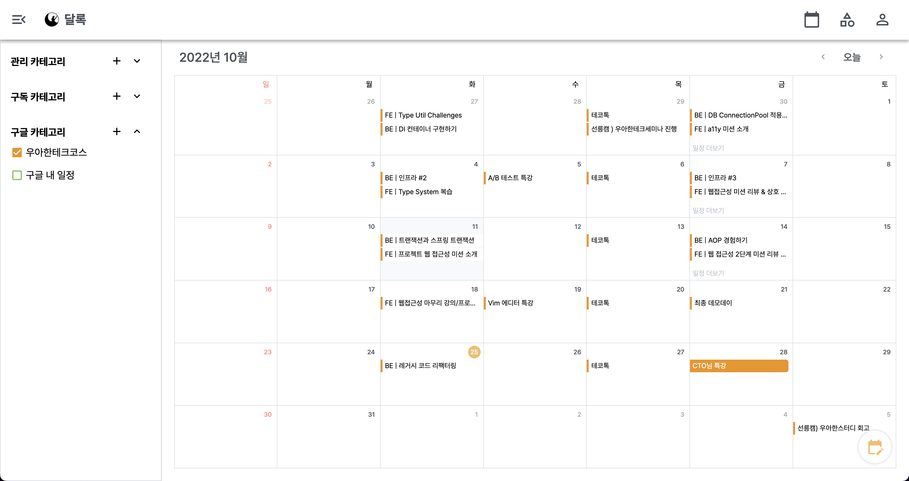
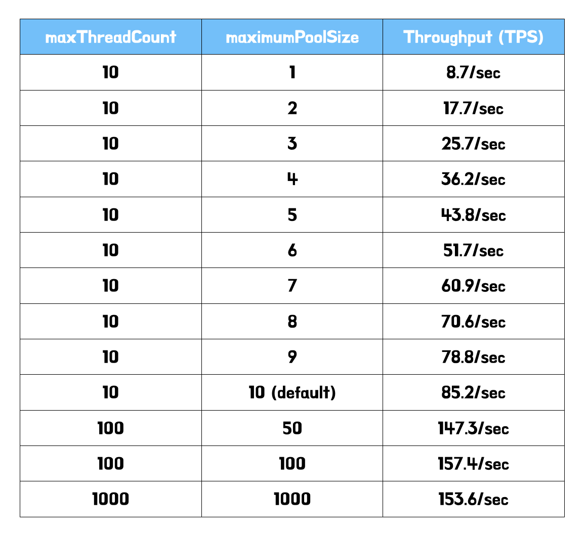
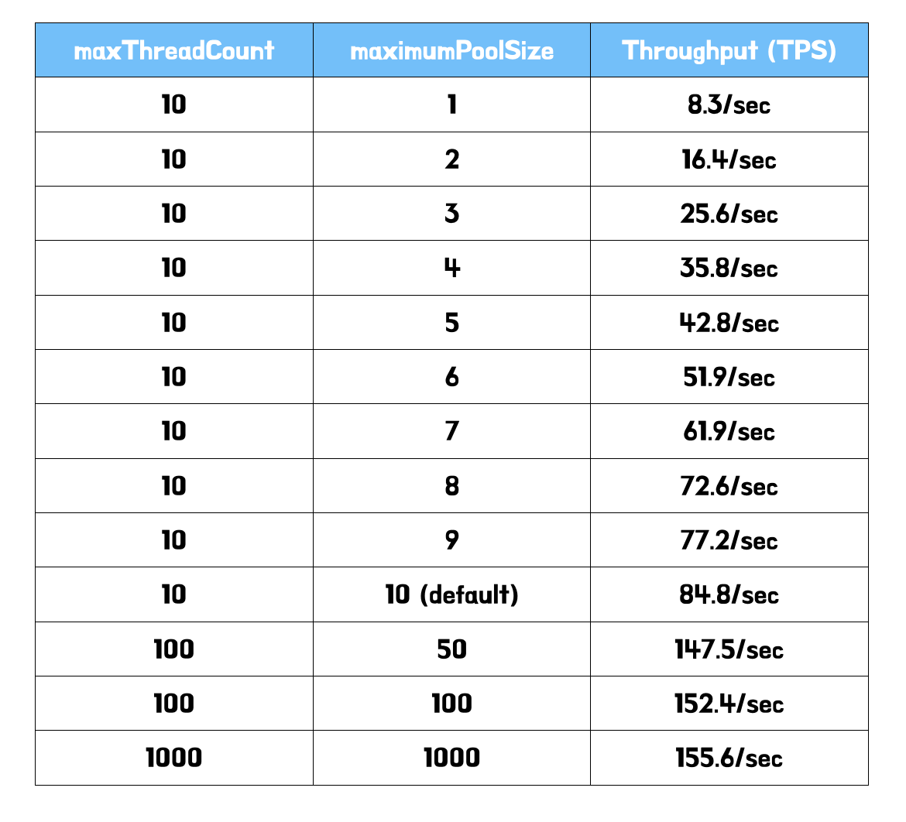
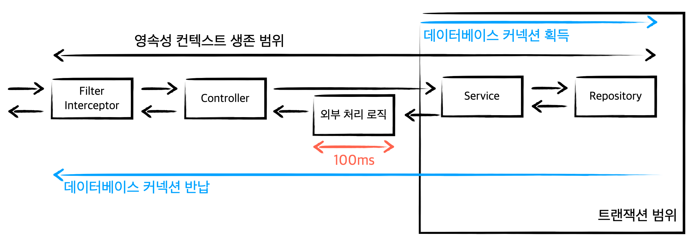
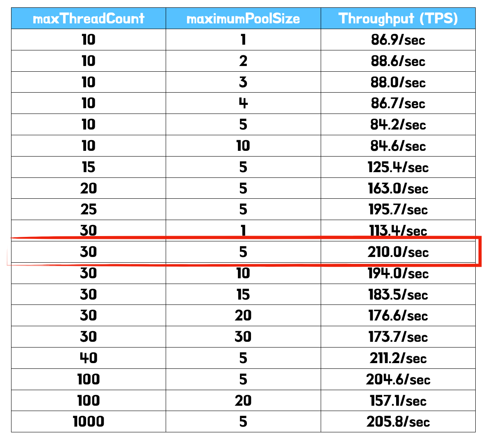
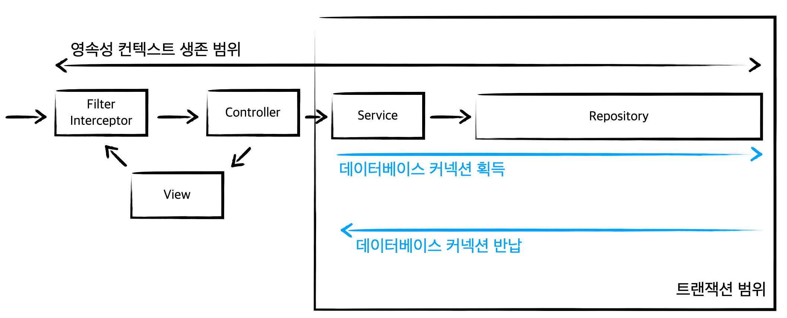
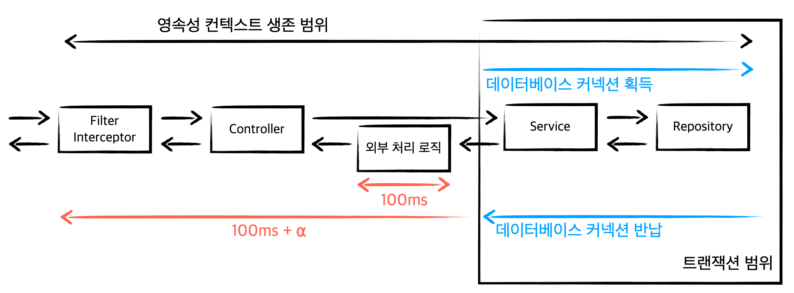
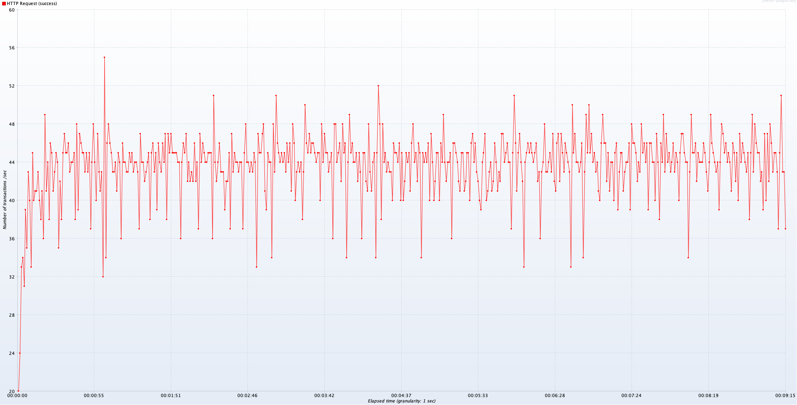
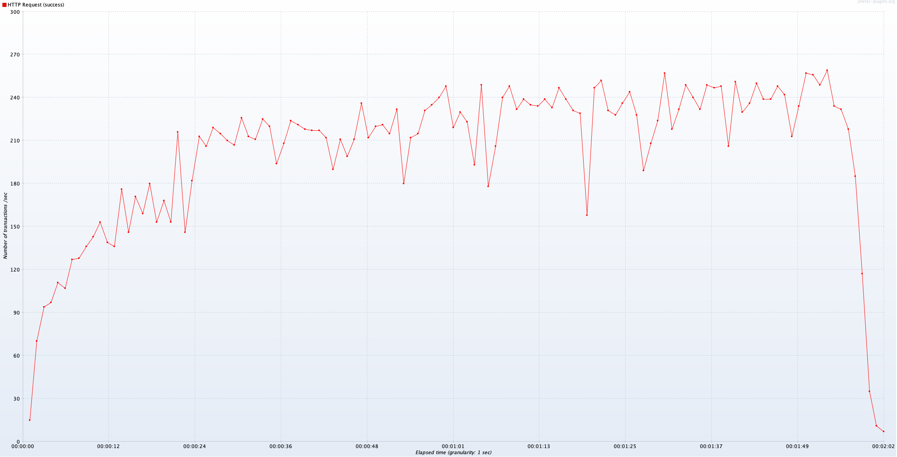

> 이 글은 우테코 달록팀 크루 [매트](https://github.com/hyeonic)가 작성했습니다.

## HikariCP와 적절한 풀 사이즈 고민하기 (3) - 삽질편

이번 시간에는 달록 서비스에서 가장 많은 조회가 일어나는 요청을 기반으로 `HikariCP`의 적절한 풀 사이즈를 설정하려 한다. 순서는 먼저 요청에 대한 특성에 대해 알아본다. 이후 JMeter를 통해 적절한 지표를 확인하려 한다.

> 해당 게시글은 달록에 특화된 상황을 가정하고 진행한 것이다. 모든 상황에 해당될 수 없으며 적절하게 테스트되지 않았을 수도 있다. 성능 테스트를 진행하며 추출된 지표는 절대적인 것이 아님을 주의해야 한다.

## 달록 API 요청 특성 파악하기

쉽고 빠른 공유 캘린더 서비스 [달록](https://github.com/woowacourse-teams/2022-dallog)은 구글 캘린더에 등록된 일정 정보를 함께 조회할 수 있다. 



처음 외부 일정에 대한 기능에 대해 논의 했을 때, 실제 우리 데이터베이스에 저장한 뒤 변경점에 대해 관리할지, 혹은 매 요청마다 구글 측에서 일정 정보를 받아올지 고민하였다.

- 외부 요청으로 부터 받아온 데이터를 데이터베이스에 저장한다. 여기서 한 가지 고려해야 할 점은 구글 일정 정보와 우리가 저장한 정보에 대해 지속적인 `싱크`를 맞춰야 한다.
- 매 일정 조회 마다 구글 측에서 일정 정보를 받아온 뒤 달록 일정 정보와 함께 보여준다.

데이터베이스에 저장하는 방법은 추가적인 최적화를 통해 충분히 조회 속도를 개선할 수 있지만 바뀐 구글 일정 정보와 우리가 관리하던 일정 정보에 대한 일치 여부를 확인해야 하는 단점이 있다.

매 일정 조회마다 구글 일정 정보를 요청하는 경우 매번 최신 일정 정보를 가져오기 때문에 일정 정보에 대한 싱크를 맞출 필요가 없다. 다만 추가적인 네트워크 비용이 발생할 수 있다.

> 우리 달록은 최대한 빠르게 해당 기능을 구현해야 했기 때문에 복잡하게 데이터의 싱크를 맞추기보다 매번 새로운 데이터를 가져오는 방향으로 결정하였다.


간단히 코드를 살펴보면 `RestTemplate`을 통해 필요한 일정 정보를 제공 받고 있다.

```java
@Component
public class GoogleExternalCalendarClient implements ExternalCalendarClient {

    private static final String CALENDAR_LIST_REQUEST_URI = "https://www.googleapis.com/calendar/v3/users/me/calendarList";
    private static final String CALENDAR_EVENTS_REQUEST_URI = "https://www.googleapis.com/calendar/v3/calendars/{calendarId}/events?singleEvents=true&timeMax={timeMax}&timeMin={timeMin}";     
    private static final String ACCEPT_HEADER_NAME = "Accept";
    ...
    private ResponseEntity<GoogleCalendarEventsResponse> fetchGoogleCalendarEvents(
            final HttpEntity<Void> request, 
            final Map<String, String> uriVariables) {
        try {
            return restTemplate.exchange(
                    CALENDAR_EVENTS_REQUEST_URI,
                    HttpMethod.GET, request,
                    GoogleCalendarEventsResponse.class,
                    uriVariables
            );
        }
        ...
    }
}
```

이러한 외부 리소스 조회는 데이터베이스의 커넥션을 활용하지 않는다. 즉 트랜잭션 외로 분리하여 불필요한 커넥션을 잡지 못하도록 개선하는 것이 좋다. 관련 내용은 [트랜잭션 내에 외부 리소스 요청이 담기게 되면 어떤 문제가 발생할까?](https://tecoble.techcourse.co.kr/post/2022-09-20-external-in-transaction/)에 정리해두었다.

이러한 내용을 기반으로 먼저 달록의 코드를 간단히 살펴보자. 코드의 흐름은 아래와 같다.

1. 우리 데이터베이스에서 한달 사이에 구독한 일정 정보를 조회한다.
2. 외부 일정 정보를 조회하기 위한 데이터를 준비한다.
3. 준비된 데이터를 기반으로 외부 일정을 조회한다.
4. 우리 일정 정보와 외부 일정 정보를 합쳐 정렬한다.

위 과정 중 데이터베이스 커넥션이 필요한 부분은 어디일까? 바로 `1, 2`이다. 3, 4의 경우 추가적인 네트워크 비용만 발생할 뿐 데이터베이스를 활용하지 않는다. 코드로 표현하면 아래와 같다.

```java
@Transactional(readOnly = true)
@Service
public class ScheduleService {
    ...
    public MaterialToFindSchedules findInternalByMemberIdAndDateRange(final Long memberId,
                                                                      final DateRangeRequest request) {
        Subscriptions subscriptions = new Subscriptions(subscriptionRepository.findByMemberId(memberId));
        List<Category> categories = subscriptions.findInternalCategory();
        LocalDateTime startDateTime = request.getStartDateTime();
        LocalDateTime endDateTime = request.getEndDateTime();

        // 1. 우리 데이터베이스에서 한달 사이에 구독한 일정 정보를 조회한다.
        List<IntegrationSchedule> schedules = toIntegrationSchedules(categories, startDateTime, endDateTime);   

        // 2. 외부 일정 정보를 조회하기 위한 데이터를 준비한다.
        String refreshToken = toRefreshToken(memberId);
        List<ExternalCategoryDetail> externalCategoryDetails = toCategoryDetails(subscriptions);

        return new MaterialToFindSchedules(subscriptions, schedules, refreshToken, externalCategoryDetails);
    }
    ...
} 
```

코드에 집중하기 보다 해당 코드가 위에서 어떤 역할을 하는지에 집중하자. 주석을 살펴보면 데이터베이스의 커넥션이 필요한 로직이 `@Transactional(readOnly = true)`에 묶여 있는 것을 확인할 수 있다.

아래는 `데이터베이스 커넥션이 불필요한 로직`이다. 코드로 살펴보자.

```java
@Component
public class CheckedSchedulesFinder {
    ...
    public IntegrationScheduleResponses findMyCheckedSchedules(final Long memberId, 
                                                               final DateRangeRequest request) {
        // 1, 2 과정 이후 반환된다.
        // 트랜잭션 시작
        MaterialToFindSchedules material = scheduleService.findInternalByMemberIdAndDateRange(memberId, request);
        // 트랜잭션 끝

        List<IntegrationSchedule> schedules = material.getSchedules();

        String refreshToken = material.getRefreshToken();
        String accessToken = toAccessToken(refreshToken);
        
        // 3. 준비된 데이터를 기반으로 외부 일정을 조회한다.
        List<IntegrationSchedule> externalSchedules = toExternalSchedules(request, material, accessToken);
        schedules.addAll(externalSchedules);

        // 4. 우리 일정 정보와 외부 일정 정보를 합쳐 정렬한다.
        return new IntegrationScheduleResponses(material.getSubscriptions(), new TypedSchedules(schedules));
    }
    ...
}
```

`CheckedSchedulesFinder` `findMyCheckedSchedules` 메서드는 데이터베이스에서 조회한 일정 정보와 외부에서 조회한 일정 정보를 합쳐 정렬하기 위한 책임을 가지고 있다.

이러한 외부 리소스 조회는 언급한 것 처럼 추가적인 네트워크 비용이 소모된다. 다만 데이터베이스를 활용하지 않기 때문에 `트랜잭션 외부로 분리`하여 불필요하게 커넥션을 잡고 있는 시간을 개선하였다.

위 코드를 살펴보면 `scheduleService.findInternalByMemberIdAndDateRange(memberId, request)`부분만 트랜잭션을 진행하고 있다.

## JMeter를 활용한 성능 테스트

> 테스트를 진행할 때 매번 구글 측으로 요청을 보내는 것은 바람직하지 않다. 특정 유저가 구글 카테고리를 구독한 상황을 가정한 뒤 테스트한다. 한 번의 요청 당 네트워크 비용은 대략 `100ms`로 설정한다. 핵심은 추가적인 네트워크 비용이 들어간다에 집중한다.
> 

이제 실전편에서 진행했던 것 처럼 JMeter를 활용하여 성능 테스트를 진행한다. 먼저 `외부 요청을 트랜잭션을 분리하지 않았을 때`의 `TPS`를 측정한다. `외부로 분리`하고 난 후 얼마나 차이가 있는지 `비교`해보려 한다.

### 트랜잭션을 분리하지 않은 경우

먼저 외부 리소스 요청을 트랜잭션에 포함 했을 때의 지표이다.



확실히 커넥션을 잡는 시간이 `100ms` 추가되다보니 커넥션이 많으면 많을수록 더 좋은 `처리량`이 측정되는 것을 확인할 수 있다. 다만 한정된 서버자원에서 커넥션의 개수를 위 처럼 과도하게 많이 설정하는 것은 좋지 않다. 항상 커넥션 풀의 개수를 유지해야 하기 때문이다. 

### 트랜잭션을 분리하는 경우

이제 위에서 개선한 것처럼 외부 요청을 트랜잭션에서 분리한 뒤 측정한다. 트랜잭션에서 외부 요청을 위한 불필요한 네트워크가 발생하지 않기 때문에 더 적은 커넥션 개수로 더 높은 처리량이 측정될 것이라 예측한다.



하지만 전혀 다른 결과를 마주할 수 있다. 트랜잭션을 분리하지 않은 경우와 거의 유사하게 측정된 것을 확인할 수 있다… 

## 원인 분석하기

트랜잭션을 분리했을 때와 분리하지 않았을 때 차이가 없다는 것은 결국 데이터베이스 커넥션의 생명 주기를  유사하게 가져가고 있다는 것을 의미한다. 내가 트랜잭션 로직을 최소화한 이유는 바로 이 데이터베이스 커넥션 유지 시간을 짧게 가져가기 위한 의도이다. 하지만 이 의도가 적절히 반영되지 않고 있다.

그렇다면 왜 유사한 시간 동안 커넥션을 잡고 있는걸까? 원인은 생각보다 가까운 곳에 있었다. 바로 `OSIV` 설정으로 인해 발생한 것이다. 

스프링의 기본 `OSIV`설정은 `true`이다. 즉 `@Transactional` 애노테이션을 최초에 마주할 때 영속성 컨텍스트는 데이터베이스 연결을 위해 커넥션 풀에서 커넥션을 획득한다. 이것은 영속성 컨텍스트가 유지되는 시간 동안 반납되지 않는다. OSIV는 이러한 영속성 컨텍스트를 Interceptor(스프링 default 설정)까지 유지한다. 자세한 설명은 [OSIV와 사용하며 직면한 문제](https://hyeonic.github.io/jpa/basic/osiv.html)에 작성해두었다.

정리하면 OSIV 설정으로 인해 트랜잭션에서 외부 요청을 분리한 것과 분리하지 않은 것이 유사하게 측정된 것이다. 어찌보면 당연한 일이다. 두 요청 모두 서비스 계층에서 `@Transactional(readOnly = true)`를 마주하면 커넥션을 획득한다. 이후 영속성 컨텍스트가 유지되는 동안 커넥션도 동일하게 유지될 것이다. 이것을 그림으로 표현하면 아래와 같다.



결국 트랜잭션을 분리해도 데이터베이스의 커넥션은 분리하지 않은 이전과 동일하게 유지되기 때문에 이러한 일이 발생한 것이다.

## OSIV 설정 끄기

자 이제 원인을 찾았으니 OSIV 설정을 제거해보자.

```yaml
spring:
    jpa:
        open-in-view: false
```

해당 설정은 `application.properties` 혹은 `application.yml`에서 위와 같이 손쉽게 진행할 수 있다.

### 트랜잭션 분리하는 경우 다시 측정

> 다시 언급하지만 외부 요청의 응답 시간을 `100ms`라 가정하고 측정한 것이다. 다양한 상황에 따라 서로 다른 결과가 나올 수 있다는 것을 염두해 두어야 한다.
> 



지표를 살펴보면 몇 가지 재밌는 부분을 확인할 수 있다. 

1. 스레드의 개수가 커넥션 보다 많을 때 `최적의 처리량`이 나온다.
2. 스레드 개수가 일정할 때, 커넥션 개수를 늘릴 경우 처리량이 동일하거나 줄어든다.

먼저 첫 번째 상황에 대해 살펴본다. 단순한 웹 애플리케이션을 개발한다고 가정해보자. 물론 다양한 상황이 있을 수 있겠지만 트랜잭션의 디폴트 전파 설정을 따르거나 엔티티 id 생성 전략을 `@GeneratedValue(strategy = GenerationType.*IDENTITY*)`로 가져가는 등 대부분의 경우에는 트랜잭션 내에서 하나의 데이터베이스 커넥션을 사용할 것이다. 

 복잡한 비즈니스 로직은 트랜잭션을 가진 서비스 계층에서 이루어진다. 또한 요청 처리 중 대부분의 시간을 트랜잭션 내에서 처리하기 때문에 스레드의 개수와 커넥션의 개수를 동일하게 가져가도 (요청 마다 커넥션을 하나씩 할당하여 사용해도) 처리량에는 큰 영향을 주지 않을 것이다.



하지만 위 지표는 트랜잭션 이후 외부 처리 로직이 추가된다. 스레드의 개수가 커넥션 보다 많을 때 최적의 처리량이 나오는 것은 트랜잭션 이후, 즉 데이터베이스 커넥션이 반납된 이후에도 추가적인 작업이 유의미하게 일어나기 때문이라고 추측한다. 아래 그림을 보자.



데이터베이스 커넥션은 트랜잭션이 종료되면 즉각 반납된다. 요청을 처리하는 스레드는 이후 작업(외부 처리 로직)을 진행한다.  전체 응답 시간을 보면 데이터베이스를 사용하는 부분은 찰나의 순간이기 때문에 다수의 요청이 들어와도 한정된 커넥션 풀을 충분히 `재사용`할 수 있다 추측된다.

 다음은 두 번째 상황이다. 스레드 개수가 일정할 때, 커넥션 개수를 늘릴 경우 처리량이 동일하거나 줄어든다. 단순히 살펴보면 커넥션 개수가 불필요하게 늘어나면 늘어날 수록 컨텍스트 스위칭 과정이 늘어날 것이다. 이러한 근거로 커넥션 개수를 고정한 뒤 스레드 개수를 늘려보았다. 하지만 유의미한 차이를 찾을 수 없었다. 이에 대한 근거는 아직 찾지 못하였다. 다양한 측면에서 문제를 바라봐야 하지만 아직 운영체제에 대한 지식이 부족한 탓인지 쉽게 츠측할 수 없었다.

## 수치 비교

### 트랜잭션 분리 X → 평균 처리량 40.8/sec



### 트랜잭션 분리 O → 평균 처리량 204.0/sec



동일한 설정(스레드 30개, 커넥션 5개)에서 트랜잭션을 분리했을 때와 안 했을 때의 처리량을 확인해보면 평균 `40.8/sec` → `204.0/sec`으로 약 5배의 성능이 개선된 것을 확인할 수 있다. 

## 정리

지금까지 HikariCP 설정을 진행하며 발생한 문제에 대해 알아보았다. 트랜잭션에 대한 범위를 최소화하는 것은 다수의 요청에서 처리량(TPS) 측면에서 실제 유의미한 결과를 만들어 낼 수 있다. 때문에 각 서비스의 특성에 맞게 다양한 상황을 고려하여 스레드 개수와 커넥션 개수를 설정해야 한다.

OSIV 설정은 스프링의 경우 기본적으로 `true`로 작성되기 때문에 이에 대해 인지하지 못할 수 있다. 만약 커넥션의 빠른 반납이 필요한 경우에는 오랜시간 커넥션을 유지하는 OSIV 설정은 바람직하지 않을 수 있다. 이 또한 서비스가 어떤 시점에 데이터베이스 커넥션을 필요로 하는지 잘 고민해봐야 한다.
