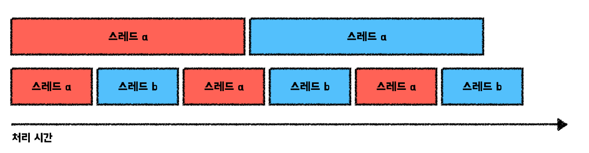

> 이 글은 우테코 달록팀 크루 [매트](https://github.com/hyeonic)가 작성했습니다.

## HikariCP와 적절한 풀 사이즈 고민하기 (이론편)

`HikariCP`는 `connection pooling`을 제공하는 `JDBC DataSource 구현체`이다. 

## 데이터베이스 커넥션 풀

데이터베이스 커넥션이 필요할 때마다 매번 생성해서 연결하는 것은 매우 비효율적이다. 데이터베이스 커넥션을 생성해둔 뒤 사용하는 방식을 데이터베이스 커넥션 풀이라 한다.

요청 마다 커넥션 객체를 생성하여 쿼리를 전달하기 위해서는 항상 아래와 같은 과정을 겪어야 한다.

- JDBC 드라이버를 로드한다.
- 연결 정보를 기반으로 데이터베이스에 연결해야 한다.
- Statement를 생성한다.
- SQL문을 전송한다.
- ResultSet을 통해 결과를 확인한다.
- 연결을 해제한다.

커넥션 객체를 생성하는 비용 자체도 문제가 되지만 매번 SQL 쿼리 자체를 전송하기 위해 `객체를 생성하고 해제하는 과정`이 매우 비효율적으로 느껴진다.

또한 커넥션 연결도 `TCP/IP`를 통해 이루어진다. 즉 `3-way-handshaking` 과정을 통해 통신을 준비하는데, 이 과정이 쿼리를 요청할 때 마다 반복되면 네트워크 구간에서 병목의 원인이 될 수 있다.

> 커넥션을 생성하는 과정은 전체 과정 중 대략 50%를 차지한다고 한다.

정리하면 데이터베이스 커넥션 풀은 아래와 같은 이점을 가지고 있다.

- 이미 커넥션을 맺은 상태로 커넥션 풀에서 관리되기 때문에 데이터베이스와 `네트워크 연결 시간을 단축` 시켜 준다. 이러한 응답 시간 단축은 처리량 증가로 이어질 수 있다.
- 데이터베이스에 대한 커넥션 개수를 일정 수준으로 제한하여 불필요한 리소스를 줄일 수 있다. 또한 과한 커넥션을 맺지 않도록 방지하여 일관된 데이터베이스 성능을 유지할 수 있다.

데이터베이스 커넥션 풀은 대표적으로 `commons-dbcp`, `tomcat-jdbc-pool`, `HikariCP` 등이 존재한다.

## HikariCP

`HikariCP`는 `connection pooling`을 제공하는 `JDBC DataSource 구현체`이다. 

공식 문서에 따르면 몇몇 바이트코드 레벨의 구현이 있으며, 마이크로 최적화, `ArrayList<Statement>` 사용 대신 FastList 직접 구현으로 처음부터 끝까지 모든 것을 스캔하는 과정을 생략하는 등 다른 프레임워크보다 빠른 속도를 가지고 있다고 소개하고 있다.

Spring Boot 2.0 이후 `HikariCP`를 default 커넥션 풀로 활용하고 있다.


## HikariCP 설정

### maximumPoolSize

풀이 제공할 수 있는 최대 커넥션 개수를 의미한다. 최대 커넥션 개수는 `사용 중인 커넥션 수 + 유후 커넥션 수`와 같다. 기본값은 `10개`이다.

```java
...
public class HikariConfig implements HikariConfigMXBean {
    ...
    private static final int DEFAULT_POOL_SIZE = 10;
    ...
}
```

최대 커넥션 개수는 `TPS`에 가장 많은 영향을 주는 옵션이다. 아래 공식 문서에 소개된 공식과 서버 상황에 따라 적절한 값을 설정해야 한다.

### connectionTimeout

커넥션 풀에서 커넥션을 구하기 위해 `대기`하는 시간이다. 만약 풀에서 모든 커넥션을 사용중인 경우 대기가 발생하게 된다. 기본값은 `30초`이다.

```java
...
public class HikariConfig implements HikariConfigMXBean {
    ...
    private static final longCONNECTION_TIMEOUT = SECONDS.toMillis(30);
    ...
}
```

사용자가 응답을 받기 까지 기본값 `30초`를 대기하는 것은 너무 길다. 스레드 풀 기반의 WAS는 순간적으로 트래픽이 증가하게 되면 스레드가 대기할 수 있다. 사용자는 응답 없이 기다리는 것 보다 빠르게 에러 화면 이라도 마주하는 것이 더 낫다. 

보통의 웹 서비스는 `0.5 ~ 3초` 이내로 설정하여 응답 시간을 최소화 한다.

### maxLifeTime

커넥션을 생성한 뒤 설정된 시간이 지나면 커넥션을 닫고 풀에서 제거한다. 제거한 뒤 커넥션을 새롭게 생성한다. 기본값은 `30초`이다.

```java
...
public class HikariConfig implements HikariConfigMXBean {
    ...
    private static final long MAX_LIFETIME = MINUTES.toMillis(30);
    ...
}
```

기본적인 규칙은 네트워크나 데이터베이스의 관련 설정 값보다 작은 값을 사용한다. 관련 설정의 예시로는 네트워크 장비의 최대 TCP 커넥션 유지 시간이 될 수 있다. 최대 TCP 유지 시간이 10분이라고 가정한다. 이 값이 관련 설정보다 크게되면 `이미 유효하지 않은 커넥션`이 풀에 남게 된다. 

풀에서 유효하지 않은 커넥션을 검증하는 과정에서 추가적인 커넥션이 새로 생성된다. 즉 트래픽이 몰리는 시점에 성능 저하를 유발할 수 있다.

### keepaliveTime

커넥션이 살아 있는지 확인하는 주기이다. 유휴 커넥션에 대해 커넥션을 검증하고 유효하지 않은 경우 풀에서 제거한다. 제거 후 커넥션을 새로 생성한다.

이 또한 네트워크나 데이터베이스의 관련 설정 값보다 작은 값을 사용한다. 관련 설정 예시로는 데이터베이스의 미활동 대기 시간이 될 수 있다. 데이터베이스의 미활동 시간보다 설정 시간이 긴 경우 이미 데이터베이스에서 커넥션을 제거했기 때문에 `무의미한 검증 시간`이 될 수 있다.

### minimumIdle

풀에서 유지할 최소 유휴 커넥션 개수를 지정한다. 기본 값은 `maximumPoolSize`와 동일하다.

```java
public class HikariConfig implements HikariConfigMXBean {
    ...
    private volatile int maxPoolSize;
    private volatile int minIdle;
    ...
  
    public HikariConfig() {
        ...
        minIdle = -1;
        maxPoolSize = -1;
        ...
    }

    public void validate() {
        ...
        validateNumerics();
        ...
    }

    private void validateNumerics() {
        ...
        if (minIdle < 0 || minIdle > maxPoolSize) {
            minIdle = maxPoolSize;
        }
        ...
    }
}
```

HikariCP 문서에 따르면 설정하지 않는 것을 추천한다. 즉 maximumPoolSize와 동일 크기를 추천한다. 이 값을 작게 설정할 경우 급격한 트래픽 증가 시 성능 저하를 일으킬 수 있다.

해당 설정은 트래픽이 적은 시간대에 데이터베이스 자원 사용을 줄이기 위함이다.

### idleTimeout

사용하지 않고 풀에 머물 수 있는 시간인 최대 유휴 시간을 설정한다. 풀에서 설정한 시간동안 머무른 커넥션은 종료하고 풀에서 제거한다. 해당 설정은 `minimumIdle < maximumPoolSize`인 경우 적용된다. 

## 적절한 커넥션 풀 사이즈 고민하기

[About Pool Sizing](https://github.com/brettwooldridge/HikariCP/wiki/About-Pool-Sizing)

커넥션 풀을 구성하는 것은 개발자가 자주 실수하는 것이다. 풀을 구성할 때 이해 해야하는 몇 가지 원칙이 있을 수 있다.

하나의 CPU 코어가 있는 컴퓨터도 수십 혹은 수백 개의 스레드를 `동시에` 지원할 수 있다. 하지만 이것은 운영체제의 속임수일 뿐이다. 실제로 단일 코어는 `한 번에 하나의 스레드`만 실행할 수 있다. 운영체제는 `컨텍스트 스위칭`을 한 뒤 다른 스레드의 코드를 실행할 뿐이다. 즉 빠른 시간의 `컨텍스트 스위칭`으로 동시에 진행하는 것 처럼 보일 뿐이다.

단일 CPU가 주어지면 `A와 B를 순차적으로 실행하는 것`이 `시분할을 통해 A와 B를 동시에 실행하는 것` 보다 항상 빠를 것이라는 것은 컴퓨팅의 기본 법칙이다. 스레드 수가 CPU 코어 수를 초과하면 단순히 스레드 수가 더 많아질 뿐이지 더 빠른 속도를 보장하는 것은 아니다. 즉 단순히 풀의 크기를 늘린다고 더 빠른 속도로 처리되는 것은 아니다.



데이터베이스의 주요 병목 현상에 대해 살펴보면 CPU, 디스크, 네트워크 세 가지 관점으로 요약할 수 있다. 디스크와 네트워크를 무시하면 간단히 계산할 수 있다. 예시로 8개의 CPU 코어가 있는 서버가 있다고 가정하자. 서버는 커넥션 풀안에 커넥션 수를 8로 설정하면 최적의 성능을 제공할 수 있으며 이 이상의 커넥션을 생성할 경우 컨텍스트 스위칭의 오버헤드로 인해 속도는 느려질 것이다.

그러나 `디스크`와 `네트워크`가 변수로 작용하게 된다. 데이터베이스는 일반적으로 디스크에 저장하는데, 전통적인 모터 구동 암에 읽기/쓰기 헤드가 장착된 회전 금속 플레이트로 구성된다. 읽기/쓰기 헤드는 한 번에 한 곳에만 읽을 수 있으며 다른 쿼리에 대한 데이터를 읽기 위해서는 새 위치를 `검색` 해야 한다. 따라서 탐색 시간 비용과 플래터의 데이터가 다시 돌아오기 까지 디스크를 기다려야 하는 `회전 비용`이 추가적으로 발생한다.

디스크에서 위 과정이 일어나는 동안 스레드는 `block` 된다. 이 시간 동안 다른 스레드의 작업을 처리할 수 있는 여유가 생기게 된다. 이러한 여유 덕분에 실제로 더 많은 작업을 수행할 수 있게 된다.

네트워크도 디스크와 유사하다. 이더넷 인터페이스를 통해  유선으로 데이터를 작성하면 송/수신 버퍼가 가득차거나 멈출 때 `block`이 발생할 수 있다.


다양한 상황을 고려 했을 때 PostgreSQL에서는 아래와 같은 공식을 제안했다. 또한 여러 데이터베이스에도 적용할 수 있다고 언급되어 있다. 

> *connections = (core_count * 2) + effective_spindle_count*

- `core_count * 2`: 코어 수에 근접할 수록 좋지만, 위에서 언급한 디스크 및 네트워크와 CPU의 속도차이로 인한 여유 시간을 활용하기 위해 계수 2를 곱해준다.
- `effective_spindle_count`: 하드 디스크는 하나의 spindle을 가진다. spindle은 데이터베이스 서버가 관리할 수 있는 동시 I/O 요청 수를 말한다. 디스크가 `n개` 존재하면 `spindle_count`는 `n`이 될 수 있다.

하나의 하드 디스크가 있는 4-core i7 CPU를 가진 서버에서 `9 = (4 * 2) + 1`의 커넥션 풀을 설정해야 한다. 대략 10을 설정할 수 있다. 위 공식은 절대적인 것이 아니기 때문에 풀 크기를 선정할 때 기준으로 활용할 수 있다. 

사용자가 10,000명이라고 커넥션 풀이 10,000개를 설정한 것은 굉장한 낭비에 가깝다. 1,000개도 많다. 심지어 100개의 커넥션도 과하다. 위에 언급한 바와 같이 `CPU core * 2` 보다 훨씬 많은 경우는 거의 없다. 데이터베이스를 과도하게 낭비하지 말자.

다음 시간에는 이러한 내용을 기반으로 달록에 직접 적용해보려 한다.

## References.

[HikariCP](https://github.com/brettwooldridge/HikariCP)<br>
[HikariCP Dead lock에서 벗어나기 (이론편)](https://techblog.woowahan.com/2663/)<br>
[HikariCP Dead lock에서 벗어나기 (실전편)](https://techblog.woowahan.com/2664/)<br>
[프로그래밍 초식: 커넥션풀 설정](https://www.youtube.com/watch?v=6Q7iRTb4tQE)<br>
[내가 만든 서비스는 얼마나 많은 사용자가 이용할 수 있을까? - 3편(DB Connection Pool)](https://hyuntaeknote.tistory.com/m/12)
