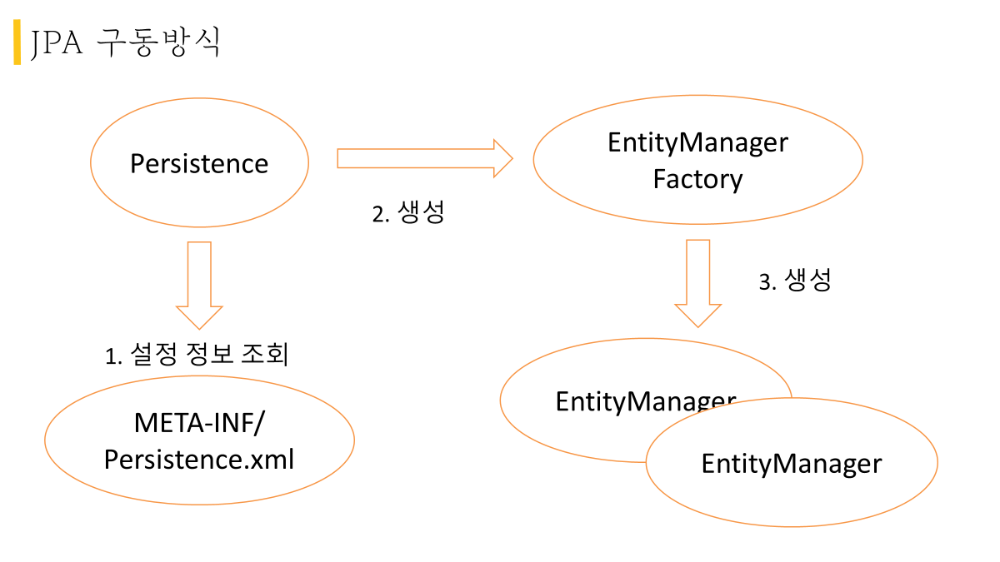

> 이 글은 우테코 달록팀 크루 '[리버](https://github.com/gudonghee2000)'가 작성했습니다.

### 들어가기에 앞서
이전 포스팅에서 SQL 중심적인 개발의 문제점을 살펴보고 객체 중심적인 개발을 하기위한 JAVA의 JPA를 가볍게 언급해보았다.

그렇다면, JPA는 어떠한 매커니즘으로 JAVA에서 작동할까?
이번 포스팅에서 JPA의 구동방식을 자세히 알아보자.  


### JPA 구동방식
우선, 아래의 그림을 통해 JPA의 구동방식을 가볍게 살펴보자.




먼저, JPA는 Build 파일을 통해서 JPA 인터페이스를 구현할 **구현체 클래스인** `Persistence` 생성한다. 
**(JPA는 인터페이스이며 구현체로는 Hibernate, EclipseLink 등이 있음)**

그리고 생성한 `Persistence`로 `META-INF/Persistence.xml`라는 설정파일의 정보를 읽어서 `EntityManagerFactory`라는 클래스를 생성한다.

`EntityManagerFactory`는 필요할때 마다 `EntityManager` 라는 클래스를 생성한다. 

개발자는 `EntityManager`를 통해서 DB에 접근하고 CRUD 작업을 수행한다.

위와 같은 과정을 통해 JPA를 사용 할 수 있다.

그렇다면, `Persistence.xml`, `EntityManagerFactory`, `EntityManager`란 무엇일까?
아래에서 자세히 살펴보자.

### Persistence.xml란?
`Persistence.xml`은 JPA가 엑세스하려는 데이터베이스들에 대해 필요한 설정정보 들을 기술해둔 파일이다.
JPA는 이 파일의 설정정보를 바탕으로 접근할 DB의 정보를 가져 올 수 있다.

`Persistence.xml` 파일에 대해 아래 그림과 함께 자세히 살펴보자.

```
<?xml version="1.0" encoding="UTF-8"?>
<persistence version="2.2"
 	xmlns="http://xmlns.jcp.org/xml/ns/persistence" xmlns:xsi="http://www.w3.org/2001/XMLSchema-instance"
    xsi:schemaLocation="http://xmlns.jcp.org/xml/ns/persistence http://xmlns.jcp.org/xml/ns/persistence/persistence_2_2.xsd">
	<persistence-unit name="hello">
 		<properties>
 			<!-- 필수 속성 -->
 			<property name="javax.persistence.jdbc.driver" value="org.h2.Driver"/>
 			<property name="javax.persistence.jdbc.user" value="sa"/>
 			<property name="javax.persistence.jdbc.password" value=""/>
			<property name="javax.persistence.jdbc.url" value="jdbc:h2:tcp://localhost/~/test"/>
 			<property name="hibernate.dialect" value="org.hibernate.dialect.H2Dialect"/>

 			<!-- 옵션 -->
 			<property name="hibernate.show_sql" value="true"/>
 			<property name="hibernate.format_sql" value="true"/>
 			<property name="hibernate.use_sql_comments" value="true"/>
 			<!--<property name="hibernate.hbm2ddl.auto" value="create" />-->
 		</properties>
	</persistence-unit>
</persistence> 
```

첫번째로 `<persistence version="2.2" ...>`태그는 사용할 JPA의 버전과 버전에 대한 Persistence.XML 문서형식 링크를 담고 있다.

`<persistence-unit name="hello">`태그는 하나의 지속성 단위를 의미한다. 서술적으로 표현하면, `hello`라는 이름을 가지는 `EntityManagerFactory`를 하위 설정에 따라 만들것이라는 의미이다. 

`<properties>`는 `<persistence-unit>`이 엑세스할 DB의 정보와 추가적인 옵션 정보들을 담는다.

`<property>`는 옵션 정보를 하나씩 설정하는 부분이다.
위 그림과 같이 `필수 속성` 부분은 엑세스할 DB에 대한 정보를 담는다.

추가로 `옵션` 부분을 하나씩 살펴보자.
`hibernate.show_sql`는 DB에 날리는 쿼리문을 확인 할것인지에 대한 설정이다.
`hibernate.format_sql`는 보여지는 쿼리문을 포맷팅하는 설정이다.
`hibernate.use_sql_comments`는 추가적인 `/* */` 주석을 쿼리문에 보여주는 설정이다.

`hibernate.hbm2ddl.auto` 는 데이터베이스 스키마 자동생성에 대한 설정이다.
`hibernate.hbm2ddl.auto`가 가지는 옵션은 아래와 같다.

```
create: 기존 테이블 삭제 후 다시 생성 (DROP + CREATE)
create-drop: create와 같으나 종료시점에 테이블 DROP
update: 변경된 부분만 반영 (운영 DB에 사용하면 안됌)
validate: entity와 table이 정상 매핑되었는지만 확인
none: 사용하지 않음
```

#### **주의점❗**
**create, create-drop, update는 운영 DB에 사용하면 안된다.  
create, create-drop은 운영 DB의 데이터를 전체 삭제 시키기 때문이다.
update는 아직 알아볼필요가있음**

이제 설정파일을 통해 생성하는 `EntityManagerFactory`를 살펴보자.


### EntityManagerFactory란?
`EntityManagerFactory`는 `EntityManager`(Entity를 관리하고 DB 관련작업을 수행 함)을 생성하는 일을한다.

**💡 `Entity` 는 DB 테이블에 대응하는 하나의 객체를 의미한다.**

우리는 `Persistence.xml` 설정정보를 통해서 `EntityManagerFactory`를 생성할수 있다.

아래의 예시코드로 살펴보자.
``` java
public class JpaMain {

    public static void main(String[] args) {
        EntityManagerFactory emf = 
        			Persistence.createEntityManagerFactory("hello");
        // 파라미터로 Persistence.xml에 설정한 persistence-unit의 name 속성값을 넣는다.
        ...
    }
}
```

전 장에서 설정했던 `Persistence.xml` 파일을 통해 
우리는 `hello`라는 이름을 가진 `<persistence-unit>`이 어떤 DB에 엑세스 할 것인지에 대한 정보를 설정했었다.

위 코드가 바로 `Persistence.xml`에 작성한 Persistence Unit(지속성 단위)을 바탕으로 `EntityManagerFactory`를 생성하는 코드이다.

`EntityManagerFactory`를 통해서 우리는 DB 관련 작업을 실제로 수행할 `EntityManager`를 생성 할 수 있다.

#### 🔎`EntityManagerFactory`가 가지는 특징
**1. 엔티티 매니저 팩토리는 하나의 데이터베이스에 하나만 생성한다. (생성 비용이 비싸기 때문)**

**2. 엔티티 매니저 팩토리는 여러 스레드가 동시에 접근해도 안전하다.**

  
### EntityManager란?

엔티티 매니저는 특정 작업을 위해 데이터베이스에 액세스 하는 역할을 한다.
또한 엔티티를 데이터베이스에 CRUD 할 수 있다.
즉, 엔티티와 관련된 모든 일을 처리하기에 이름 그대로 엔티티를 관리하는 관리자다.

``` java
public class JpaMain {

    public static void main(String[] args) {
        EntityManagerFactory emf = 
        			Persistence.createEntityManagerFactory("hello");
        // 파라미터로 Persistence.xml에 설정한 persistence-unit의 name 속성값을 넣는다.
        
        EntityManager em = emf.createEntityManager();
        ...
    }
}
```

위와 같이 `EntityManagerFactory`를 통해서 `EntityManager`를 생성 할 수 있다.

#### 🔎`EntityManager`가 가지는 특징
**1. 엔티티 매니저는 DB connection과 밀접한 관계가 있기 때문에, 스레드 간에 공유하거나 재사용하면 안된다.**

**2. 엔티티 매니저의 CRUD 작업은 트랜잭션 단위로 처리 해야한다.**

#### **주의점❗**
**EntityManager의 작업은 트랜잭션 단위로 진행되어야한다.
왜냐하면, CRUD 작업을 수행하다가 중간에 문제가 발생하는 경우 트랜잭션 이전의 상태로 돌아가야 하기 때문이다.**


마지막으로 코드를 통해 `EntityManagerFactory` 생성부터 DB에 엔티티의 데이터를 저장하는 과정을 살펴보자.

### JPA의 구동과정
JAVA 코드상에서 `JPA`를 통해 데이터를 DB에 저장하는 과정은 아래와 같다.

```java
public class JpaMain {

    public static void main(String[] args) {
        EntityManagerFactory emf = 
        			Persistence.createEntityManagerFactory("hello"); 
                    // 엔티티 매니저 팩토리 생성
        EntityManager em = emf.createEntityManager(); // 엔티티 매니저 생성
        
        EntityTransaction tx = em.getTransaction(); // 트랜잭션 생성
        tx.begin(); // 트랜잭션 시작

        try {
        	Member member = new Member() // 멤버 엔티티 생성
            member.setId(100L)
            member.setName("JPA")
            
            em.persist(member) // 멤버 엔티티 데이터를 저장
        
            tx.commit(); // 트랜잭션 커밋
        } catch (Exception e) {
            tx.rollback(); // 트랜잭션 롤백
        } finally {
            em.close(); // 엔티티 매니저 연결 종료
        }
        emf.close();
    }
}
```
1. Persistence.xml 설정파일의 Persistence Unit을 통해 엔티티 매니저 팩토리를 생성한다.

2. 엔티티 매니저 팩토리로 엔티티 매니저를 생성한다. 

3. 엔티티 매니저에 대한 트랜잭션을 생성한다.

4. 트랜잭션을 시작한다.

5. DB에 저장할 멤버 엔티티를 생성한다.

6. em.persist(member)를 통해 엔티티 데이터를 저장한다.

7. 트랜잭션을 커밋한다.

8. 엔티티 매니저를 닫는다.

9. 엔티티 매니저 팩토리를 닫는다.


위와 같은 과정을 통해 DB에 데이터를 저장 할 수 있다.

`em.persist()` 메서드는 파라미터로 들어온 엔티티에 대한 insert 쿼리문을 JPA가 작성하여 DB에 엔티티의 데이터를 저장하는 메서드이다.

얼핏 보면, `em.persist(member)`를 실행할때 데이터가 바로 DB에 저장 될 것 같다.

하지만 실제로는 `Member` 엔티티가 `EntityManager`의 영속 컨텍스트라는 공간에 저장되고 트랜잭션이 커밋되는 시점에 DB에 `Member` 엔티티에 대한 insert 쿼리문이 날라간다.

왜 바로, DB에 데이터를 저장하지 않고 영속 컨텍스트에 데이터를 저장할까? 다음 포스팅에서 알아보자.
