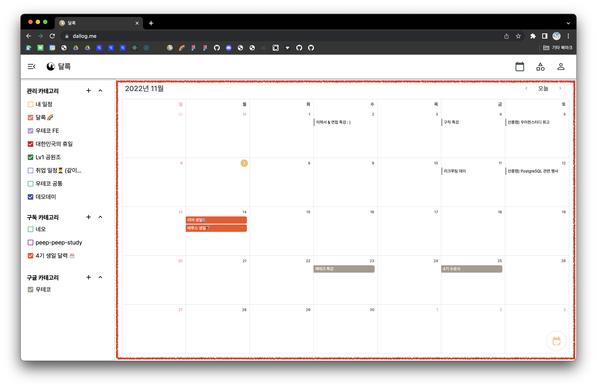
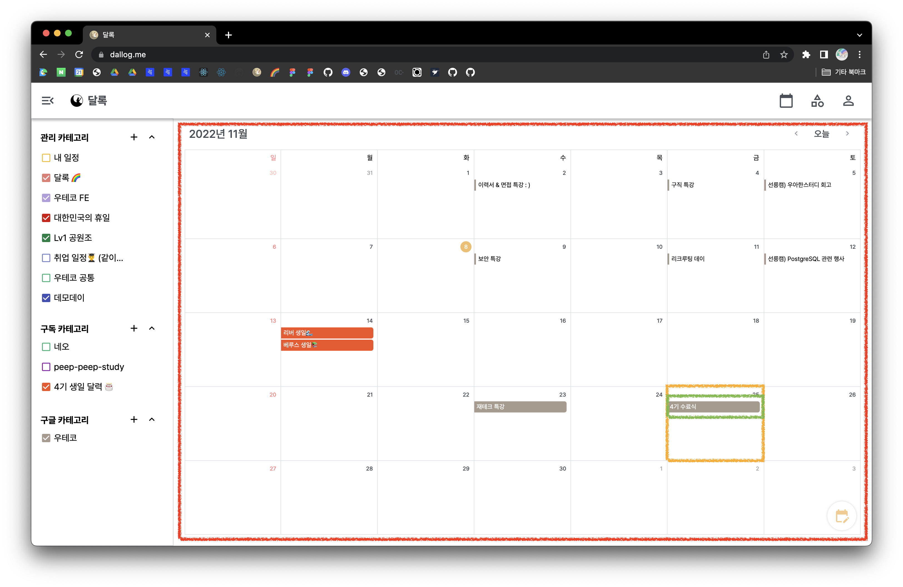
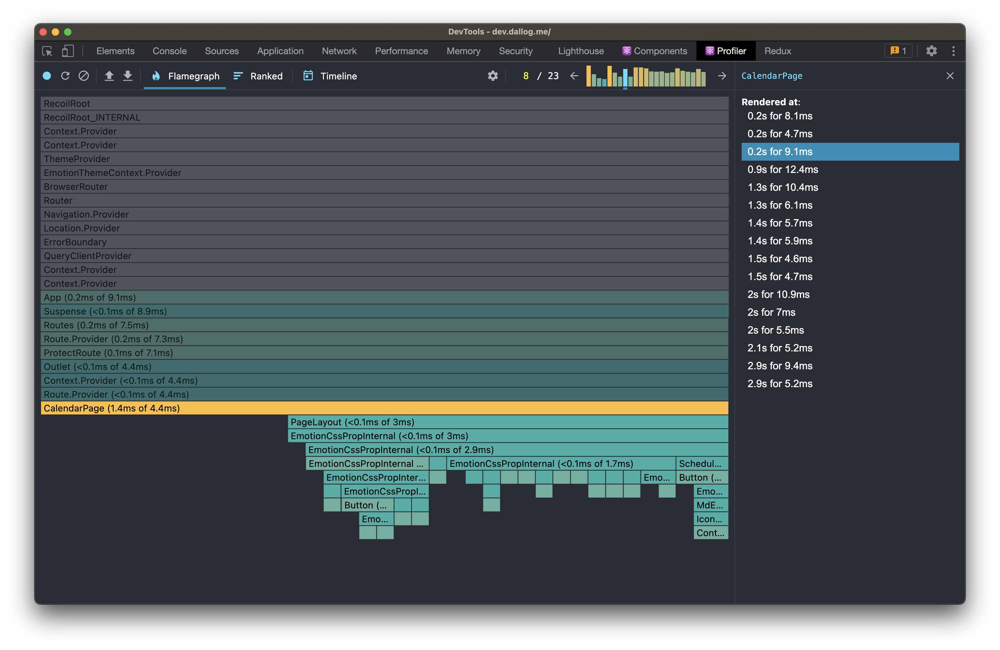
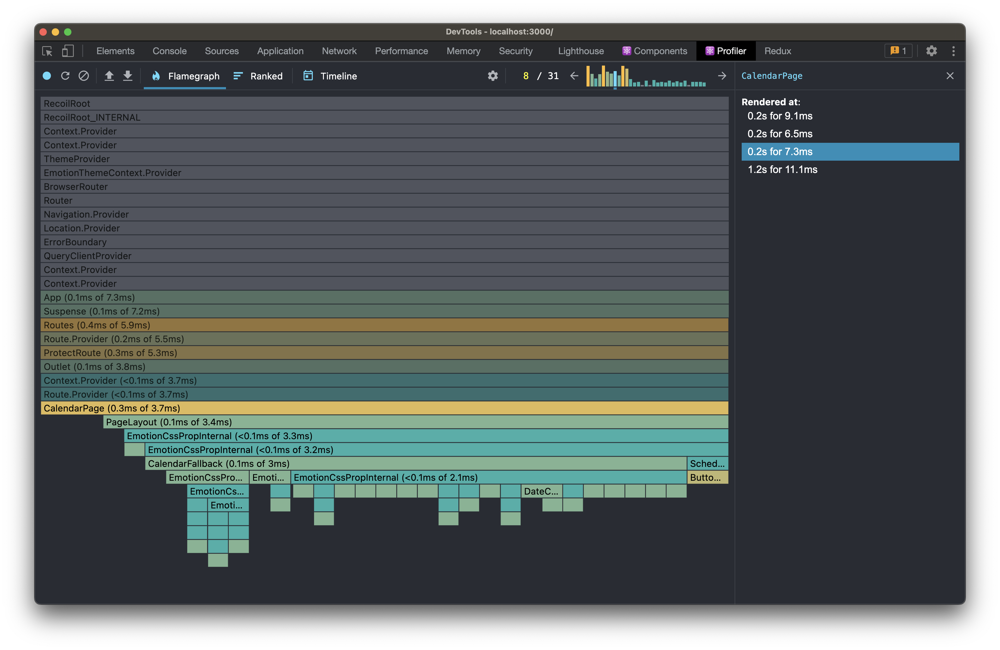

> 이 글은 우테코 달록팀 크루 [티거](https://github.com/daaaayeah)가 작성했습니다.



짜잔 🌈 달록에 접속했을 때 로그인 사용자가 가장 처음 마주하는 화면입니다. 메인 페이지라고 말할 수 있는 ~~애증의~~ 달력 페이지! 저희는 이 페이지에서 내비게이션 바를 제외한 빨간 영역을 `CalendarPage`라는 컴포넌트로 만들었어요.

이 컴포넌트는 어떻게 구성되어 있을까요? 내부의 어떤 요소를 컴포넌트로 분리할 수 있을까요?


놀랍게도 `CalendarPage`는 하나의 큰 컴포넌트였습니다. 내부의 그 어떤 요소도 별개의 컴포넌트로 분리하지 않았었어요.

> Components let you split the UI into independent, reusable pieces, and think about each piece in isolation.

[리액트 공식 문서](https://reactjs.org/docs/components-and-props.html)에 따르면 우리는 컴포넌트를 통해 UI를 재사용 가능한 개별적인 여러 조각으로 나누고, 각 조각을 개별적으로 살펴볼 수 있습니다. 달록은 여기서 '개별적'이라는 단어에 집중했습니다. 요소가 서로 연관이 있다면 컴포넌트로 분리하지 않는 것을 기본으로 하고, 이유가 생겼을 때 분리하기로 했죠. 컴포넌트 분리 기준은 `UI`와 `모델`로 세웠습니다. (자세한 컴포넌트 분리 기준이 궁금하시다면 [이 글](https://dallog.github.io/seperate-components/)을 참고해 주세요 🙃) 결국, 달력은 내부의 요소가 서로 연관되어 있어 하나의 큰 컴포넌트로 남을 수밖에 없었던 거죠.

컴포넌트가 크면 어떤 문제가 발생할까요?


달록은 다음과 같은 문제점을 겪었습니다.

1. 리렌더링이 자주 발생한다.
2. 코드가 길고 복잡해 읽기 어렵다.
3. 재사용하기 어렵다.

`CalendarPage`가 달력과 관련된 모든 state를 관리하다 보니 사용자의 액션이 있을 때마다 리렌더링 되었습니다. 코드를 읽기 어려운 건 당연했고요. 다른 페이지에 달력을 사용하고 싶을 땐 긴 코드를 그대~로 복사해서 가져다 써야 했어요.

하하... 컴포넌트를 분리할 이유가 생긴 것 같나요? 저희도 개발할 때마다 신경 쓰였지만 제한된 시간에 타협해서 눈 감기 바빴답니다. 공식적인 프로젝트 기간이 끝나자마자 후다닥 리팩토링을 시작했어요.

## 🛠 리팩토링

찬찬히 `CalendarPage` 이곳저곳을 뜯어보았습니다. 여기에서는 무려 14개의 state를 관리하고 있었습니다. 이 정도면 리렌더링이 자주 발생하지 않는 게 더 이상하죠 😇🔫


state를 분산시키기 위해 각각 어떤 요소에 가장 종속적인지 정리해 보았습니다.

```
달력
- root font size
- 일정을 조회하려는 달의 첫 번째 날짜 (default: 오늘 날짜)
- 일정을 조회하려는 달의 날짜 배열
- 날짜 한 칸에 보여줄 수 있는 최대 일정 개수
- 일정 생성 모달의 개폐 여부

날짜
- 일정을 생성하려는 날짜
- 일정 더보기를 하려는 날짜
- 일정 더보기 모달의 개폐 여부
- 일정 더보기 모달의 위치

일정
- hover하고 있는 일정의 id
- 상세 조회하려는 일정의 정보
- 일정 상세 조회 모달의 개폐 여부
- 일정 상세 조회 모달의 위치
- 일정 수정 모달의 개폐 여부
```

달력, 날짜, 일정 세 가지로 아주 깔끔하게 분류됐네요. 달력 페이지는 `state가 어떤 요소에 가장 종속적인지`에 따라 컴포넌트를 추출하여 분리하였습니다.



노란색 영역은 날짜 컴포넌트로, 초록색 영역은 일정 컴포넌트로 분리되었습니다. (면밀하게는 재사용을 위한 달력 컴포넌트도 있습니다. 달력 페이지 안에 달력이, 달력 안에 날짜가, 날짜 안에 일정이 있어요.) 각 컴포넌트가 관리하는 state는 다음과 같습니다.

```
달력 페이지 컴포넌트
- root font size
- 일정을 조회하려는 달의 첫 번째 날짜 (default: 오늘 날짜)
- 일정을 조회하려는 달의 날짜 배열
- 날짜 한 칸에 보여줄 수 있는 최대 일정 개수
- 일정 생성 모달의 개폐 여부

날짜 컴포넌트
- 일정을 생성하려는 날짜
- 일정 더보기 모달의 개폐 여부
- 일정 더보기 모달의 위치

일정 컴포넌트
- hover하고 있는 일정의 id
- 일정 상세 조회 모달의 개폐 여부
- 일정 상세 조회 모달의 위치
- 일정 수정 모달의 개폐 여부
```

컴포넌트를 분리하면서 날짜와 일정 컴포넌트에서 각각 1개의 state가 불필요해졌습니다. 의도치 않은 이득...! 따라서 각 컴포넌트가 관리하는 state가 1개씩 줄었습니다. ~~은 원래 필요하지 않았을 수도 있는 state 💩~~

## ✨ 성과

뭐가 얼마나 개선되었을까요?


`CalendarPage`의 코드는 399줄에서 119줄로 무려 280줄(약 70%)이 줄었습니다. 페이지에서 관리하던 state는 14개에서 5개로 무려 9개(약 64%)가 줄었습니다. 그만큼 코드 가독성이 좋아졌고 관심사가 분리되었어요.

리렌더링은 얼마나 줄었을까요?

이전에는 일정 수정 모달이나 일정 더보기 모달을 여닫을 때, 달력 전체가 리렌더링 되던 것이 해당 날짜에서만 리렌더링 되는 것으로 개선되었어요. 이전에는 일정에 mouse enter나 leave 할 때도, 달력 전체에서 리렌더링이 발생했었어요. 지금은 일정에서만 리렌더링이 발생합니다.





야호~ 이렇게 profiler로도 렌더링이 개선된 걸 확인할 수 있었답니다.

## 🐯 결론

불필요한 리렌더링이 자주 발생한다면 컴포넌트 설계를 의심할 필요가 있습니다. 해당 컴포넌트가 관리해야 하는 state가 맞는지, 부모 컴포넌트가 state를 대신 관리하고 있지는 않은지 살펴볼 필요가 있어요. 이번 리팩토링을 계기로 자연스럽게 컴포넌트 분리 기준에 `state`도 추가되었습니다. [알록달록하게 일을 더 잘하는 9가지 방법](https://github.com/woowacourse-teams/2022-dallog#-%EC%95%8C%EB%A1%9D%EB%8B%AC%EB%A1%9D%ED%95%98%EA%B2%8C-%EC%9D%BC%EC%9D%84-%EB%8D%94-%EC%9E%98%ED%95%98%EB%8A%94-9%EA%B0%80%EC%A7%80-%EB%B0%A9%EB%B2%95) 5번 '영원한 건 없다'를 또 한 번 느낄 수 있었습니다. 오랫동안 하고 싶었던 리팩토링을 마쳐서 시원~한 태스크였습니다 🥳
