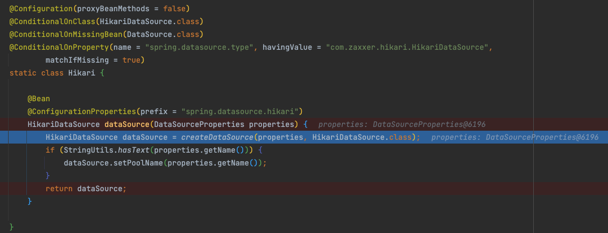

> 이 글은 우테코 달록팀 크루 '[매트](https://github.com/hyeonic)'가 작성했습니다.

## properties 객체로 다루기

Spring에서 `application.yml`이나 `application.properties`에 존재하는 값을 불러오는 방법에는 대표적으로 `@Value` 애노테이션을 사용한 방법과 `@ConfigurationProperties`를 사용한 방법이 존재한다. 두 방식을 직접 적용해 본 뒤 차이와 이점에 대해 알아보려 한다.

## @Value 사용하기

`@Value`는 기본적으로 설정 정보를 단일값으로 주입 받기 위해 사용된다. 아래는 실제 달록 프로젝트에서 적용한 예시이다.

```java
@Component
public class GoogleOAuthClient implements OAuthClient {

    private static final String JWT_DELIMITER = "\\.";

    private final String clientId;
    private final String clientSecret;
    private final String grantType;
    private final String redirectUri;
    private final String tokenUri;
    private final RestTemplate restTemplate;
    private final ObjectMapper objectMapper;

    public GoogleOAuthClient(@Value("${oauth.google.client-id}") final String clientId,
                             @Value("${oauth.google.client-secret}") final String clientSecret,
                             @Value("${oauth.google.grant-type}") final String grantType,
                             @Value("${oauth.google.redirect-uri}") final String redirectUri,
                             @Value("${oauth.google.token-uri}") final String tokenUri,
                             final RestTemplateBuilder restTemplateBuilder, final ObjectMapper objectMapper) {
        this.clientId = clientId;
        this.clientSecret = clientSecret;
        this.grantType = grantType;
        this.redirectUri = redirectUri;
        this.tokenUri = tokenUri;
        this.restTemplate = restTemplateBuilder.build();
        this.objectMapper = objectMapper;
    }
		...
}
```

간단하게 적용이 가능하지만 공통으로 묶인 프로퍼티가 많아질 경우 코드가 지저분해진다. 이러한 프로퍼티 값들을 객체로 매핑하여 사용하기 위한 애노테이션으로 `@ConfigurationProperties`가 존재한다.

## @ConfigurationProperties

우리는 때때로 DB 설정을 작성하기 위해 `application.yml`을 통해 관련 정보를 작성하곤 한다. 아래는 간단한 h2 DB를 연결하기 위한 설정을 적은 예시이다.

```yaml
spring:
  datasource:
    url: jdbc:h2:~/dallog;MODE=MYSQL;DB_CLOSE_DELAY=-1;DB_CLOSE_ON_EXIT=FALSE
    username: sa
```

이러한 설정들은 어디서 어떻게 활용되고 있을까? 실제 바인딩 되고 있는 객체를 따라가보자.

```java
@ConfigurationProperties(prefix = "spring.datasource")
public class DataSourceProperties implements BeanClassLoaderAware, InitializingBean {
	
    private ClassLoader classLoader;
    private boolean generateUniqueName = true;
	private String name;
	private Class<? extends DataSource> type;
	private String driverClassName;
	private String url;
    ...
}
```

위 `DataSourceProperties`는 우리가 `application.yml`에 작성한 설정 정보를 기반으로 객체로 추출하고 있다. 이것은 Spring Boot의 자동설정으로 `DataSource`가 빈으로 주입되는 시점에 설정 정보를 활용하여 생성된다. 

간단히 디버깅을 진행해보면 Bean이 주입되는 시점에 아래와 같이 `application.yml`에 명시한 값들을 추출한 `DataSourceProperties`를 기반으로 생성하고 있다.




정리하면 우리는 Spring Boot를 사용하며 자연스럽게 `@ConfigurationProperties`를 활용하여 만든 객체를 사용하고 있는 것이다.

이제 우리가 작성한 설정 값을 기반으로 객체를 생성해서 활용해보자. 아래는 실제 프로젝트에서 사용하고 있는 `application.yml`의 일부를 가져온 것이다.

```yaml
...
oauth:
  google:
    client-id: ${GOOGLE_CLIENT_ID}
    client-secret: ${GOOGLE_CLIENT_SECRET}
    redirect-uri: ${GOOGLE_REDIRECT_URI}
    oauth-end-point: https://accounts.google.com/o/oauth2/v2/auth
    response-type: code
    scopes:
        - https://www.googleapis.com/auth/userinfo.profile
        - https://www.googleapis.com/auth/userinfo.email
    token-uri: ${GOOGLE_TOKEN_URI}
    grant-type: authorization_code
...
```

이것을 객체로 추출하기 위해서는 아래와 같이 작성해야 한다.

```java
@ConfigurationProperties("oauth.google")
@ConstructorBinding
public class GoogleProperties {

    private final String clientId;
    private final String clientSecret;
    private final String redirectUri;
    private final String oAuthEndPoint;
    private final String responseType;
    private final List<String> scopes;
    private final String tokenUri;
    private final String grantType;

    public GoogleProperties(final String clientId, final String clientSecret, final String redirectUri,
                            final String oAuthEndPoint, final String responseType, final List<String> scopes,
                            final String tokenUri, final String grantType) {
        this.clientId = clientId;
        this.clientSecret = clientSecret;
        this.redirectUri = redirectUri;
        this.oAuthEndPoint = oAuthEndPoint;
        this.responseType = responseType;
        this.scopes = scopes;
        this.tokenUri = tokenUri;
        this.grantType = grantType;
    }

    public String getClientId() {
        return clientId;
    }

    public String getClientSecret() {
        return clientSecret;
    }

    public String getRedirectUri() {
        return redirectUri;
    }

    public String getoAuthEndPoint() {
        return oAuthEndPoint;
    }

    public String getResponseType() {
        return responseType;
    }

    public List<String> getScopes() {
        return scopes;
    }

    public String getTokenUri() {
        return tokenUri;
    }

    public String getGrantType() {
        return grantType;
    }
}
```

- `@ConfigurationProperties`: 프로퍼티에 있는 값을 클래스로 바인딩하기 위해 사용하는 애노테이션이다. `@ConfigurationProperties`는 값을 바인딩하기 위해 기본적으로 `Setter`가 필요하다. 하지만 `Setter`를 열어둘 경우 불변성을 보장할 수 없다. 이때 생성자를 통해 바인딩 하기 위해서는 `@ConstructorBinding`을 활용할 수 있다.
- `@ConstructorBinding`: 앞서 언급한 것 처럼 생성자를 통해 바인딩하기 위한 목적의 애노테이션이다.

```java
@Configuration
@EnableConfigurationProperties(GoogleProperties.class)
public class PropertiesConfig {
}
```

- `@EnableConfigurationProperties`: 클래스를 지정하여 스캐닝 대상에 포함시킨다.

### 개선하기

```java
@Component
public class GoogleOAuthClient implements OAuthClient {

    private static final String JWT_DELIMITER = "\\.";

    private final GoogleProperties googleProperties;
    private final RestTemplate restTemplate;
    private final ObjectMapper objectMapper;

    public GoogleOAuthClient(final GoogleProperties googleProperties, final RestTemplateBuilder restTemplateBuilder,
                             final ObjectMapper objectMapper) {
        this.googleProperties = googleProperties;
        this.restTemplate = restTemplateBuilder.build();
        this.objectMapper = objectMapper;
    }
    ...
}
```

이전 보다 적은 수의 필드를 활용하여 설정 정보를 다룰 수 있도록 개선되었다.

### 정리

 우리는 `application.yml` 혹은 `application.properties`에 작성하여 메타 정보를 관리할 수 있다. 클래스 내부에서 관리할 경우 수정하기 위해서는 해당 클래스에 직접 접근해야 한다. 하지만 설정 파일로 분리할 경우 우리는 환경에 따라 유연하게 값을 설정할 수 있다. 또한 `@ConfigurationProperties` 애노테이션을 사용할 경우 클래스로 값을 바인딩하기 때문에 연관된 값을 한 번에 바인딩할 수 있다.

## References.

[달록 repository](https://github.com/woowacourse-teams/2022-dallog)<br>
[[Spring] @Value와 @ConfigurationProperties의 사용법 및 차이 - (2/2)](https://mangkyu.tistory.com/207)<br>
[appendix.configuration-metadata.annotation-processor](https://docs.spring.io/spring-boot/docs/2.7.1/reference/html/configuration-metadata.html#appendix.configuration-metadata.annotation-processor)
