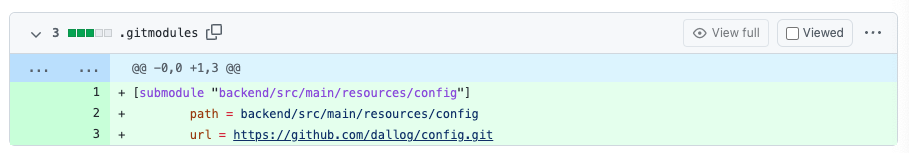
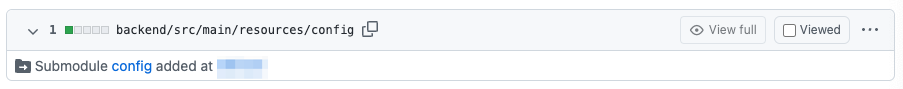

> 이 글은 우테코 달록팀 크루 '[매트](https://github.com/hyeonic)'가 작성했습니다.

## 달록 서브모듈 도입기

Spring Boot를 활용하여 애플리케이션을 개발할 때 `application.properties`, `application.yml` 통해 다양한 설정 정보를 지정할 수 있다. 우리 [달록](https://github.com/woowacourse-teams/2022-dallog)도 `application.yml`을 통해 애플리케이션 구동 시 필요한 정보들을 명시하여 사용하고 있다.

하지만 이러한 설정 정보는 애플리케이션이 실행되는 환경에 따라 분리되어야 하며 private한 정보까지 명시해야 했다. 우리 달록은 이것을 이루기 위해 환경 변수를 활용하여 설정 정보를 명시하였다.

```yaml
spring:
  sql:
    init:
      mode: always

  datasource:
    url: jdbc:h2:~/dallog;MODE=MYSQL;DB_CLOSE_DELAY=-1;DB_CLOSE_ON_EXIT=FALSE
    username: sa

  jpa:
    properties:
      hibernate:
        format_sql: true
    show-sql: true

    hibernate:
      ddl-auto: create
    defer-datasource-initialization: true

  data:
    web:
      pageable:
        max-page-size: 100

  h2:
    console:
      enabled: true

logging:
  level:
    root: ${LOGGING_LEVEL}
  file:
    name: "./logs/dallog.log"
  logback:
    rollingpolicy:
      file-name-pattern: "./logs/dallog-%d{yyyy-MM-dd}-%i.log"
      max-file-size: 5MB
      total-size-cap: 100MB

oauth:
  google:
    client-id: ${GOOGLE_CLIENT_ID}
    client-secret: ${GOOGLE_CLIENT_SECRET}
    redirect-uri: ${GOOGLE_REDIRECT_URI}
    oauth-end-point: https://accounts.google.com/o/oauth2/v2/auth
    response-type: code
    scopes:
      - https://www.googleapis.com/auth/userinfo.profile
      - https://www.googleapis.com/auth/userinfo.email
    token-uri: ${GOOGLE_TOKEN_URI}
    grant-type: authorization_code

report:
  webhook:
    discord: ${DISCORD_WEBHOOK_URI}

security:
  jwt:
    token:
      secret-key: ${JWT_SECRET_KEY}
      expire-length: ${JWT_EXPIRE_LENGTH}
```

환경 변수는 `${}`와 같은 형식으로 작성된다. 가장 큰 장점은 빠르게 적용이 가능하다는 것이다. 하지만 모든 팀원과 개발 및 운영 서버에 환경 변수를 물리적으로 세팅해두어야 한다. 만약 개발 중 환경 변수가 추가된다면 모든 팀원이 동일하게 추가해야 하며 개발 및 운영 환경에도 동일하게 세팅해주어야 하는 단점이 있다.

## 서브모듈 도입

앞서 언급한 단점들로 우리는 환경 변수를 통한 설정 정보 관리의 불편함을 느끼게 되었다. 이러한 불편함을 개선하기 위해 서브모듈을 도입하기로 결정하였다. 서브모듈을 통해 필요한 환경 정보를 유연하게 관리하고, repository를 통한 형상 관리 까지 진행할 수 있게 되었다. 또한 서브모듈을 활용하게 되면 `JWT의 Secret Key`와 같은 private한 정보들을 private repository를 통해 안전하게 관리할 수 있다. 

### private repository 생성


먼저 환경 별 설정 정보와 private한 설정 정보를 모아두기 위한 `private repository`를 생성한다. repository의 이름을 `config`라고 설정한 것은 추후 언급할 예정이다. 필요한 파일을 해당 repository에 작성 후 `commit & push`를 진행한다.

### main repository에 서브모듈 추가

```bash
$ git add submodule https://github.com/dallog/{private repository}.git
or
$ git add submodule https://github.com/dallog/{private repository}.git {연결한 디렉토리} 
```

`{private repository}`에 앞서 생성한 private repository의 이름을 명시한다. 만약 뒤에 추가로 디렉토리의 위치를 인자로 전달하면 해당 디렉토리와 서브모듈이 연결된다.

위 명령어를 작성하면 `.gitsubmodules` 파일이 생성된다.

```
[submodule "backend/src/main/resources/config"]
        path = backend/src/main/resources/config
        url = https://github.com/dallog/config.git
```

우리 달록은 `backend/src/main/resources/config`로 위치를 지정하였다. 이제 새롭게 추가된 서브모듈 설정을 `commit & push` 한다. 새로운 기능이 추가되었기 때문에 PR을 시도한다.

PR에 commit 내역을 살펴보면 아래와 같은 commit 내역을 확인할 수 있다.




잘 연결된 것을 확인할 수 있다.

## submodule 적용 시키기

위 PR이 merge가 되면 main repository에 서브모듈 디렉토리가 추가될 것이다. 만약 최초로 main repository를 clone하는 경우 아래와 같이 진행한다.

```bash
$ git clone --recurse-submodules https://github.com/woowacourse-teams/2022-dallog.git
```

 *  `--recurse-submodules`: clone 시점에 서브모듈을 자동으로 `init`하고 `update`한다.

위 과정은 아래와 같다.

```bash
$ git clone https://github.com/woowacourse-teams/2022-dallog.git
$ git submodule init
$ git submodule update

or

$ git clone https://github.com/woowacourse-teams/2022-dallog.git
$ git submodule update --init
```

 * `git submodule update --init`: 현재 main repository에 연결되어 있는 sub repository의 정보를 가지고 update를 진행한다. main repository의 commit 당시의 snap shot을 가져오는 것이다. 즉 매번 최신의 private repository commit을 가져오는 것이 아니라 main repository의 기준으로 반영된 commit을 가져온다.

## 작업 중간에 서브모듈이 추가되어 반영해야 하는 경우

우리 달록은 fetch + rebase를 기반으로 프로젝트를 최신화하고 있다.

```bash
$ git pull --rebase upstream develop
```

main repository를 pull 한다고 서브모듈의 repository까지 최신화 되지 않는다. 각 서브모듈을 일괄적으로 업데이트 해야 한다. 각각의 sub repository에서 fetch + merge 혹은 pull을 진행해도 되지만 아래와 같이 한 번에 진행할 수 있다.

```bash
git submodule update --init
```

해당 명령어를 통해 main repository에 추가 반영된 서브모듈 repository 정보를 가져올 수 있다.

## 주의사항

서브모듈이 수정되면 남은 팀원에게 변경사항에 대해 전달해야 한다. 우리는 서브모듈을 하나의 main 브랜치로 관리하고 있기 때문에 동시에 수정할 경우 충돌될 가능성이 크다. 왠만하면 서브모듈에 대한 작업은 동시에 진행하지 않도록 한다.

서브모듈이 변동될 경우 나머지 팀원들은 앞서 작성한 명령어를 통해 일괄적으로 서브모듈의 변경점을 반영해야 한다. 서브모듈을 변경한 사람은 자신이 어떤 이유로 수정했는지 명시한 뒤 PR 작성 시 나머지 팀원이 잘 적용할 수 있도록 가이드 라인을 명시해둔다.

## [번외] 왜 config인가?

> Spring Boot will automatically find and load `application.properties` and `application.yaml` files from the following locations when your application starts:

Spring Boot 애플리케이션은 시작될 때 다음 위치에서 자동으로 `application.properties` 및 `application.yml` 파일을 찾아 로드한다. 

 * From the classpath
    * The classpath root
    * The classpath `/config` package
 * From the current directory
    * The current directory
    * The `/config` subdirectory in the current directory
    * Immediate child directories of the `/config` subdirectory

> The list is ordered by precedence (with values from lower items overriding earlier ones). Documents from the loaded files are added as PropertySources to the Spring Environment.

목록은 우선 순위에 따라 정렬된다(하위 항목의 값이 이전 항목보다 우선이다). 로드된 파일의 문서는 스프링 환경에 속성 소스로 추가된다. 정리하면 아래로 갈수록 높은 우선순위를 가진다.

```java
public class ConfigFileApplicationListener implements EnvironmentPostProcessor, SmartApplicationListener, Ordered {
    ...
    private static final String DEFAULT_SEARCH_LOCATIONS = "classpath:/,classpath:/config/,file:./,file:./config/*/,file:./config/";
    ...
}
```

Maven, Gradle를 활용하여 Spring 프로젝트를 생성하면 기본적으로 리소스 파일은 `src/main/resources`에 저장된다. `.java`와 같이 컴파일 대상이 아닌 리소스 파일은 resources 디렉토리에 저장하고 관리한다. 즉 리소스 파일의 Classpath는 기본적으로 `src/main/resources`가 된다. 만약 해당 위치에 설정 관련 리소스가 존재하지 않는 경우 다음 우선 순위인 `src/main/resources/config`를 찾아 설정 정보를 로드한다.

> Classpath는 JVM이 실행할 때 class 파일을 찾는데 기준이 되는 경로를 의미한다. Spring은 이러한 classpath를 통해 필요한 resources를 가져온다.

물론 외부에서 jar 파일을 실행할 때 아래와 같이 `spring.config.location` 설정을 통해 기본 위치를 변경할 수 있다.

```bash
$ java -jar myproject.jar --spring.config.location=classpath:custom-config/
```

이렇게 애플리케이션 실행 시점에 의존하여 주입하는 것 보다 기본으로 제공하는 우선 순위에 따라 조정하는 것이 더욱 편하다 판단하여 `config`라는 이름을 가진 `private repository`를 생성하여 반영했다.

## 정리

우리 달록은 다양한 환경과 private한 정보 관리를 위해 서브모듈을 도입하게 되었다. 환경 변수를 사용할 때 보다 적절한 형상 관리와 팀원 간의 정보 공유를 통해 편리하게 설정 정보를 관리할 수 있게 되었다.

장점만 있는 것은 아닌다. private repository와 서브모듈에 대한 관리 포인트가 늘어나게 되었다. 모든 팀원들이 서브모듈에 대한 배경지식이 없다면 최악의 경우 commit 기록이 꼬이게 되어 설정 정보가 온전하게 적용되지 않을 수 있다. 또한 `외부 환경(jenkins 등)`에서 `CD`를 진행할 때도 서브모듈을 적용한 repository도 함께 pull 받기 위해 추가적인 설정이 필요해진다.

서브모듈은 편리한 부분도 많지만 결국 관리해야 할 포인트가 늘어난다는 단점도 있다. 팀원과의 충분한 협의와 프로젝트의 규모를 잘 고민한 뒤 적용하는 것이 바람직하다 판단한다.

### References.

[git submodule로 중요한 정보 관리하기](https://tecoble.techcourse.co.kr/post/2021-07-31-git-submodule/)<br>
[7.2. Externalized Configuration](https://docs.spring.io/spring-boot/docs/2.7.0/reference/htmlsingle/#features.external-config)
