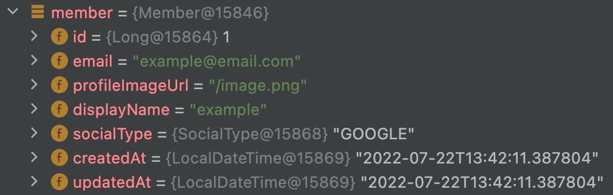
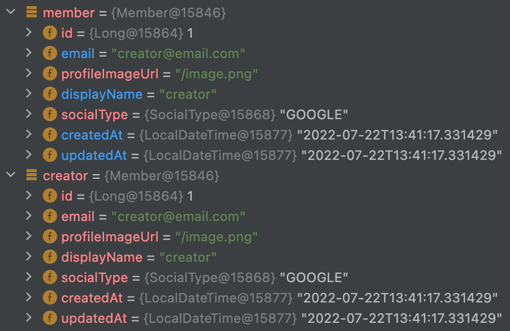
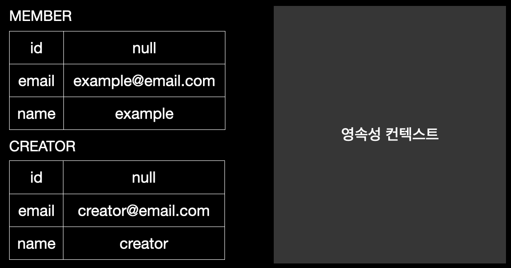
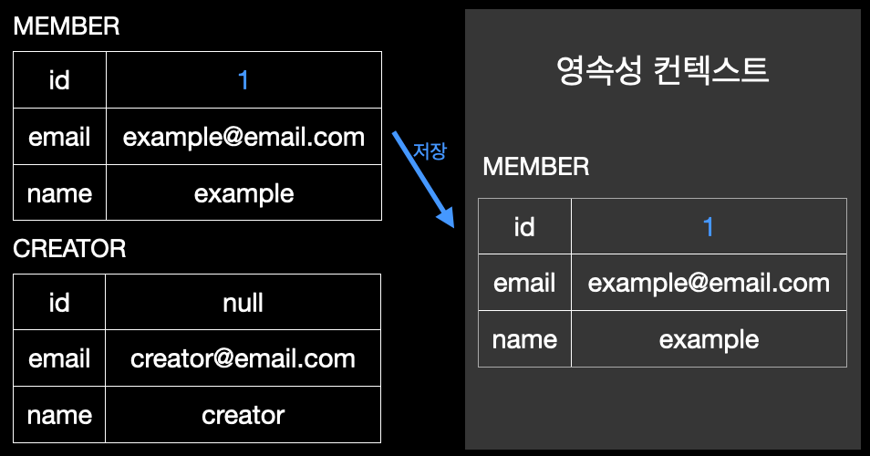
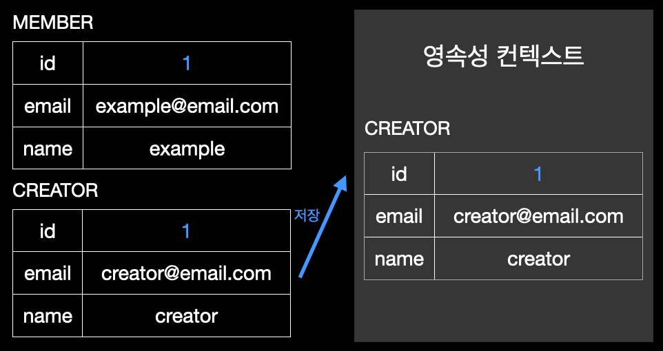
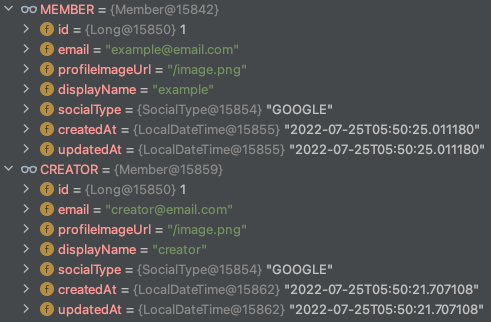
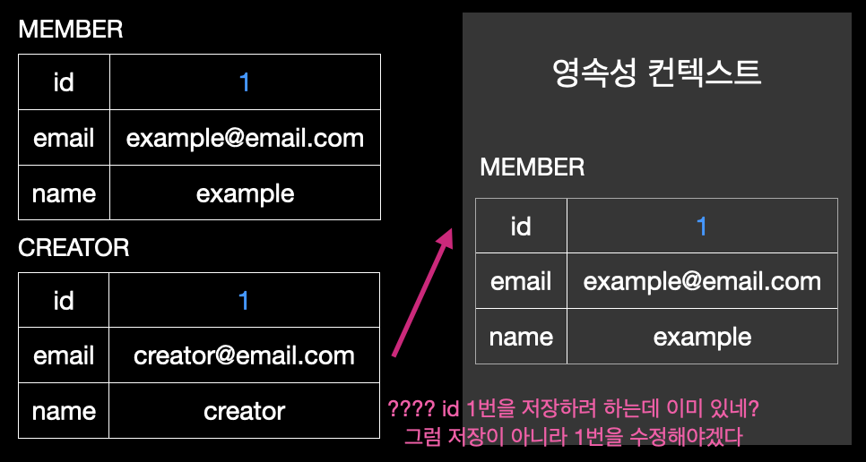

> 이 글은 우테코 달록팀 크루 [파랑](https://github.com/summerlunaa)이 작성했습니다.

## 문제

```java
// MemberFixtures

public static final Member MEMBER 
		= new Member("example@email.com", "/image.png", "example", SocialType.GOOGLE);
public static final Member CREATOR 
		= new Member("creator@email.com", "/image.png", "creator", SocialType.GOOGLE);
```

```java
// CategoryServiceTest

@DisplayName("자신이 만들지 않은 카테고리를 수정할 경우 예외를 던진다.")
@Test
void 자신이_만들지_않은_카테고리를_수정할_경우_예외를_던진다() {
    // given
    Member member = memberRepository.save(MEMBER);
    Member creator = memberRepository.save(CREATOR);
    CategoryResponse savedCategory = categoryService.save(creator.getId(),
            new CategoryCreateRequest(CATEGORY_NAME));

    CategoryUpdateRequest categoryUpdateRequest = new CategoryUpdateRequest(MODIFIED_CATEGORY_NAME);

    // when & then
    assertThatThrownBy(
            () -> categoryService.update(member.getId(), savedCategory.getId(), categoryUpdateRequest))
            .isInstanceOf(NoPermissionException.class);
}
```

`CategoryServiceTest`에서 카테고리 수정 기능에 대한 테스트가 터졌다. `update` 시 다른 회원의 id를 넣으면 `NoPermissionException`이 발생해야 하는데 아무런 예외도 발생하지 않았다. 더 이상한 점은 단독으로 돌렸을 때는 잘 돌아가지만 전체 테스트를 돌리면 터진다는 것이다. 테스트 격리에 문제가 있어 보였다. 디버깅을 해보았다.



MEMBER까지 저장했을 때는 분명 값들이 잘 들어가있는 걸 볼 수 있다.



근데 CREATOR를 저장하는 순간!? member의 값이 갑자기 CREATOR의 값으로 전부 변경되었다. 왜 이런 걸까.

## 원인

> 가변객체인 회원의 Entity를 상수로 등록하여 사용하고 있는 것이 문제였다.

아래 그림을 통해 알아보자.



테스트 실행 전 MEMBER와 CREATOR는 id를 가지지 않은 상태이다. 영속성 컨텍스트도 비어있다.

전체 테스트를 실행하면 MEMBER와 CREATOR는 상수이므로 온갖 테스트에서 두 개의 상수를 가져다 쓰게 된다. 그 과정에서 MEMBER가 저장되는 상황이 발생한다.



그럼 상수 MEMBER의 id 값이 1로 바뀌게 된다. 이후 다른 테스트에서는 CREATOR가 저장된다. 이 때 각각의 테스트는 격리되어 있으므로 영속성 컨텍스트는 빈 상태이다. 따라서 CREATOR의 id도 1로 저장된다.



이렇게 상수 MEMBER와 CREATOR의 id가 모두 1로 바뀌었다. 디버깅을 해보니 실제로 상수의 id 값이 모두 1로 바뀐 것을 볼 수 있다.



이 상태에서 처음 봤던 테스트 코드로 돌아가보자.

```java
// CategoryServiceTest

@DisplayName("자신이 만들지 않은 카테고리를 수정할 경우 예외를 던진다.")
@Test
void 자신이_만들지_않은_카테고리를_수정할_경우_예외를_던진다() {
    // given
    Member member = memberRepository.save(MEMBER);
    Member creator = memberRepository.save(CREATOR); // 문제 발생 !!!
    CategoryResponse savedCategory = categoryService.save(creator.getId(),
            new CategoryCreateRequest(CATEGORY_NAME));

    CategoryUpdateRequest categoryUpdateRequest = new CategoryUpdateRequest(MODIFIED_CATEGORY_NAME);

    // when & then
    assertThatThrownBy(
            () -> categoryService.update(member.getId(), savedCategory.getId(), categoryUpdateRequest))
            .isInstanceOf(NoPermissionException.class);
}
```

테스트를 보면 처음으로 MEMBER를 저장한다. 이까지는 아무 문제가 없다. 문제는 두 번째로 CREATOR를 저장할 때 발생한다.



CREATOR를 저장하려고 하는데 저장된 MEMBER의 id도 1이고, CREATOR의 id도 1이다. CREATOR를 저장할 때 영속성 컨텍스트에 같은 id를 가진 entity가 있으므로 CREATOR를 새롭게 저장하지 않고, 기존의 id가 1번인 entity를 수정하게 된다.


기존의 값이 수정되니 id가 1번인, MEMBER를 저장한 member instance의 값까지 변경되는 것이다.

## 해결

Entity 객체에 대한 fixture가 필요한 경우 객체를 생성하는 메서드를 통해 호출할 때마다 새로운 객체를 생성해서 반환하도록 했다.

```java
public static Member 파랑() {
    return new Member(파랑_이메일, 파랑_프로필, 파랑_이름, SocialType.GOOGLE);
}
```

## 결론

상수란 변하지 않고 고정된 값을 담는 변수를 의미한다. 하지만 우리는 필드가 변하는 객체인 Member Entity를 상수로 선언했다. 테스트 격리를 아무리 잘 해도 상수까지 계속 리프레쉬 해주진 않기 때문에 이런 문제가 발생한 것이다.

**변하지 않는 불변 객체만 상수로 지정하자!!**
