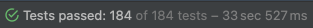
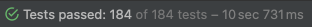

> 이 글은 우테코 달록팀 크루 '[매트](https://github.com/hyeonic)'가 작성했습니다.

테스트는 독립적이어야 하며 공유 자원을 사용하면 안된다. 격리되지 못한 테스트는 [테스트에서 Entity 객체를 상수로 두면 안 되는 이유](https://dallog.github.io/test-fixture-constant/) 같이 많은 문제를 야기할 수 있다.

테스트를 격리하는 방법에는 여러가지가 있다. 우리 [달록](https://github.com/woowacourse-teams/2022-dallog)에서는 크게 두 가지 방식을 적용해봤고, 각 방식에 대한 장단점을 확인해보려 한다.

## TRUNCATE

테스트 격리에 대한 방식에 대해 알아보기 전에 간단한 SQL 쿼리의 특성에 대해 알아보려 한다.

`TRUNCATE`는  테이블의 모든 행을 삭제하는 `데이터 정의 언어 (Data Definition Language)`이다. `TRUNCATE`는 `DELETE`와 거의 유사하지만 부분 삭제가 불가능하다. 또한 `TRUNCATE`는 테이블 구조를 유지하기 때문에 `모든 행을 삭제하는데 가장 빠르고 효율적인 방법`이 될 수 있다.

우리는 이러한 특성을 활용하여 테스트 간의 격리를 위해 활용 하였다. 각각의 테스트 이전에 직접 작성한 SQL 스크립트를 통해 매번 테이블을 초기화 하는 방식으로 말이다.

아래는 테스트 격리를 위한 `truncate.sql`이다.

```sql
SET foreign_key_checks = 0;
TRUNCATE TABLE subscriptions;
TRUNCATE TABLE categories;
TRUNCATE TABLE members;
SET foreign_key_checks = 1;
```

- `foreign_key_checks`: `MySQL`에서 외래키 제약 조건을 키고 끄기 위한 설정이다. `0`으로 설정하면 제약 조건을 해제하고, `1`로 설정하면 제약 조건을 설정한다.
- `TRUNCATE 테이블명`: 앞서 언급한 것 처럼 테이블 구조를 유지하고 테이블에 모든 행을 삭제한다.

### 방법 1: @Sql(”truncate.sql”)

```java
@Target({ElementType.TYPE, ElementType.METHOD})
@Retention(RetentionPolicy.RUNTIME)
@Documented
@Inherited
@Repeatable(SqlGroup.class)
public @interface Sql {

	@AliasFor("scripts")
	String[] value() default {};

	@AliasFor("value")
	String[] scripts() default {};
	...
}
```

`테스트 클래스`나 `테스트 메서드`에 작성할 수 있는 애노테이션이다. 해당 애노테이션에 SQL 스크립트를 명시하면 메서드 실행 시점에 해당 스크립트가 수행된다.

아래와 같이 손쉽게 적용할 수 있다.

```java
@SpringBootTest(webEnvironment = SpringBootTest.WebEnvironment.RANDOM_PORT)
@Sql("truncate.sql")
@Import(TestConfig.class)
class AcceptanceTest {

    @LocalServerPort
    private int port;

    @BeforeEach
    void setUp() {
        RestAssured.port = port;
    }
}
```

하지만 이 방식은 `Entity`가 추가될 경우 직접 `truncate.sql` 파일에 접근하여 테이블을 추가해줘야 하는 불편함이 있다.

### 방법 2: EntityManager를 통한 TRUNCATE

앞서 언급한 단점을 해결하기 위한 방법이다. `EntityManager`를 통해 동적으로 현재 등록된 `Entity`를 조회한 뒤 각각의 `Entity`의 클래스 정보를 활용하여 테이블 이름을 획득한 뒤 쿼리문을 실행하도록 할 수 있다. 

하지만 단순히 Entity의 이름을 가져올 경우 아래와 같이 클래스 이름을 가져올 뿐이다.

```java
@DataJpaTest
class DatabaseCleanupTest {

    @Autowired
    private EntityManager entityManager;

    @Test
    void entities() {
        entityManager.getMetamodel()
                .getEntities()
                .stream()
                .map(EntityType::getName)
                .forEach(System.out::println);
    }
}
```

```bash
Member
Category
Subscription
Schedule
```

하지만 우리 `달록`은 `MySQL`에 `schedule 예약어`로 인해 `schedules`와 같이 복수형으로 표현하기로 통일하였다. 하지만 클래스 이름을 활용하여 다양한 조건을 가진 복수 형태를 만드는 것은 한계가 있었다. 예를 들면 `Member`는 `members`, `Category`는 `categories`와 같이 표현하고 있다.

우리는 이러한 테이블명은 `Entity` 클래스에 `@Table` 애노테이션을 통해 명시하기로 약속하였고, 이것을 활용하는 방안을 고민하였다.

```java
@Table(name = "categories")
@Entity
public class Category extends BaseEntity {

    public static final int MAX_NAME_LENGTH = 20;

    @Id
    @GeneratedValue(strategy = GenerationType.IDENTITY)
    @Column(name = "id")
    private Long id;

    @Column(name = "name", nullable = false)
    private String name;

    @ManyToOne(fetch = FetchType.LAZY)
    @JoinColumn(name = "members_id", nullable = false)
    private Member member;
		...
}
```

해답은 바로 Java의 `Reflection API`를 활용한 방법이다. 아래는 Java의 Reflection을 활용하여 Table 애노테이션에 명시한 name 값을 추출하여 `tableNames`로 활용한 예시이다.

```java
@Component
public class DatabaseCleanup {

    private final EntityManager entityManager;
    private final List<String> tableNames;

    public DatabaseCleanup(final EntityManager entityManager) {
        this.entityManager = entityManager;
        this.tableNames = entityManager.getMetamodel()
                .getEntities()
                .stream()
                .map(Type::getJavaType)
                .map(javaType -> javaType.getAnnotation(Table.class))
                .map(Table::name)
                .collect(Collectors.toList());
    }

    @Transactional
    public void execute() {
        entityManager.flush();
        entityManager.createNativeQuery("SET foreign_key_checks = 0").executeUpdate();

        for (String tableName : tableNames) {
            entityManager.createNativeQuery("TRUNCATE TABLE " + tableName).executeUpdate();
        }

        entityManager.createNativeQuery("SET foreign_key_checks = 1").executeUpdate();
    }
}
```

- `getMetamodel()`: persistence unit의 메타 모델에 접근하기 위한 `Metamodel` 인터페이스를 반환한다.
- `getEntities()`: metamodel에 Entity Type을 반환한다.
- `getJavaType()`: Java Type을 반환한다. 반환 타입은 `Class<T>`이다.
- `getAnnotation(Table.class)`: `@Table` 애노테이션을 가져온다.
- `Table::name`: 해당 애노테이션에 명시한 이름 정보를 가져온다.

우리는 이제 작성한 `Entity`의 모든 테이블명을 가지게 되었다. 이제 앞서 작성한 `TRUNCATE` 관련 쿼리를 `entityManager`가 실행할 수 있도록 작성 해준다.

자 이제 우리가 만든 `DatabaseCleanup` 객체를 주입 받아 각각의 메서드 실행 이전에 호출할 수 있도록 개선하자.

```java
@SpringBootTest(webEnvironment = SpringBootTest.WebEnvironment.RANDOM_PORT)
@Import(TestConfig.class)
class AcceptanceTest {

    @LocalServerPort
    private int port;

    @Autowired
    private DatabaseCleanup databaseCleanup;

    @BeforeEach
    void setUp() {
        RestAssured.port = port;
        databaseCleanup.execute();
    }
}
```

- `@Autowired private DatabaseCleanup databaseCleanup`: 앞서 작성한 `DatabaseCleanup`을 주입 받는다.
- `databaseCleanup.execute()`: `@BeforeEach`를 통해 각 테스트 메서드가 실행되기 이전에 DB 테이블의 행을 모두 비워준다.

이제 우리는 직접 파일을 수정하지 않아도 `Entity`의 추가에 유동적으로 대응할 수 있게 되었다.

## 테스트 격리 방식 비교

가장 간편하게 테스트를 격리하는 방법은 각각의 분리된 테스트 마다 Spring Context를 새롭게 로드하는 것이다. `@DirtiesContext`를 활용하면 아래와 같이 적용이 가능하다.

```java
@DirtiesContext(classMode = ClassMode.BEFORE_EACH_TEST_METHOD)
@SpringBootTest(webEnvironment = SpringBootTest.WebEnvironment.RANDOM_PORT)
@Import(TestConfig.class)
class AcceptanceTest {

    @LocalServerPort
    private int port;

    @BeforeEach
    void setUp() {
        RestAssured.port = port;
    }
}
```

- `@DirtiesContext(classMode = ClassMode.BEFORE_EACH_TEST_METHOD)`: 테스트 메서드를 실행하기 전에 context를 새롭게 로드한다.

하지만 이 방식은 테스트하는데 매우 오랜 시간이 걸린다. 아래는 `@DirtiesContext`를 적용한 뒤 달록에 있는 테스트를 실행한 것이다.



이제 위에서 작성한 `DatabaseCleaner`를 활용해보자.



`33 sec`에서 `10 sec`의 성능 개선을 확인할 수 있었다.

## 정리

`@DirtiesContext`를 활용한 테스트 격리는 테스트 마다 context를 새롭게 로드하기 때문에 매우 오랜 시간이 걸린다.

그렇기 때문에 `TRUNCATE`를 통해 테스트 격리를 진행하는 것이 더욱 빠른 테스트 피드백을 확인할 수 있다. `@Sql`을 통해 적용할 경우 간편하게 적용이 가능하다. 하지만 `Entity`가 추가될 경우 직접 스크립트 파일에 접근하여 수정해야 하는 단점이 있다. 또한 문자열로 작성되기 때문에 최악의 경우 오타로 인하여 테이블을 찾지 못할 수도 있다.

`EntityManager`를 통해 `TRUNCATE`를 적용할 경우 현재 작성된 `Entity`를 기반으로 명시한 테이블명을 가져온다. 즉 우리가 의도한 테이블명을 그대로 활용할 수 있기 때문에 직접 수정하지 않아도 편리하게 활용할 수 있다.

## References.

[TRUNCATE (SQL)](https://ko.wikipedia.org/wiki/TRUNCATE_(SQL))<br>
[Annotation Type Sql](https://docs.spring.io/spring-framework/docs/current/javadoc-api/org/springframework/test/context/jdbc/Sql.html)<br>
[Guide to Java Reflection](https://www.baeldung.com/java-reflection)<br>
[Separated Interface](https://www.martinfowler.com/eaaCatalog/separatedInterface.htmlhttps://www.martinfowler.com/eaaCatalog/separatedInterface.html)
