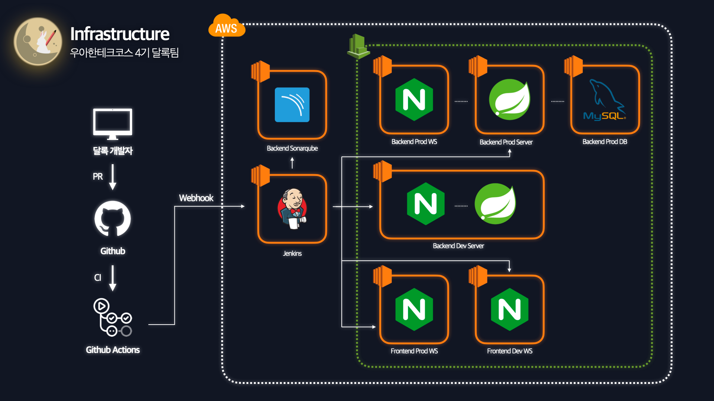

> 이 글은 우테코 달록팀 크루 [파랑](https://github.com/summerlunaa)이 작성했습니다.

# 무중단 배포 도입 이유

달록의 기존 배포 스크립트는 이렇습니다.

```bash
if [ -z "$CURRENT_PID" ]; then
    echo "🌈 구동중인 애플리케이션이 없으므로 종료하지 않습니다."
else
    echo "🌈 구동중인 애플리케이션을 종료했습니다. (pid : $CURRENT_PID)"
    kill -9 $CURRENT_PID
fi

echo "\n🌈 SpringBoot 애플리케이션을 실행합니다.\n"

JAR_NAME=$(ls | grep .jar | head -n 1)

nohup java -jar -Dserver.port=$1 -Dspring.profiles.active=${SPRING_PROFILE} -Duser.timezone=Asia/Seoul /home/ubuntu/$JAR_NAME > /dev/null 2>&1 &
```

```
1. 구동중인 애플리케이션을 확인하고
2. 구동중인 애플리케이션이 있다면 종료한다.
3. 이후 jar 파일을 실행한다.
```

여기서 2 → 3의 과정, 구동중인 애플리케이션을 종료하고 새로 실행하는 과정에서 서비스가 중단됩니다. 저희 서비스의 중단 시간을 측정해보니 약 `8초` 정도 중단되는 것을 확인할 수 있었습니다.

물론 지금이야 달록의 사용자가 많지 않아 그 동안 큰 문제는 없었습니다. 하지만 사용자가 많은 실제 서비스에서 매 배포때마다 8초씩 서비스가 멈춘다면 사용자들의 신뢰가 떨어지고 매출에도 영향을 미치겠조랭이떡? 🤔  저희 달록도 사용자의 편의성과 서비스의 안정성을 보장하기 위해 무중단 배포를 도입하기로 했습니다.

# 달록의 배포 전략 선택

이번 글은 실제 무중단 배포 도입기이기 때문에 이론적인 내용은 자세히 다루지 않겠습니다.

> 무중단 배포 전략의 자세한 내용이 궁금하다면? [후디의 무중단 배포 아키텍처와 배포 전략](https://hudi.blog/zero-downtime-deployment/)을 참고해주세요.
>

## 1. 롤링(Rolling) 배포

> 트래픽을 점진적으로 구버전에서 새로운 버전으로 옮기는 방식.
>정

애초에 달록은 EC2 한 대만 사용하고 있으며 호환성 문제가 발생할 가능성이 있어 제외했습니다.

## 2. 카나리(Canary) 배포

> 소수 인원에 대해서만 트래픽을 새로운 버전에 옮겨둔 상태에서 서비스를 운영한다. 새로운 버전에 이상이 없다고 판단하였을 경우에 모든 트래픽을 신규 버전으로 옮기는 방식. A/B 테스트를 하기에 적합하다.
>

롤링 배포와 마찬가지로 호환성 문제가 발생합니다. 또한 달록에서는 트래픽까지 점진적으로 옮겨가며 배포할 정도로 오류 감지에 대한 필요성을 느끼지 못해 제외했습니다.

## 3. 블루그린(Blue/Green) 배포

> 현재 운영 중인 서비스를 종료하지 않고 새로운 운영 환경을 만든 뒤 트래픽을 한 번에 신버전으로 옮기는 방식.
>

### 3-1. N개의 서버를 이용하는 방식

기존에 N개의 서버를 사용하고 있었다면 새롭게 N개의 서버를 구성하여 신버전을 배포하고 트래픽을 옮기는 방식입니다. 이 방식을 사용하면 배포 시 서버 자원이 두 배로 필요하며 서버를 제거하지 않는다면 불필요하게 서버를 방치하게 됩니다.

### 3-2. `포트를 변경하는 방식`

포트를 변경하는 방식의 장점은 서버 자원을 늘리지 않아도 무중단 배포가 가능하다는 것입니다. EC2 하나만 사용하는 달록에서는 이 방식이 자원을 늘리지 않으며 간단하게 무중단 배포를 적용할 수 있는 적절한 방법이라고 생각했습니다.

이제 포트 변경 방식의 블루그린 배포 전략을 어떻게 적용했는지 알아보겠습니다.

# 포트 변경 방식의 블루그린 배포 전략 적용



위는 기존 달록의 인프라 구조입니다. 실제 prod 백엔드 서버를 기준으로 간단히 설명하겠습니다.

```
1. 젠킨스에서 github actions를 통해 merge를 감지
2. 코드를 빌드한 뒤 jar 파일을 prod 서버로 전송
3. 젠킨스가 prod 서버의 jar 파일 실행 스크립트를 실행
4. 배포 완료
```

블루그린 전략을 적용하기 위해서는 3에서 jar 파일을 실행하기 전 배포할 포트 번호를 설정해 주어야 합니다. 따라서 위의 3번이 아래의 과정으로 대체됩니다.

```
1. 현재 실행 중인 포트 번호 확인
2. 새롭게 배포할 포트 번호로 애플리케이션 실행
3. 새로운 포트에 애플리케이션이 잘 떴는지 확인(health check)
4. nginx 설정에서 포트 번호 수정 후 reload
5. 기존 포트 종료
```

달록은 이 과정을 젠킨스 파이프라인 스크립트에 추가했습니다. 코드를 보겠습니다.

- 파이프라인 스크립트는 선언형(Declarative)으로 작성했습니다.
- SSH Agent 플러그인을 사용했습니다.
- 전체 코드가 궁금하다면? [달록의 backend-prod 젠킨스 파일 전체 보기](https://www.notion.so/9435a94ef13244d2bb31e4adfb339b38)

### 1. 현재 실행 중인 포트 번호 확인

```bash
if curl -s "http://${BACKEND_PROD_PUBLIC_IP}:${BLUE_PORT}" > /dev/null
then
    target_port=${GREEN_PORT}
else
    target_port=${BLUE_PORT}
fi
```

BLUE_PORT(8080)에 health check를 합니다. BLUE_PORT가 살아 있다면 `target_port`를 GREEN_PORT(8081)로, 죽어 있다면 BLUE_PORT로 설정합니다.

### 2. 새롭게 배포할 포트 번호로 애플리케이션 실행

```bash
scp -o StrictHostKeyChecking=no backend-0.0.1-SNAPSHOT.jar ubuntu@${BACKEND_PROD_IP}:/home/ubuntu
ssh ubuntu@${BACKEND_PROD_IP} 'sh run.sh ${target_port}' &
```

`scp` 명령어를 통해 jar 파일을 백엔드 서버로 전송합니다. 이후 `run.sh` 스크립트를 실행합니다. 이 때 인자로 `target_port` 를 넘깁니다. 실행 스크립트는 아래와 같습니다.

```bash
#! /bin/bash

PROJECT_NAME=backend
SPRING_PROFILE=prod

echo "\n🌈 SpringBoot 애플리케이션을 실행합니다.\n"

JAR_NAME=$(ls | grep .jar | head -n 1)

nohup java -jar -Dserver.port=$1 -Dspring.profiles.active=${SPRING_PROFILE} -Duser.timezone=Asia/Seoul /home/ubuntu/$JAR_NAME > /dev/null 2>&1 &
```

jar 파일 실행 시 시스템 변수인 `server.port` 값을 설정해주어서 원하는 포트에서 애플리케이션이 실행되도록 설정했습니다.

찾아해보면 properties 파일을 포트별로 나눠 사용하기도 합니다. 하지만 포트에 따라 properties 파일을 나누면 관리 포인트가 늘어나는 것이 마음에 들지 않았습니다. 따라서 이렇게 스크립트 실행 시 포트를 인자로 받아 설정하는 방법을 선택했습니다.

### 3. 새로운 포트에 애플리케이션이 잘 떴는지 확인(health check)

```bash
for retry_count in $($seq 10)
do
    if curl -s "http://${BACKEND_PROD_PUBLIC_IP}:${target_port}" > /dev/null
    then
        echo "Health check success ✅ port number: ${target_port}"
        break
    fi

    if [ $retry_count -eq 10 ]
    then
        echo "Health check failed ❌ port number: ${target_port}"
        exit 1
    fi

    echo "The server is not alive yet. Retry health check in 20 seconds... retry count: ${retry_count}"
    sleep 20
done
```

20초 단위로 최대 10번 `target_port` 에 애플리케이션이 잘 떴는지 health check를 실시합니다. 지금은 20초 단위로 확인하고 있어 애플리케이션이 제대로 뜨지 않은 경우 3분 20초나 기다리게 됩니다. health check의 텀이 너무 긴 것 같긴 하네요😅. 10초나 그 이하로 줄여도 괜찮을 것 같습니다.

다시 스크립트로 돌아와서 health check에 성공한다면 for 문을 빠져 나갑니다. 만약 10번의 시도가 모두 실패한다면 exit으로 스크립트를 종료합니다.

### 4. nginx 설정에서 포트 번호 수정 후 reload

```bash
ssh -o StrictHostKeyChecking=no ubuntu@${BACKEND_WS_IP} "echo 'set \\\$service_port ${target_port};' | sudo tee /etc/nginx/conf.d/service-port.inc && sudo service nginx reload"
echo "Switch the reverse proxy direction of nginx to ${target_port} 🔄"
```

nginx가 떠있는 백엔드 WS 서버에 service할 포트 번호를 설정하는 파일을 만들어 줍니다. `tee`는 명령어의 출력 결과를 파일과 화면에 동시에 출력하는 명령어입니다.

즉, `echo 'set \\\$service_port ${target_port};'` 이 명령의 결과를 화면과 `/etc/nginx/conf.d/service-port.inc` 이 위치에 출력하라는 것입니다. `$service_port` 앞에 역슬래시가 3번 붙는 이유는 `$` 로 한 번, 작은 따옴표에서 한 번, `ssh` 명령어에서 한 번 escape가 일어나기 때문입니다. 우리는 `service_port` 의 실제 변수 값을 쓰고 싶은 게 아니라 `$service_port` 이 단어 자체를 쓰고 싶은 것이기 때문에 역슬래시를 3번 붙여주어야 합니다.

이 명령어를 통해 만들어진 파일의 결과는 아래와 같습니다. 실행할 포트 번호가 8081인 경우엔 8081로 쓰이겠죠?

```bash
# /etc/nginx/conf.d/service-port.inc
set $service_port 8080;
```

이 작업이 끝나면 nginx를 reload해서 바뀐 포트 번호로 요청이 가도록 합니다. nginx의 설정 파일은 아래와 같습니다.

```bash
# /etc/nginx/conf.d/default.conf
server {
  listen 443 ssl http2;
  server_name api.dallog.me;

  ssl_certificate /etc/letsencrypt/live/api.dallog.me/fullchain.pem;
  ssl_certificate_key /etc/letsencrypt/live/api.dallog.me/privkey.pem;

  include /etc/nginx/conf.d/service-port.inc; # 포트 변수 선언 파일 include

  location / {
    proxy_pass http://$dallog_prod_ip:$service_port; # 바뀐 포트로 리버스 프록시 설정
    proxy_set_header Host $http_host;
    proxy_set_header X-Real-IP $remote_addr;
    proxy_set_header X-Forwarded-For $proxy_add_x_forwarded_for;
    proxy_set_header X-Forwarded-Proto $scheme;
  }
}
```

> ⚠️  여기서 주의할 점!! 혹시 한 인스턴스에 nginx와 spring을 함께 띄워두셨나요? 
>
> 혹시 `http://localhos:$service_port;` 로 리버스 프록시를 설정했는데 동작이 안 되나요? 
>
> 그렇다면 이 부분을 유심히 봐주세요.


기존 달록의 인프라 구조를 다시 가져왔습니다. 달록은 prod 서버와 dev 서버에 모두 무중단 배포를 적용했는데요, 위 사진에서 보이다시피 dev 서버의 경우 하나의 인스턴스에 nginx와 spring을 함께 띄워놨습니다. 따라서 nginx 설정 파일에서 `http://localhost:$service_port;` 로 주소를 설정해주었습니다.

분명 스크립트도 똑같이 짰고 설정도 잘 했는데 `service_port` 변수 값을 불러오지 못하는 에러를 만났습니다🥲. 한참을 찾아보니 `localhost`를 사용하면 `resolver`를 통해 주소를 `127.0.0.1` 로 변환하는데 뒤에 `$service_port` 변수가 붙어 주소를 찾아 변환하는 과정에 문제가 생기는 것이었습니다.

> 약간의 참고 자료 → [https://trac.nginx.org/nginx/ticket/2335](https://trac.nginx.org/nginx/ticket/2335)
>

정확한 원인까지는 파악하지 못했으나 **혹시 한 인스턴스에 nginx와 spring을 함께 두었다면 꼭 주소를 `localhost` 가 아닌 `127.0.0.1` 로 설정합시다.**

### 5. 기존 포트 종료

```bash
if [ "${target_port}" == "${BLUE_PORT}" ]
then
    ssh ubuntu@${BACKEND_PROD_IP} "fuser -s -k ${GREEN_PORT}/tcp"
else
    ssh ubuntu@${BACKEND_PROD_IP} "fuser -s -k ${BLUE_PORT}/tcp"
fi

echo "Kill the process on the opposite server. 🔪"
```

기존 포트를 종료합니다.

# 무중단 배포 결과

포트 변경 방식의 블루그린 전략을 적용한 달록의 CI/CD 구조는 이렇습니다. 중간에 WS에 변경된 포트 번호를 설정해주는 부분은 사진에서 생략되어 있습니다.


그린블루 전략으로 무중단 배포를 적용한 결과 downtime이 `8초`에서 `0.03초`로 크게 줄었습니다. nginx reload하는 이 짧은 시간까지도 없애는 방법이 있는지 궁금하네요. 아시는 분은 댓글로 남겨주시면 감사하겠습니다.

### References

[Jenkins와 Nginx로 스프링부트 애플리케이션 무중단 배포하기](https://hudi.blog/zero-downtime-deployment-with-jenkins-and-nginx/)

[무중단 배포 적용기](https://ecsimsw.tistory.com/940)

[Spring Boot에서 기본 포트를 변경하는 방법](https://recordsoflife.tistory.com/325)

[무중단 배포 아키텍처(Zero Downtime Deployment)- 글로벌 서비스 운영의 필수 요소](https://www.samsungsds.com/kr/insights/1256264_4627.html)
